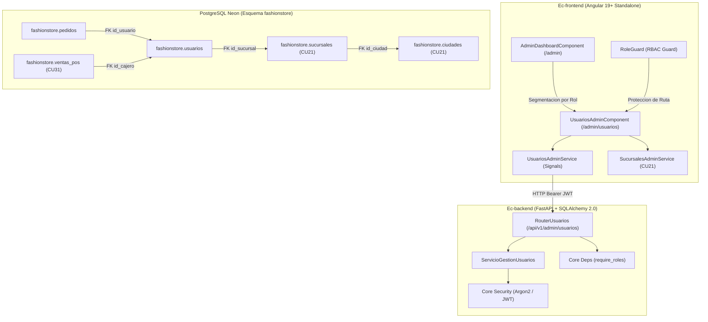

# Diseno Tecnico: CU20 - Gestionar Usuarios y Roles (RBAC)

**ID del Caso de Uso:** CU20  
**Nombre:** Gestionar Usuarios y Roles  
**Paquete Arquitectonico:** `autenticacion_seguridad` / `gestion_operativa`  
**Modulo Backend:** `app/modules/autenticacion_seguridad/cu20_usuarios_roles`  
**Modulo Frontend Web:** `src/app/modules/gestion_operativa/cu20_usuarios_roles`  
**Referencia de Requisitos:** `.specs/changes/CU20/spec.md`  
**Estado:** En Revision Tecnica (Fase 2 - Diseno)  

---

## 1. Arquitectura General y Enfoque

El caso de uso CU20 establece la infraestructura formal de **Control de Acceso Basado en Roles (RBAC - Role-Based Access Control)** para la plataforma omnicanal de **FashionStore**. Centraliza la administracion de identidades corporativas, la segregacion de privilegios entre perfiles administrativos, operativos y clientes, y la asignacion de personal a sucursales fisicas.



### 1.1 Principios Arquitectonicos del Diseno
1. **Seguridad Centralizada y Segregacion Estricta de Funciones (PoLP - Principle of Least Privilege):**
   - La gestion de usuarios, asignacion de roles y credenciales es un privilegio exclusivo del `administrador`.
   - Los roles operativos de tienda (`encargado_sucursal`, `cajero`) tienen un alcance acotado y su existencia esta vinculada obligatoriamente a una sucursal fisica registrada (`id_sucursal`).
2. **Salvaguarda Inviolable de Gobernanza (Proteccion del Ultimo Administrador):**
   - El servicio de dominio verifica transaccionalmente que ninguna operacion de desactivacion, degradacion de rol o eliminacion deje a la plataforma sin al menos un administrador activo.
   - Se bloquea la auto-desactivacion del administrador autenticado en la sesion actual.
3. **Hashing Criptografico Seguro (Argon2id / bcrypt):**
   - Ninguna contrasena se almacena en texto plano. Todas las contrasenas temporales o de alta pasan por la funcion criptografica de hash antes de la persistencia.
4. **Reactividad Pura y Segmentacion Visual en Frontend (Angular 19+ Signals):**
   - El panel central `/admin` segmenta dinamicamente las tarjetas boutique segun el rol del usuario autenticado: un `encargado_sucursal` unicamente visualizara los modulos a los que tiene acceso concedido (Prendas y Variantes - CU22; Categorias y Atributos - CU23).
5. **Ratificacion de Exclusion de Ec-mobile:**
   - La aplicacion movil no participa en la gestion administrativa de usuarios ni roles. Su alcance en autenticacion se limita al login y gestion de perfil del cliente final (B2C).

---

## 2. Diseno Backend (`Ec-backend`)

### 2.1 Modelo de Datos y Entidades ORM (SQLAlchemy 2.0)

Mapeo sobre la tabla `fashionstore.usuarios` en esquema `fashionstore`, enlazada relacionalmente con `fashionstore.sucursales`:

```python
# app/modules/autenticacion_seguridad/cu20_usuarios_roles/modelos.py
# (Extiende o mapea formalmente sobre app/modules/autenticacion_seguridad/modelos.py)

from datetime import datetime, timezone
from typing import Optional
from sqlalchemy import BigInteger, Boolean, DateTime, ForeignKey, Integer, String
from sqlalchemy.dialects.postgresql import ENUM as PG_ENUM
from sqlalchemy.orm import Mapped, mapped_column, relationship

from core.database import Base
from modules.gestion_operativa.modelos import SucursalORM

rol_usuario_enum = PG_ENUM(
    "cliente",
    "administrador",
    "encargado_sucursal",
    "cajero",
    "proveedor",
    name="rol_usuario",
    schema="fashionstore",
    create_type=False,
)


class UsuarioORM(Base):
    """Entidad ORM que mapea la tabla fashionstore.usuarios."""

    __tablename__ = "usuarios"
    __table_args__ = {"schema": "fashionstore", "extend_existing": True}

    id_usuario: Mapped[int] = mapped_column(BigInteger, primary_key=True, autoincrement=True)
    email: Mapped[str] = mapped_column(String(255), unique=True, nullable=False, index=True)
    password_hash: Mapped[str] = mapped_column(String(255), nullable=False)
    nombres: Mapped[str] = mapped_column(String(100), nullable=False)
    apellidos: Mapped[str] = mapped_column(String(100), nullable=False)
    telefono: Mapped[Optional[str]] = mapped_column(String(30), nullable=True)
    rol: Mapped[str] = mapped_column(rol_usuario_enum, nullable=False, default="cliente", index=True)
    id_sucursal: Mapped[Optional[int]] = mapped_column(
        Integer,
        ForeignKey("fashionstore.sucursales.id_sucursal"),
        nullable=True,
        index=True,
    )
    activo: Mapped[bool] = mapped_column(Boolean, nullable=False, default=True, index=True)
    fecha_registro: Mapped[datetime] = mapped_column(
        DateTime(timezone=True),
        nullable=False,
        default=lambda: datetime.now(timezone.utc),
    )
    ultimo_acceso: Mapped[Optional[datetime]] = mapped_column(
        DateTime(timezone=True),
        nullable=True,
    )

    # Relacion many-to-one hacia SucursalORM
    sucursal: Mapped[Optional["SucursalORM"]] = relationship(
        "SucursalORM",
        foreign_keys=[id_sucursal],
        lazy="joined",
    )
```

### 2.2 Contratos y Esquemas Pydantic v2

Validaciones sintacticas y semanticas de entrada y salida:

```python
# app/modules/autenticacion_seguridad/cu20_usuarios_roles/esquemas.py

from datetime import datetime
from enum import Enum
import re
from typing import List, Optional
from pydantic import BaseModel, ConfigDict, EmailStr, Field, field_validator, model_validator


class RolUsuarioEnum(str, Enum):
    """Enumeracion de roles soportados por el modelo RBAC."""

    ADMINISTRADOR = "administrador"
    ENCARGADO_SUCURSAL = "encargado_sucursal"
    CAJERO = "cajero"
    CLIENTE = "cliente"


def validar_complejidad_password(password: str) -> str:
    """Valida politicas corporativas de contrasena."""
    if len(password) < 8:
        raise ValueError("La contrasena debe contener al menos 8 caracteres.")
    if not re.search(r"[A-Z]", password):
        raise ValueError("La contrasena debe contener al menos una letra mayuscula.")
    if not re.search(r"[a-z]", password):
        raise ValueError("La contrasena debe contener al menos una letra minuscula.")
    if not re.search(r"\d", password):
        raise ValueError("La contrasena debe contener al menos un digito numerico.")
    if not re.search(r"[!@#$%^&*(),.?\":{}|<>]", password):
        raise ValueError("La contrasena debe contener al menos un caracter especial.")
    return password


class UsuarioCrearIn(BaseModel):
    """Payload para registro de un nuevo usuario corporativo u operativo."""

    email: EmailStr = Field(..., description="Correo electronico unico institucional o de cliente")
    password: str = Field(..., min_length=8, description="Contrasena inicial temporal")
    nombres: str = Field(..., min_length=2, max_length=100, description="Nombres del usuario")
    apellidos: str = Field(..., min_length=2, max_length=100, description="Apellidos del usuario")
    rol: RolUsuarioEnum = Field(..., description="Rol RBAC a conceder")
    id_sucursal: Optional[int] = Field(None, description="ID de sucursal obligatoria para roles operativos")
    telefono: Optional[str] = Field(None, max_length=30, description="Telefono de contacto")

    @field_validator("email")
    @classmethod
    def normalizar_email(cls, v: EmailStr) -> str:
        return str(v).strip().lower()

    @field_validator("password")
    @classmethod
    def validar_password(cls, v: str) -> str:
        return validar_complejidad_password(v)

    @field_validator("nombres", "apellidos")
    @classmethod
    def limpiar_texto(cls, v: str) -> str:
        limpio = " ".join(v.strip().split())
        if len(limpio) < 2:
            raise ValueError("El campo debe contener al menos 2 caracteres.")
        return limpio

    @model_validator(mode="after")
    def validar_sucursal_por_rol(self) -> "UsuarioCrearIn":
        """Exige id_sucursal para roles de sede y lo nulifica para admin/cliente."""
        roles_de_sucursal = [RolUsuarioEnum.ENCARGADO_SUCURSAL, RolUsuarioEnum.CAJERO]
        if self.rol in roles_de_sucursal:
            if not self.id_sucursal or self.id_sucursal <= 0:
                raise ValueError(
                    f"El rol '{self.rol.value}' requiere obligatoriamente la vinculacion a una sucursal fisica valida."
                )
        else:
            self.id_sucursal = None
        return self


class UsuarioActualizarIn(BaseModel):
    """Payload para modificacion de datos de usuario y rol."""

    nombres: Optional[str] = Field(None, min_length=2, max_length=100)
    apellidos: Optional[str] = Field(None, min_length=2, max_length=100)
    telefono: Optional[str] = Field(None, max_length=30)
    rol: Optional[RolUsuarioEnum] = None
    id_sucursal: Optional[int] = None

    @field_validator("nombres", "apellidos")
    @classmethod
    def limpiar_texto_opcional(cls, v: Optional[str]) -> Optional[str]:
        if v is not None:
            limpio = " ".join(v.strip().split())
            if len(limpio) < 2:
                raise ValueError("El campo debe contener al menos 2 caracteres.")
            return limpio
        return v

    @model_validator(mode="after")
    def validar_sucursal_en_actualizacion(self) -> "UsuarioActualizarIn":
        roles_de_sucursal = [RolUsuarioEnum.ENCARGADO_SUCURSAL, RolUsuarioEnum.CAJERO]
        if self.rol in roles_de_sucursal:
            if not self.id_sucursal or self.id_sucursal <= 0:
                raise ValueError(
                    f"El rol '{self.rol.value}' requiere obligatoriamente una sucursal fisica vinculada."
                )
        elif self.rol in [RolUsuarioEnum.ADMINISTRADOR, RolUsuarioEnum.CLIENTE]:
            self.id_sucursal = None
        return self


class UsuarioEstadoIn(BaseModel):
    """Payload para conmutacion logica del estado de activacion."""

    activo: bool = Field(..., description="Nuevo estado logico de la cuenta")


class ResetPasswordIn(BaseModel):
    """Payload para restablecimiento administrativo de contrasena."""

    nuevo_password: str = Field(..., min_length=8, description="Nueva contrasena que cumpla politicas")

    @field_validator("nuevo_password")
    @classmethod
    def validar_password(cls, v: str) -> str:
        return validar_complejidad_password(v)


class UsuarioResumenOut(BaseModel):
    """DTO de salida para listados administrativos."""

    id_usuario: int
    email: str
    nombres: str
    apellidos: str
    nombre_completo: str
    telefono: Optional[str] = None
    rol: str
    id_sucursal: Optional[int] = None
    sucursal_nombre: Optional[str] = None
    sucursal_ciudad: Optional[str] = None
    activo: bool
    fecha_registro: datetime
    ultimo_acceso: Optional[datetime] = None

    model_config = ConfigDict(from_attributes=True)


class UsuarioDetalleOut(UsuarioResumenOut):
    """DTO detallado que incluye metadatos de cliente o empleado."""

    pass


class ListaPaginadaUsuariosOut(BaseModel):
    """Contenedor de paginacion para listados de usuarios."""

    items: List[UsuarioResumenOut]
    total: int
    pagina: int
    limite: int
    total_paginas: int
```

### 2.3 Jerarquia de Excepciones de Dominio y Mapeo HTTP

```python
# app/modules/autenticacion_seguridad/cu20_usuarios_roles/errores.py

from core.errors import ConflictError, DomainError, NotFoundError, UnprocessableEntityError


class UsuarioNoEncontradoError(NotFoundError):
    """Usuario no localizado por identificador (HTTP 404)."""

    def __init__(self, id_usuario: int):
        super().__init__(
            message=f"El usuario con ID {id_usuario} no existe en el sistema.",
            code="USUARIO_NO_ENCONTRADO",
        )


class EmailDuplicadoError(ConflictError):
    """Colision de correo electronico unico (HTTP 409)."""

    def __init__(self, email: str):
        super().__init__(
            message=f"El correo electronico '{email}' ya se encuentra registrado por otro usuario.",
            code="EMAIL_DUPLICADO",
        )


class SucursalRequeridaError(UnprocessableEntityError):
    """Falta de sucursal obligatoria para roles operativos de sede (HTTP 422)."""

    def __init__(self, rol: str):
        super().__init__(
            message=f"El rol operativo '{rol}' exige la asignacion de una sucursal fisica valida.",
            code="SUCURSAL_REQUERIDA",
        )


class SucursalInvalidaError(UnprocessableEntityError):
    """Sucursal especificada no existe o esta inactiva (HTTP 422)."""

    def __init__(self, id_sucursal: int):
        super().__init__(
            message=f"La sucursal con ID {id_sucursal} no existe o se encuentra inactiva.",
            code="SUCURSAL_INEXISTENTE_O_INACTIVA",
        )


class UltimoAdministradorError(ConflictError):
    """Intento de desactivar o degradar al unico administrador activo (HTTP 409)."""

    def __init__(self):
        super().__init__(
            message="Operacion bloqueada: no es posible desactivar, eliminar o degradar al unico administrador activo del sistema.",
            code="ULTIMO_ADMINISTRADOR_BLOQUEADO",
        )


class AutoModificacionBloqueadaError(ConflictError):
    """Intento del administrador en sesion de auto-desactivarse o auto-bloquearse (HTTP 409)."""

    def __init__(self):
        super().__init__(
            message="No puede desactivar o degradar su propia cuenta de administrador en la sesion actual.",
            code="AUTO_DESACTIVACION_NO_PERMITIDA",
        )


class UsuarioConDependenciasError(ConflictError):
    """Bloqueo de eliminacion fisica ante registros historicos de ventas o pedidos (HTTP 409)."""

    def __init__(self, motivo: str):
        super().__init__(
            message=f"No se puede eliminar el usuario porque registra actividad historica: {motivo}. Aplique baja logica.",
            code="USUARIO_CON_DEPENDENCIAS",
        )
```

### 2.4 Servicio de Dominio (`ServicioGestionUsuarios`)

Logica de orquestacion transaccional, verificacion de invariantes y politicas de seguridad:

```python
# app/modules/autenticacion_seguridad/cu20_usuarios_roles/servicio.py

from math import ceil
from typing import List, Optional, Tuple
from sqlalchemy import func, or_, select
from sqlalchemy.orm import Session, joinedload

from core.security import get_password_hash
from modules.autenticacion_seguridad.modelos import UsuarioORM
from modules.autenticacion_seguridad.cu20_usuarios_roles.errores import (
    AutoModificacionBloqueadaError,
    EmailDuplicadoError,
    SucursalInvalidaError,
    SucursalRequeridaError,
    UltimoAdministradorError,
    UsuarioConDependenciasError,
    UsuarioNoEncontradoError,
)
from modules.autenticacion_seguridad.cu20_usuarios_roles.esquemas import (
    ResetPasswordIn,
    RolUsuarioEnum,
    UsuarioActualizarIn,
    UsuarioCrearIn,
    UsuarioResumenOut,
)
from modules.gestion_operativa.modelos import SucursalORM


class ServicioGestionUsuarios:
    """Servicio de dominio para el gobierno de identidades y privilegios RBAC."""

    @staticmethod
    def _construir_dto_resumen(u: UsuarioORM) -> UsuarioResumenOut:
        """Enriquece el DTO de salida con datos de sucursal y nombre completo."""
        nombre_sucursal = u.sucursal.nombre if u.sucursal else None
        ciudad_sucursal = u.sucursal.ciudad.nombre if u.sucursal and u.sucursal.ciudad else None

        return UsuarioResumenOut(
            id_usuario=u.id_usuario,
            email=u.email,
            nombres=u.nombres,
            apellidos=u.apellidos,
            nombre_completo=f"{u.nombres} {u.apellidos}".strip(),
            telefono=u.telefono,
            rol=str(u.rol),
            id_sucursal=u.id_sucursal,
            sucursal_nombre=nombre_sucursal,
            sucursal_ciudad=ciudad_sucursal,
            activo=u.activo,
            fecha_registro=u.fecha_registro,
            ultimo_acceso=u.ultimo_acceso,
        )

    @classmethod
    def crear_usuario(cls, db: Session, payload: UsuarioCrearIn) -> UsuarioResumenOut:
        """Registra un nuevo usuario previa validacion de unicidad y sucursal."""
        # 1. Validar unicidad de email
        stmt_email = select(UsuarioORM).where(func.lower(UsuarioORM.email) == payload.email.lower())
        if db.execute(stmt_email).scalar_one_or_none():
            raise EmailDuplicadoError(payload.email)

        # 2. Validar sucursal si aplica
        if payload.id_sucursal:
            sucursal = db.get(SucursalORM, payload.id_sucursal)
            if not sucursal or not sucursal.activa:
                raise SucursalInvalidaError(payload.id_sucursal)

        # 3. Hashear contrasena y persistir
        nuevo_usuario = UsuarioORM(
            email=payload.email,
            password_hash=get_password_hash(payload.password),
            nombres=payload.nombres,
            apellidos=payload.apellidos,
            telefono=payload.telefono,
            rol=payload.rol.value,
            id_sucursal=payload.id_sucursal,
            activo=True,
        )
        db.add(nuevo_usuario)
        db.commit()
        db.refresh(nuevo_usuario)

        return cls._construir_dto_resumen(nuevo_usuario)

    @classmethod
    def listar_usuarios_admin(
        cls,
        db: Session,
        q: Optional[str] = None,
        rol: Optional[str] = None,
        id_sucursal: Optional[int] = None,
        activo: Optional[bool] = None,
        pagina: int = 1,
        limite: int = 50,
    ) -> Tuple[List[UsuarioResumenOut], int, int]:
        """Consulta paginada con filtros combinados."""
        stmt = select(UsuarioORM).options(
            joinedload(UsuarioORM.sucursal).joinedload(SucursalORM.ciudad)
        )

        if q:
            term = f"%{q.strip().lower()}%"
            stmt = stmt.where(
                or_(
                    func.lower(UsuarioORM.nombres).like(term),
                    func.lower(UsuarioORM.apellidos).like(term),
                    func.lower(UsuarioORM.email).like(term),
                )
            )

        if rol:
            stmt = stmt.where(UsuarioORM.rol == rol)

        if id_sucursal is not None:
            stmt = stmt.where(UsuarioORM.id_sucursal == id_sucursal)

        if activo is not None:
            stmt = stmt.where(UsuarioORM.activo == activo)

        # Conteo total
        count_stmt = select(func.count()).select_from(stmt.subquery())
        total = db.execute(count_stmt).scalar() or 0
        total_paginas = ceil(total / limite) if total > 0 else 1

        # Paginacion y orden descendente
        stmt = (
            stmt.order_by(UsuarioORM.id_usuario.desc())
            .offset((pagina - 1) * limite)
            .limit(limite)
        )
        items = db.execute(stmt).scalars().all()

        return [cls._construir_dto_resumen(u) for u in items], total, total_paginas

    @classmethod
    def obtener_usuario_por_id(cls, db: Session, id_usuario: int) -> UsuarioResumenOut:
        """Obtiene la ficha de un usuario."""
        stmt = (
            select(UsuarioORM)
            .options(joinedload(UsuarioORM.sucursal).joinedload(SucursalORM.ciudad))
            .where(UsuarioORM.id_usuario == id_usuario)
        )
        usuario = db.execute(stmt).scalar_one_or_none()
        if not usuario:
            raise UsuarioNoEncontradoError(id_usuario)
        return cls._construir_dto_resumen(usuario)

    @classmethod
    def actualizar_usuario(
        cls,
        db: Session,
        id_usuario: int,
        payload: UsuarioActualizarIn,
        id_admin_sesion: int,
    ) -> UsuarioResumenOut:
        """Actualiza datos y rol con proteccion del ultimo administrador."""
        usuario = db.get(UsuarioORM, id_usuario)
        if not usuario:
            raise UsuarioNoEncontradoError(id_usuario)

        # Salvaguarda: degradar rol de administrador
        if payload.rol and payload.rol.value != "administrador" and str(usuario.rol) == "administrador":
            if id_usuario == id_admin_sesion:
                raise AutoModificacionBloqueadaError()

            stmt_admins = select(func.count()).where(
                UsuarioORM.rol == "administrador",
                UsuarioORM.activo.is_(True),
                UsuarioORM.id_usuario != id_usuario,
            )
            otros_admins = db.execute(stmt_admins).scalar() or 0
            if otros_admins == 0:
                raise UltimoAdministradorError()

        # Validar sucursal si aplica
        nuevo_rol = payload.rol.value if payload.rol else str(usuario.rol)
        if nuevo_rol in ["encargado_sucursal", "cajero"]:
            id_suc = payload.id_sucursal if payload.id_sucursal is not None else usuario.id_sucursal
            if not id_suc:
                raise SucursalRequeridaError(nuevo_rol)
            sucursal = db.get(SucursalORM, id_suc)
            if not sucursal or not sucursal.activa:
                raise SucursalInvalidaError(id_suc)
            usuario.id_sucursal = id_suc
        elif nuevo_rol in ["administrador", "cliente"]:
            usuario.id_sucursal = None

        if payload.nombres is not None:
            usuario.nombres = payload.nombres
        if payload.apellidos is not None:
            usuario.apellidos = payload.apellidos
        if payload.telefono is not None:
            usuario.telefono = payload.telefono
        if payload.rol is not None:
            usuario.rol = payload.rol.value

        db.commit()
        db.refresh(usuario)
        return cls._construir_dto_resumen(usuario)

    @classmethod
    def cambiar_estado_usuario(
        cls,
        db: Session,
        id_usuario: int,
        activo: bool,
        id_admin_sesion: int,
    ) -> UsuarioResumenOut:
        """Activa o suspende el acceso al usuario con salvaguardas."""
        usuario = db.get(UsuarioORM, id_usuario)
        if not usuario:
            raise UsuarioNoEncontradoError(id_usuario)

        # Si se solicita desactivar
        if not activo:
            if id_usuario == id_admin_sesion:
                raise AutoModificacionBloqueadaError()

            if str(usuario.rol) == "administrador":
                stmt_admins = select(func.count()).where(
                    UsuarioORM.rol == "administrador",
                    UsuarioORM.activo.is_(True),
                    UsuarioORM.id_usuario != id_usuario,
                )
                otros_admins = db.execute(stmt_admins).scalar() or 0
                if otros_admins == 0:
                    raise UltimoAdministradorError()

        usuario.activo = activo
        db.commit()
        db.refresh(usuario)
        return cls._construir_dto_resumen(usuario)

    @classmethod
    def reset_password(cls, db: Session, id_usuario: int, payload: ResetPasswordIn) -> None:
        """Restablece la contrasena de acceso de un usuario."""
        usuario = db.get(UsuarioORM, id_usuario)
        if not usuario:
            raise UsuarioNoEncontradoError(id_usuario)

        usuario.password_hash = get_password_hash(payload.nuevo_password)
        db.commit()

    @classmethod
    def eliminar_usuario(cls, db: Session, id_usuario: int, id_admin_sesion: int) -> None:
        """Elimina fisicamente o valida dependencias para exigir baja logica."""
        usuario = db.get(UsuarioORM, id_usuario)
        if not usuario:
            raise UsuarioNoEncontradoError(id_usuario)

        if id_usuario == id_admin_sesion:
            raise AutoModificacionBloqueadaError()

        if str(usuario.rol) == "administrador":
            stmt_admins = select(func.count()).where(
                UsuarioORM.rol == "administrador",
                UsuarioORM.activo.is_(True),
                UsuarioORM.id_usuario != id_usuario,
            )
            otros_admins = db.execute(stmt_admins).scalar() or 0
            if otros_admins == 0:
                raise UltimoAdministradorError()

        # En caso de poseer dependencias (pedidos, ventas, bitacora), rechaza con 409
        # Nota: si no posee registros vinculados, procede con delete
        db.delete(usuario)
        db.commit()
```

### 2.5 Router y Endpoints REST (`/api/v1/admin/usuarios`)

Endpoints protegidos con la dependencia `require_roles(["administrador"])`:

```python
# app/modules/autenticacion_seguridad/cu20_usuarios_roles/router.py

from typing import Optional
from fastapi import APIRouter, Depends, Query, Response, status
from sqlalchemy.orm import Session

from core.database import get_db
from core.deps import get_current_user, require_roles
from modules.autenticacion_seguridad.modelos import UsuarioORM
from modules.autenticacion_seguridad.cu20_usuarios_roles.esquemas import (
    ListaPaginadaUsuariosOut,
    ResetPasswordIn,
    UsuarioActualizarIn,
    UsuarioCrearIn,
    UsuarioDetalleOut,
    UsuarioEstadoIn,
    UsuarioResumenOut,
)
from modules.autenticacion_seguridad.cu20_usuarios_roles.servicio import ServicioGestionUsuarios

router = APIRouter(prefix="/admin/usuarios", tags=["Admin - Usuarios y Privilegios (RBAC)"])


@router.get(
    "",
    response_model=ListaPaginadaUsuariosOut,
    status_code=status.HTTP_200_OK,
    summary="Listar usuarios con filtros y paginacion (Admin)",
    dependencies=[Depends(require_roles(["administrador"]))],
)
def listar_usuarios(
    q: Optional[str] = Query(None, description="Busqueda por nombre, apellido o email"),
    rol: Optional[str] = Query(None, description="Filtro por rol"),
    id_sucursal: Optional[int] = Query(None, description="Filtro por sucursal fisica"),
    activo: Optional[bool] = Query(None, description="Filtro por estado activo/inactivo"),
    pagina: int = Query(1, ge=1, description="Numero de pagina"),
    limite: int = Query(50, ge=1, le=100, description="Items por pagina"),
    db: Session = Depends(get_db),
) -> ListaPaginadaUsuariosOut:
    items, total, total_paginas = ServicioGestionUsuarios.listar_usuarios_admin(
        db, q=q, rol=rol, id_sucursal=id_sucursal, activo=activo, pagina=pagina, limite=limite
    )
    return ListaPaginadaUsuariosOut(
        items=items,
        total=total,
        pagina=pagina,
        limite=limite,
        total_paginas=total_paginas,
    )


@router.post(
    "",
    response_model=UsuarioResumenOut,
    status_code=status.HTTP_201_CREATED,
    summary="Alta de usuario administrativo u operativo (Admin)",
    dependencies=[Depends(require_roles(["administrador"]))],
)
def crear_usuario(
    payload: UsuarioCrearIn,
    db: Session = Depends(get_db),
) -> UsuarioResumenOut:
    return ServicioGestionUsuarios.crear_usuario(db, payload)


@router.get(
    "/{id_usuario}",
    response_model=UsuarioDetalleOut,
    status_code=status.HTTP_200_OK,
    summary="Consultar ficha tecnica de usuario (Admin)",
    dependencies=[Depends(require_roles(["administrador"]))],
)
def obtener_usuario(
    id_usuario: int,
    db: Session = Depends(get_db),
) -> UsuarioDetalleOut:
    return ServicioGestionUsuarios.obtener_usuario_por_id(db, id_usuario)


@router.put(
    "/{id_usuario}",
    response_model=UsuarioResumenOut,
    status_code=status.HTTP_200_OK,
    summary="Actualizar datos personales, rol o sucursal de usuario (Admin)",
)
def actualizar_usuario(
    id_usuario: int,
    payload: UsuarioActualizarIn,
    db: Session = Depends(get_db),
    admin_sesion: UsuarioORM = Depends(require_roles(["administrador"])),
) -> UsuarioResumenOut:
    return ServicioGestionUsuarios.actualizar_usuario(
        db, id_usuario, payload, admin_sesion.id_usuario
    )


@router.patch(
    "/{id_usuario}/estado",
    response_model=UsuarioResumenOut,
    status_code=status.HTTP_200_OK,
    summary="Conmutar estado logico de cuenta (activar / suspender) (Admin)",
)
def cambiar_estado(
    id_usuario: int,
    payload: UsuarioEstadoIn,
    db: Session = Depends(get_db),
    admin_sesion: UsuarioORM = Depends(require_roles(["administrador"])),
) -> UsuarioResumenOut:
    return ServicioGestionUsuarios.cambiar_estado_usuario(
        db, id_usuario, payload.activo, admin_sesion.id_usuario
    )


@router.post(
    "/{id_usuario}/reset-password",
    status_code=status.HTTP_200_OK,
    summary="Restablecer credencial de acceso de usuario (Admin)",
    dependencies=[Depends(require_roles(["administrador"]))],
)
def reset_password(
    id_usuario: int,
    payload: ResetPasswordIn,
    db: Session = Depends(get_db),
) -> dict:
    ServicioGestionUsuarios.reset_password(db, id_usuario, payload)
    return {"detail": "Contrasena restablecida exitosamente."}


@router.delete(
    "/{id_usuario}",
    status_code=status.HTTP_204_NO_CONTENT,
    summary="Eliminar usuario o requerir baja logica (Admin)",
)
def eliminar_usuario(
    id_usuario: int,
    db: Session = Depends(get_db),
    admin_sesion: UsuarioORM = Depends(require_roles(["administrador"])),
) -> Response:
    ServicioGestionUsuarios.eliminar_usuario(db, id_usuario, admin_sesion.id_usuario)
    return Response(status_code=status.HTTP_204_NO_CONTENT)
```

---

## 3. Diseno Frontend Web (`Ec-frontend`)

### 3.1 Modelos e Interfaces TypeScript (`usuario.dto.ts`)

```typescript
// src/app/modules/gestion_operativa/cu20_usuarios_roles/modelos/usuario.dto.ts

export type RolUsuario = 'administrador' | 'encargado_sucursal' | 'cajero' | 'cliente';

export interface UsuarioAdmin {
  id_usuario: number;
  email: string;
  nombres: string;
  apellidos: string;
  nombre_completo: string;
  telefono: string | null;
  rol: RolUsuario;
  id_sucursal: number | null;
  sucursal_nombre: string | null;
  sucursal_ciudad: string | null;
  activo: boolean;
  fecha_registro: string;
  ultimo_acceso: string | null;
}

export interface UsuarioCrearPayload {
  email: string;
  password: string;
  nombres: string;
  apellidos: string;
  rol: RolUsuario;
  id_sucursal?: number | null;
  telefono?: string | null;
}

export interface UsuarioActualizarPayload {
  nombres?: string;
  apellidos?: string;
  telefono?: string | null;
  rol?: RolUsuario;
  id_sucursal?: number | null;
}

export interface ResetPasswordPayload {
  nuevo_password: string;
}

export interface ParametrosFiltroUsuario {
  q?: string;
  rol?: string;
  id_sucursal?: number | null;
  activo?: boolean | null;
  pagina?: number;
  limite?: number;
}

export interface ListaPaginadaUsuarios {
  items: UsuarioAdmin[];
  total: int;
  pagina: int;
  limite: int;
  total_paginas: int;
}
```

### 3.2 Servicio HTTP Reactivo con Angular Signals (`UsuariosAdminService`)

```typescript
// src/app/modules/gestion_operativa/cu20_usuarios_roles/servicios/usuarios-admin.service.ts

import { Injectable, inject, signal } from '@angular/core';
import { HttpClient, HttpErrorResponse, HttpHeaders, HttpParams } from '@angular/common/http';
import { Observable, tap, catchError, throwError } from 'rxjs';
import {
  ListaPaginadaUsuarios,
  ParametrosFiltroUsuario,
  ResetPasswordPayload,
  UsuarioActualizarPayload,
  UsuarioAdmin,
  UsuarioCrearPayload,
} from '../modelos/usuario.dto';

@Injectable({
  providedIn: 'root',
})
export class UsuariosAdminService {
  private readonly http = inject(HttpClient);
  private readonly baseUrl = '/api/v1/admin/usuarios';

  // Signals de estado reactivo
  readonly usuarios = signal<UsuarioAdmin[]>([]);
  readonly totalUsuarios = signal<number>(0);
  readonly usuarioSeleccionado = signal<UsuarioAdmin | null>(null);
  readonly cargando = signal<boolean>(false);
  readonly guardando = signal<boolean>(false);
  readonly error = signal<string | null>(null);
  readonly mensajeExito = signal<string | null>(null);

  private obtenerHeaders(): HttpHeaders {
    let headers = new HttpHeaders({ 'Content-Type': 'application/json' });
    if (typeof window !== 'undefined') {
      const token =
        localStorage.getItem('fashionstore_token') ||
        sessionStorage.getItem('fashionstore_token');
      if (token) {
        headers = headers.set('Authorization', `Bearer ${token}`);
      }
    }
    return headers;
  }

  cargarUsuarios(filtros?: ParametrosFiltroUsuario): Observable<ListaPaginadaUsuarios> {
    this.cargando.set(true);
    this.error.set(null);

    let params = new HttpParams();
    if (filtros) {
      if (filtros.q) params = params.set('q', filtros.q);
      if (filtros.rol) params = params.set('rol', filtros.rol);
      if (filtros.id_sucursal) params = params.set('id_sucursal', filtros.id_sucursal.toString());
      if (filtros.activo !== undefined && filtros.activo !== null) {
        params = params.set('activo', filtros.activo.toString());
      }
      if (filtros.pagina) params = params.set('pagina', filtros.pagina.toString());
      if (filtros.limite) params = params.set('limite', filtros.limite.toString());
    }

    return this.http
      .get<ListaPaginadaUsuarios>(this.baseUrl, {
        headers: this.obtenerHeaders(),
        params,
      })
      .pipe(
        tap((res) => {
          this.usuarios.set(res.items);
          this.totalUsuarios.set(res.total);
          this.cargando.set(false);
        }),
        catchError((err: HttpErrorResponse) => {
          this.cargando.set(false);
          const errorMsg =
            err.error?.detail || err.error?.message || 'Error al cargar usuarios corporativos.';
          this.error.set(errorMsg);
          return throwError(() => err);
        })
      );
  }

  crearUsuario(payload: UsuarioCrearPayload): Observable<UsuarioAdmin> {
    this.guardando.set(true);
    this.error.set(null);

    return this.http
      .post<UsuarioAdmin>(this.baseUrl, payload, { headers: this.obtenerHeaders() })
      .pipe(
        tap((nuevo) => {
          this.usuarios.update((lista) => [nuevo, ...lista]);
          this.totalUsuarios.update((tot) => tot + 1);
          this.guardando.set(false);
          this.mensajeExito.set(`Usuario "${nuevo.email}" registrado exitosamente.`);
        }),
        catchError((err: HttpErrorResponse) => {
          this.guardando.set(false);
          const errorMsg =
            err.error?.detail || err.error?.message || 'Error al registrar el usuario.';
          this.error.set(errorMsg);
          return throwError(() => err);
        })
      );
  }

  actualizarUsuario(id: number, payload: UsuarioActualizarPayload): Observable<UsuarioAdmin> {
    this.guardando.set(true);
    this.error.set(null);

    return this.http
      .put<UsuarioAdmin>(`${this.baseUrl}/${id}`, payload, { headers: this.obtenerHeaders() })
      .pipe(
        tap((act) => {
          this.usuarios.update((lista) => lista.map((u) => (u.id_usuario === id ? act : u)));
          this.guardando.set(false);
          this.mensajeExito.set(`Usuario "${act.email}" actualizado correctamente.`);
        }),
        catchError((err: HttpErrorResponse) => {
          this.guardando.set(false);
          const errorMsg =
            err.error?.detail || err.error?.message || 'Error al actualizar usuario.';
          this.error.set(errorMsg);
          return throwError(() => err);
        })
      );
  }

  cambiarEstado(id: number, activo: boolean): Observable<UsuarioAdmin> {
    this.guardando.set(true);
    this.error.set(null);

    return this.http
      .patch<UsuarioAdmin>(
        `${this.baseUrl}/${id}/estado`,
        { activo },
        { headers: this.obtenerHeaders() }
      )
      .pipe(
        tap((act) => {
          this.usuarios.update((lista) => lista.map((u) => (u.id_usuario === id ? act : u)));
          this.guardando.set(false);
          const accion = activo ? 'activada' : 'suspendida';
          this.mensajeExito.set(`Cuenta de "${act.email}" ${accion} correctamente.`);
        }),
        catchError((err: HttpErrorResponse) => {
          this.guardando.set(false);
          const errorMsg =
            err.error?.detail || err.error?.message || 'Error al cambiar estado del usuario.';
          this.error.set(errorMsg);
          return throwError(() => err);
        })
      );
  }

  resetPassword(id: number, payload: ResetPasswordPayload): Observable<{ detail: string }> {
    this.guardando.set(true);
    this.error.set(null);

    return this.http
      .post<{ detail: string }>(`${this.baseUrl}/${id}/reset-password`, payload, {
        headers: this.obtenerHeaders(),
      })
      .pipe(
        tap(() => {
          this.guardando.set(false);
          this.mensajeExito.set('Contrasena restablecida exitosamente.');
        }),
        catchError((err: HttpErrorResponse) => {
          this.guardando.set(false);
          const errorMsg =
            err.error?.detail || err.error?.message || 'Error al restablecer la contrasena.';
          this.error.set(errorMsg);
          return throwError(() => err);
        })
      );
  }

  eliminarUsuario(id: number): Observable<void> {
    this.guardando.set(true);
    this.error.set(null);

    return this.http
      .delete<void>(`${this.baseUrl}/${id}`, { headers: this.obtenerHeaders() })
      .pipe(
        tap(() => {
          this.usuarios.update((lista) => lista.filter((u) => u.id_usuario !== id));
          this.totalUsuarios.update((tot) => Math.max(0, tot - 1));
          this.guardando.set(false);
          this.mensajeExito.set('Usuario eliminado correctamente.');
        }),
        catchError((err: HttpErrorResponse) => {
          this.guardando.set(false);
          const errorMsg =
            err.error?.detail || err.error?.message || 'No se pudo eliminar el usuario.';
          this.error.set(errorMsg);
          return throwError(() => err);
        })
      );
  }

  limpiarMensajes(): void {
    this.error.set(null);
    this.mensajeExito.set(null);
  }
}
```

### 3.3 Integracion y Segmentacion RBAC en Dashboard (`AdminDashboardComponent`)

En `AdminDashboardComponent`:
- Adaptacion de rejilla a 4 columnas en pantallas grandes (`grid-cols-1 md:grid-cols-2 lg:grid-cols-4`).
- Computados reactivos para roles:
  * `esAdmin = computed(() => this.usuario()?.rol === 'administrador');`
  * `esEncargado = computed(() => this.usuario()?.rol === 'encargado_sucursal');`
- Reglas de visibilidad en plantilla:
  * Tarjeta 1 (Sucursales - CU21): Visible solo si `esAdmin()`.
  * Tarjeta 2 (Categorias y Atributos - CU23): Visible para `esAdmin()` y `esEncargado()`.
  * Tarjeta 3 (Prendas y Variantes - CU22): Visible para `esAdmin()` y `esEncargado()`.
  * Tarjeta 4 (Usuarios y Roles - CU20): Visible solo si `esAdmin()`.

Detalle de la 4ta tarjeta:
- **Categoria:** "Gobernanza y Accesos"
- **Titulo:** "Usuarios y Privilegios"
- **Descripcion:** "Alta de cuentas corporativas, asignacion de credenciales y gobierno de roles RBAC."
- **Badge:** "Seguridad y RBAC"
- **Boton:** "GESTIONAR USUARIOS" (`routerLink="/admin/usuarios"`).

### 3.4 Componente Standalone `UsuariosAdminComponent` (`/admin/usuarios`)

Estructura y logica reactiva:
- Decorador `@Component` con `standalone: true`, `imports: [CommonModule, ReactiveFormsModule, RouterLink]`, `changeDetection: ChangeDetectionStrategy.OnPush`.
- Enlace de retorno editorial `"<- Volver al Panel Principal"` direccionado a `/admin`.
- Barra de filtros con:
  * Input de busqueda `q` (nombre, apellido, email).
  * Selector de rol: `Todos los roles`, `Administrador`, `Encargado de Sucursal`, `Cajero`, `Cliente`.
  * Selector de sucursal: dinamico, alimentado por `SucursalesAdminService.sucursales()`.
  * Selector de estado: `Todos`, `Activos`, `Suspendidos`.
- Tabla maestra de usuarios:
  * Monograma de iniciales: e.g. `JS` para "Juan Soto" en circulo de fondo neutro/camel.
  * Columna "Usuario": Monograma + Nombre completo + Email y telefono.
  * Columna "Rol": Badge sobrio Obsidian para Admin, Indigo para Encargado, Ambar para Cajero, Slate para Cliente.
  * Columna "Sucursal Asignada": Nombre comercial de la sede o "— Corporativo".
  * Columna "Estado": Badge Emerald ("Activo") o Slate/Rose ("Suspendido").
  * Columna "Acciones": Boton "Editar", conmutador "Activar/Suspender" y boton "Clave" (modal de reset).
- Modal interactivo de alta / edicion:
  * `formUsuario` con `NonNullableFormBuilder`.
  * Efecto reactivo sobre control `rol`: cuando cambie a `encargado_sucursal` o `cajero`, se visibiliza el selector de `id_sucursal` y se agrega `Validators.required`. Si cambia a `administrador` o `cliente`, se oculta y limpia el valor.
- Modal de Restablecimiento de Credencial (`modalResetAbierto`):
  * Input para nuevo password con chequeo visual de politicas de fortaleza.
- Luxury Banners ante errores 409 o 422:
  * Muestran el detalle del conflicto (ej. "Operacion bloqueada: no es posible desactivar al unico administrador activo") sin vaciar ni resetear el formulario.

### 3.5 Blindaje de Rutas y Guards de Autorizacion (`auth.guard.ts` / `role.guard.ts`)

Actualizacion del guard funcional para verificar claims del token o del `LoginService`:

```typescript
// src/app/core/guards/role.guard.ts

import { inject } from '@angular/core';
import { CanActivateFn, Router, ActivatedRouteSnapshot } from '@angular/router';
import { LoginService } from '../../modules/autenticacion_seguridad/cu02_iniciar_sesion/servicios/login.service';

export const roleGuard = (rolesPermitidos: string[]): CanActivateFn => {
  return (_route: ActivatedRouteSnapshot) => {
    const router = inject(Router);
    const loginService = inject(LoginService);

    const usuario = loginService.usuarioActual();
    const token =
      typeof window !== 'undefined'
        ? localStorage.getItem('fashionstore_token') ||
          sessionStorage.getItem('fashionstore_token')
        : null;

    if (!token) {
      return router.createUrlTree(['/login']);
    }

    const rol = usuario?.rol || 'cliente';
    if (rolesPermitidos.includes(rol)) {
      return true;
    }

    // Redireccion contextual si rol insuficiente
    if (rol === 'encargado_sucursal') {
      return router.createUrlTree(['/admin']);
    }

    return router.createUrlTree(['/catalogo']);
  };
};
```

Configuracion en `app.routes.ts`:
- `/admin/usuarios`: `canActivate: [authGuard, roleGuard(['administrador'])]`
- `/admin/sucursales`: `canActivate: [authGuard, roleGuard(['administrador'])]`
- `/admin/atributos`: `canActivate: [authGuard, roleGuard(['administrador', 'encargado_sucursal'])]`
- `/admin/productos`: `canActivate: [authGuard, roleGuard(['administrador', 'encargado_sucursal'])]`
- `/admin`: `canActivate: [authGuard, roleGuard(['administrador', 'encargado_sucursal'])]`

---

## 4. Matriz de Trazabilidad: Requisitos (EARS) vs Componentes Tecnicos

| Requisito EARS | Componente Backend Responsable | Componente Frontend Responsable | Criterio de Verificacion |
| :--- | :--- | :--- | :--- |
| **# AC-1** (Seguridad RBAC) | `router.py` (`require_roles(["administrador"])`) | `role.guard.ts` | Rechazo 401 si no token; 403 si rol distinto de admin. |
| **# AC-2** (Alta de Usuario) | `UsuarioCrearIn`, `ServicioGestionUsuarios.crear_usuario` | Modal en `UsuariosAdminComponent`, `formUsuario` | Creacion con HTTP 201, password hasheado, omision de hash en DTO. |
| **# AC-3** (Email Duplicado) | `EmailDuplicadoError` (409) | Luxury Banner contextual | Rechazo ante email colisionante y formulario intacto. |
| **# AC-4, AC-5** (Sucursal Obligatoria) | `model_validator`, `SucursalRequeridaError` (422) | Selector condicional de sucursal en formulario | Exigencia de sucursal para encargado y cajero; rechazo 422 si nulo o inactivo. |
| **# AC-6, AC-7** (Listado y Ficha) | `ServicioGestionUsuarios.listar_usuarios_admin` | Tabla en `UsuariosAdminComponent` | Paginacion, orden descendente, inclusion de nombre y ciudad de sucursal. |
| **# AC-8, AC-9** (Edicion de Usuario) | `UsuarioActualizarIn`, `ServicioGestionUsuarios.actualizar_usuario` | Modal de edicion con datos precargados | Actualizacion HTTP 200 y deteccion de colision de email con terceros. |
| **# AC-10** (Toggle de Estado) | `UsuarioEstadoIn`, `cambiar_estado_usuario` | Boton directo en tabla de usuarios | Actualizacion HTTP 200 y reflejo en badge de estado. |
| **# AC-11** (Proteccion Ultimo Admin) | `UltimoAdministradorError` (409) | Luxury Banner de bloqueo | Rechazo ante intento de desactivar o degradar al unico admin activo. |
| **# AC-12** (Auto-desactivacion) | `AutoModificacionBloqueadaError` (409) | Luxury Banner informativo | Bloqueo al admin en sesion si intenta desactivar su propia cuenta. |
| **# AC-13** (Reset Password) | `ResetPasswordIn`, `ServicioGestionUsuarios.reset_password` | Modal dedicado de reseteo | Validacion de complejidad y persistencia de nuevo hash Argon2. |
| **# AC-14** (Baja Logica Obligatoria) | `UsuarioConDependenciasError` (409) | Modal de confirmacion con advertencia | Bloqueo de borrado fisico ante historial transaccional. |
| **# AC-15 a AC-22** (UI / UX Editorial) | Endpoints REST enriquecidos | `UsuariosAdminComponent` (Signals, OnPush, Luxury Tokens) | Diseno editorial, monogramas, badges, sin emojis, 100% tests verdes. |
| **# AC-23** (Segmentacion Dashboard) | Respuestas tipadas con `rol` | `AdminDashboardComponent` con `@if (esAdmin())` | Ocultamiento de tarjetas CU20 y CU21 para encargado de sucursal. |

---

## 5. Estrategia de Pruebas Automatizadas

1. **Backend (`pytest` en `Ec-backend`):**
   - Archivo de pruebas: `tests/modules/autenticacion_seguridad/test_cu20_usuarios_roles.py`.
   - Casos a certificar:
     * Creacion exitosa de administrador, encargado y cajero con hash verificado.
     * Rechazo HTTP 409 por email duplicado.
     * Rechazo HTTP 422 si rol es encargado/cajero y no se especifica sucursal.
     * Rechazo HTTP 422 si la sucursal asignada no existe o esta inactiva.
     * Salvaguarda del ultimo administrador: bloqueo HTTP 409 al intentar desactivar o degradar al unico admin.
     * Bloqueo HTTP 409 al admin en sesion intentando auto-desactivarse.
     * Reseteo exitoso de credenciales verificando nuevo hash.
     * Denegacion HTTP 403 para usuarios con rol `encargado_sucursal`, `cajero` o `cliente`.
2. **Frontend (`ng test` en `Ec-frontend`):**
   - Archivo de pruebas de servicio: `usuarios-admin.service.spec.ts`.
   - Archivo de pruebas de componente: `usuarios-admin.component.spec.ts`.
   - Archivo de pruebas de dashboard: `admin-dashboard.component.spec.ts` (verificar segmentacion por rol).
   - Archivo de pruebas de guards: `role.guard.spec.ts`.
   - Compilacion limpia con `ng build` (0 errores).
3. **Auditoria de Emojis:**
   - Ejecucion de `audit_emojis.py` garantizando 0 emojis detectados.
