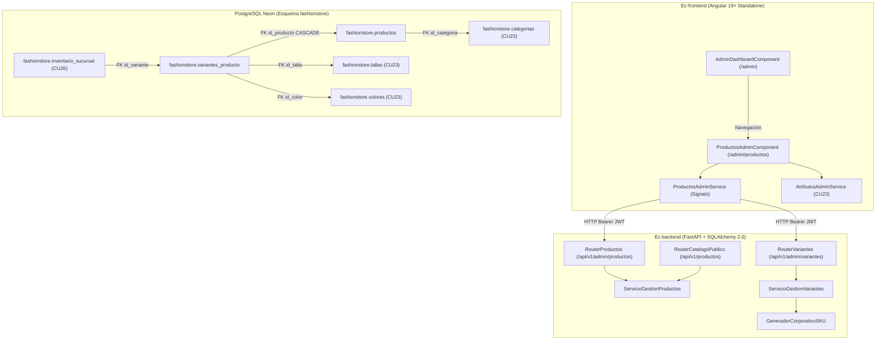
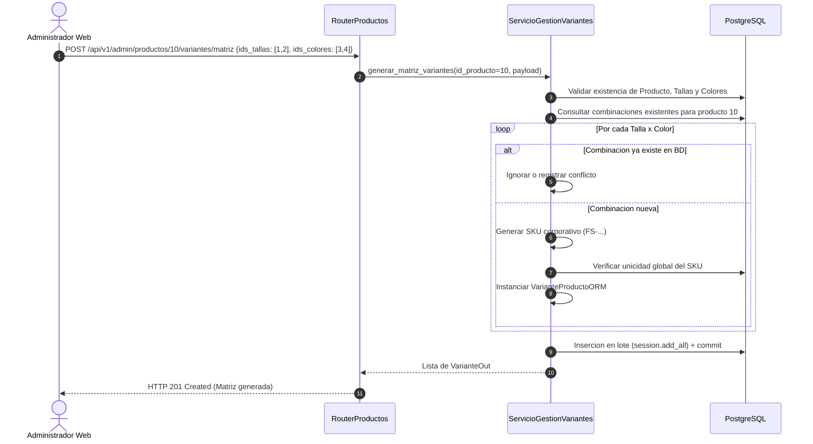
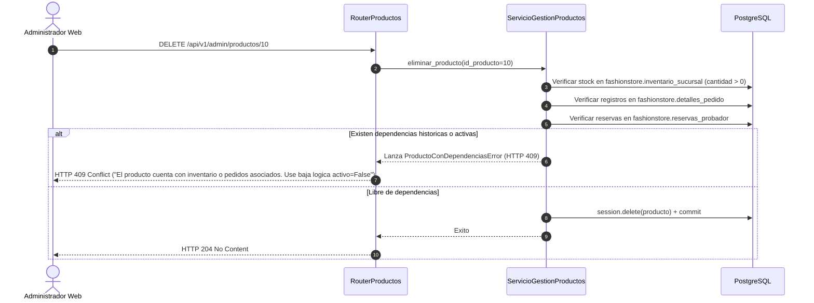

# Diseno Tecnico: CU22 - Gestionar Prendas, Productos y Variantes (SKUs)

**ID del Caso de Uso:** CU22  
**Nombre:** Gestionar Prendas, Productos y Variantes (SKUs)  
**Paquete Arquitectonico:** `gestion_operativa` / `catalogo`  
**Modulo Backend:** `app/modules/gestion_operativa/cu22_prendas_productos`  
**Modulo Frontend Web:** `src/app/modules/gestion_operativa/cu22_prendas_productos`  
**Referencia de Requisitos:** `.specs/changes/CU22/spec.md`  
**Estado:** En Revision Tecnica (Fase 2 - Diseno)  

---

## 1. Arquitectura General y Enfoque

El caso de uso CU22 centraliza el ciclo de vida de los productos y sus variantes fisicas (SKUs) dentro del ecosistema omnicanal de **FashionStore**. Responde a una arquitectura en capas desacoplada y orientada a eventos de negocio:



### 1.1 Principios Arquitectonicos del Diseno
1. **Separacion de Prenda Abstracta vs. Variante Fisica:**
   - La entidad `Producto` modela el diseno editorial, clasificacion taxonomica y precio base de la prenda.
   - La entidad `VarianteProducto` modela la instancia comercial tangible especificada por talla y color, con su identificador fisico unico (SKU) y eventuales recargos de precio (`precio_extra`).
2. **Generacion Estandarizada de SKU en Capa de Dominio:**
   - La construccion de los codigos SKU se realiza siguiendo una regla corporativa normalizada y determinista, garantizando unicidad global y legibilidad logistica.
3. **Control Estricto de Integridad Referencial Pre-Eliminacion:**
   - El sistema valida la ausencia de registros operacionales (inventario en sucursales, movimientos, lineas de pedido o reservas de probador) antes de autorizar cualquier `DELETE` fisico. Ante dependencias activas o historicas, el sistema bloquea con HTTP 409 y exige desactivacion logica (`activo = False`).
4. **Exclusion Justificada de Ec-mobile:**
   - Se ratifica la no implementacion de componentes de mutacion en Flutter. La aplicacion movil consume unicamente endpoints de lectura de catalogo.

---

## 2. Diseno Backend (`Ec-backend`)

### 2.1 Modelo de Datos y Entidades ORM (SQLAlchemy 2.0)

Mapeo formal sobre las tablas del esquema `fashionstore` en PostgreSQL:

```python
# app/modules/gestion_operativa/cu22_prendas_productos/modelos.py

from datetime import datetime, timezone
from decimal import Decimal
from typing import List, Optional
from sqlalchemy import (
    BigInteger,
    Boolean,
    DateTime,
    ForeignKey,
    Integer,
    Numeric,
    String,
    Text,
    UniqueConstraint,
)
from sqlalchemy.orm import Mapped, mapped_column, relationship
from core.database import Base


class ProductoORM(Base):
    """Mapeo de la tabla fashionstore.productos.
    
    Representa una prenda de vestir de diseno con su clasificacion taxonomica
    y precio base comercial.
    """
    __tablename__ = "productos"
    __table_args__ = {"schema": "fashionstore"}

    id_producto: Mapped[int] = mapped_column(BigInteger, primary_key=True, autoincrement=True)
    id_categoria: Mapped[int] = mapped_column(
        Integer, ForeignKey("fashionstore.categorias.id_categoria", ondelete="RESTRICT"), nullable=False, index=True
    )
    id_coleccion: Mapped[Optional[int]] = mapped_column(
        Integer, ForeignKey("fashionstore.colecciones.id_coleccion", ondelete="SET NULL"), nullable=True, index=True
    )
    id_proveedor: Mapped[Optional[int]] = mapped_column(Integer, nullable=True)
    nombre: Mapped[str] = mapped_column(String(200), unique=True, nullable=False, index=True)
    descripcion: Mapped[Optional[str]] = mapped_column(Text, nullable=True)
    precio_base: Mapped[Decimal] = mapped_column(Numeric(10, 2), nullable=False)
    imagen_url: Mapped[Optional[str]] = mapped_column(String(500), nullable=True)
    modelo_ar_url: Mapped[Optional[str]] = mapped_column(String(500), nullable=True)
    activo: Mapped[bool] = mapped_column(Boolean, nullable=False, default=True, index=True)
    creado_en: Mapped[datetime] = mapped_column(
        DateTime(timezone=True),
        nullable=False,
        default=lambda: datetime.now(timezone.utc),
    )

    # Relaciones relacionales
    categoria: Mapped["CategoriaORM"] = relationship("CategoriaORM")
    coleccion: Mapped[Optional["ColeccionORM"]] = relationship("ColeccionORM")
    variantes: Mapped[List["VarianteProductoORM"]] = relationship(
        "VarianteProductoORM", back_populates="producto", cascade="all, delete-orphan"
    )


class VarianteProductoORM(Base):
    """Mapeo de la tabla fashionstore.variantes_producto.
    
    Representa la combinacion especifica de Prenda, Talla y Color con SKU unico.
    """
    __tablename__ = "variantes_producto"
    __table_args__ = (
        UniqueConstraint("id_producto", "id_talla", "id_color", name="uq_variante_producto_talla_color"),
        {"schema": "fashionstore"},
    )

    id_variante: Mapped[int] = mapped_column(BigInteger, primary_key=True, autoincrement=True)
    id_producto: Mapped[int] = mapped_column(
        BigInteger, ForeignKey("fashionstore.productos.id_producto", ondelete="CASCADE"), nullable=False, index=True
    )
    id_talla: Mapped[int] = mapped_column(
        Integer, ForeignKey("fashionstore.tallas.id_talla", ondelete="RESTRICT"), nullable=False, index=True
    )
    id_color: Mapped[int] = mapped_column(
        Integer, ForeignKey("fashionstore.colores.id_color", ondelete="RESTRICT"), nullable=False, index=True
    )
    sku: Mapped[str] = mapped_column(String(64), unique=True, nullable=False, index=True)
    precio_extra: Mapped[Decimal] = mapped_column(Numeric(10, 2), nullable=False, default=Decimal("0.00"))
    activo: Mapped[bool] = mapped_column(Boolean, nullable=False, default=True, index=True)
    creado_en: Mapped[datetime] = mapped_column(
        DateTime(timezone=True),
        nullable=False,
        default=lambda: datetime.now(timezone.utc),
    )

    # Relaciones
    producto: Mapped["ProductoORM"] = relationship("ProductoORM", back_populates="variantes")
    talla: Mapped["TallaORM"] = relationship("TallaORM")
    color: Mapped["ColorORM"] = relationship("ColorORM")
```

---

### 2.2 Schemas de Validacion y Transferencia (Pydantic v2)

```python
# app/modules/gestion_operativa/cu22_prendas_productos/esquemas.py

import re
from datetime import datetime
from decimal import Decimal
from typing import List, Optional
from pydantic import BaseModel, ConfigDict, Field, field_validator


# =============================================================================
# SCHEMAS DE PRODUCTO
# =============================================================================

class ProductoBaseIn(BaseModel):
    nombre: str = Field(..., min_length=3, max_length=200, description="Nombre comercial unico")
    id_categoria: int = Field(..., gt=0, description="ID de la categoria taxonomica obligatoria")
    precio_base: Decimal = Field(..., gt=Decimal("0.00"), description="Precio base mayor a cero")
    descripcion: Optional[str] = Field(None, description="Descripcion editorial de diseno y tejido")
    id_coleccion: Optional[int] = Field(None, gt=0, description="ID de la coleccion opcional")
    imagen_url: Optional[str] = Field(None, max_length=500, description="URL de la fotografia principal")
    modelo_ar_url: Optional[str] = Field(None, max_length=500, description="URL del recurso 3D/AR")

    @field_validator("nombre")
    @classmethod
    def normalizar_nombre(cls, v: str) -> str:
        v_limpio = " ".join(v.strip().split())
        if len(v_limpio) < 3:
            raise ValueError("El nombre del producto debe contener al menos 3 caracteres.")
        return v_limpio


class ProductoCrearIn(ProductoBaseIn):
    activo: bool = Field(True, description="Estado de publicacion inicial")


class ProductoActualizarIn(BaseModel):
    nombre: Optional[str] = Field(None, min_length=3, max_length=200)
    id_categoria: Optional[int] = Field(None, gt=0)
    precio_base: Optional[Decimal] = Field(None, gt=Decimal("0.00"))
    descripcion: Optional[str] = None
    id_coleccion: Optional[int] = Field(None, gt=0)
    imagen_url: Optional[str] = Field(None, max_length=500)
    modelo_ar_url: Optional[str] = Field(None, max_length=500)
    activo: Optional[bool] = None

    @field_validator("nombre")
    @classmethod
    def normalizar_nombre_opcional(cls, v: Optional[str]) -> Optional[str]:
        if v is not None:
            v_limpio = " ".join(v.strip().split())
            if len(v_limpio) < 3:
                raise ValueError("El nombre debe contener al menos 3 caracteres.")
            return v_limpio
        return v


class ProductoEstadoIn(BaseModel):
    activo: bool = Field(..., description="Nuevo estado logico de publicacion")


class ProductoResumenOut(BaseModel):
    id_producto: int
    nombre: str
    descripcion: Optional[str] = None
    precio_base: Decimal
    id_categoria: int
    categoria_nombre: Optional[str] = None
    id_coleccion: Optional[int] = None
    coleccion_nombre: Optional[str] = None
    imagen_url: Optional[str] = None
    activo: bool
    total_variantes: int = 0
    stock_total: int = 0
    creado_en: datetime

    model_config = ConfigDict(from_attributes=True)


# =============================================================================
# SCHEMAS DE VARIANTES Y MATRIZ DE SKUs
# =============================================================================

class VarianteItemIn(BaseModel):
    id_talla: int = Field(..., gt=0, description="ID de la talla")
    id_color: int = Field(..., gt=0, description="ID del color")
    sku: Optional[str] = Field(None, max_length=64, description="SKU manual opcional")
    precio_extra: Decimal = Field(Decimal("0.00"), ge=Decimal("0.00"), description="Recargo sobre precio base")


class MatrizGenerarIn(BaseModel):
    ids_tallas: List[int] = Field(..., min_length=1, description="Lista de tallas seleccionadas")
    ids_colores: List[int] = Field(..., min_length=1, description="Lista de colores seleccionados")
    precio_extra_defecto: Decimal = Field(Decimal("0.00"), ge=Decimal("0.00"))


class VarianteActualizarIn(BaseModel):
    sku: Optional[str] = Field(None, min_length=3, max_length=64)
    precio_extra: Optional[Decimal] = Field(None, ge=Decimal("0.00"))
    activo: Optional[bool] = None


class VarianteOut(BaseModel):
    id_variante: int
    id_producto: int
    id_talla: int
    talla_codigo: str
    id_color: int
    color_nombre: str
    color_hex: Optional[str] = None
    sku: str
    precio_extra: Decimal
    precio_final: Decimal
    activo: bool
    stock_disponible: int = 0
    creado_en: datetime

    model_config = ConfigDict(from_attributes=True)


class ProductoDetalleOut(ProductoResumenOut):
    variantes: List[VarianteOut] = []
```

---

### 2.3 Algoritmo Corporativo de Generacion de SKUs

El sistema implementa una funcion pura y determinista para autogenerar el identificador SKU cuando el usuario no especifica uno personalizado:

$$\text{SKU} = \text{FS} - \text{SLUG}(\text{NombreProducto}) - \text{CodTalla} - \text{SLUG}(\text{Color})$$

#### Especificacion del Generador:
```python
# app/modules/gestion_operativa/cu22_prendas_productos/utilidades.py

import re
import unicodedata

def slugify_text(texto: str, max_len: int = 16) -> str:
    """Convierte texto en un slug alfanumerico en mayusculas sin tildes ni caracteres especiales."""
    # Descomposicion Unicode para purgar tildes y diacriticos
    nfkd = unicodedata.normalize("NFKD", texto)
    ascii_texto = nfkd.encode("ASCII", "ignore").decode("utf-8")
    # Conservar unicamente alfanumericos
    limpio = re.sub(r"[^A-Za-z0-9]+", "-", ascii_texto).strip("-").upper()
    return limpio[:max_len].strip("-")

def generar_sku_corporativo(
    nombre_producto: str,
    codigo_talla: str,
    nombre_color: str,
    id_producto: Optional[int] = None
) -> str:
    """Genera un SKU estandarizado con el formato FS-[PROD]-[TALLA]-[COLOR]."""
    slug_prod = slugify_text(nombre_producto, max_len=14)
    slug_talla = slugify_text(codigo_talla, max_len=6)
    slug_color = slugify_text(nombre_color, max_len=8)
    
    sku_candidato = f"FS-{slug_prod}-{slug_talla}-{slug_color}"
    return sku_candidato[:64]
```

---

### 2.4 Jerarquia de Excepciones de Dominio

Se mapean explicitamente las excepciones tipadas a codigos de estado HTTP:

```mermaid
classDiagram
    class DominioError {
        +str codigo
        +str mensaje
        +int status_code
    }
    class ProductoNoEncontradoError {
        +status_code = 404
        +codigo = "PRODUCTO_NO_ENCONTRADO"
    }
    class ProductoDuplicadoError {
        +status_code = 409
        +codigo = "PRODUCTO_DUPLICADO"
    }
    class CategoriaInexistenteError {
        +status_code = 422
        +codigo = "CATEGORIA_INEXISTENTE"
    }
    class SkuDuplicadoError {
        +status_code = 409
        +codigo = "SKU_DUPLICADO"
    }
    class VarianteDuplicadaError {
        +status_code = 409
        +codigo = "VARIANTE_DUPLICADA"
    }
    class ProductoConDependenciasError {
        +status_code = 409
        +codigo = "PRODUCTO_CON_DEPENDENCIAS_OPERATIVAS"
    }
    class VarianteConDependenciasError {
        +status_code = 409
        +codigo = "VARIANTE_CON_DEPENDENCIAS_OPERATIVAS"
    }

    DominioError <|-- ProductoNoEncontradoError
    DominioError <|-- ProductoDuplicadoError
    DominioError <|-- CategoriaInexistenteError
    DominioError <|-- SkuDuplicadoError
    DominioError <|-- VarianteDuplicadaError
    DominioError <|-- ProductoConDependenciasError
    DominioError <|-- VarianteConDependenciasError
```



---

### 2.5 Servicios de Dominio y Flujos Transaccionales

#### Flujo 1: Generacion Masiva de Variantes (Matriz Cartesiana)


#### Flujo 2: Verificacion de Dependencias Pre-Eliminacion


---

### 2.6 Endpoints y Contratos HTTP

| Metodo | Ruta | Rol Minimo | Codigo Exito | Descripcion |
|:---|:---|:---:|:---:|:---|
| `GET` | `/api/v1/productos` | Publico | `200 OK` | Catalogo abierto de productos activos con variantes |
| `GET` | `/api/v1/productos/{id}` | Publico | `200 OK` | Ficha tecnica de producto activo con inventario |
| `GET` | `/api/v1/admin/productos` | `administrador` | `200 OK` | Listado enriquecido con paginacion, filtros y metricas |
| `POST` | `/api/v1/admin/productos` | `administrador` | `201 Created` | Alta de prenda o producto base |
| `GET` | `/api/v1/admin/productos/{id}` | `administrador` | `200 OK` | Detalle editorial con todas sus variantes |
| `PUT` | `/api/v1/admin/productos/{id}` | `administrador` | `200 OK` | Modificacion de datos y categoria de la prenda |
| `PATCH` | `/api/v1/admin/productos/{id}/estado` | `administrador` | `200 OK` | Conmutacion de visibilidad comercial (`activo`) |
| `DELETE` | `/api/v1/admin/productos/{id}` | `administrador` | `204 No Content` | Baja fisica (valida dependencias; 409 si existen) |
| `POST` | `/api/v1/admin/productos/{id}/variantes/matriz` | `administrador` | `201 Created` | Generador masivo por producto cartesiano |
| `POST` | `/api/v1/admin/productos/{id}/variantes` | `administrador` | `201 Created` | Alta individual de variante |
| `GET` | `/api/v1/admin/productos/{id}/variantes` | `administrador` | `200 OK` | Lista de variantes fisicas del producto |
| `PUT` | `/api/v1/admin/variantes/{id_variante}` | `administrador` | `200 OK` | Actualizacion de SKU o `precio_extra` |
| `PATCH` | `/api/v1/admin/variantes/{id_variante}/estado` | `administrador` | `200 OK` | Conmutacion de disponibilidad de la variante |
| `DELETE` | `/api/v1/admin/variantes/{id_variante}` | `administrador` | `204 No Content` | Eliminacion fisica de variante (valida dependencias) |

---

## 3. Diseno Frontend Web (`Ec-frontend`)

### 3.1 Modelos TypeScript

```typescript
// src/app/modules/gestion_operativa/cu22_prendas_productos/modelos/producto.dto.ts

export interface ProductoResumenAdmin {
  id_producto: number;
  nombre: str;
  descripcion: string | null;
  precio_base: number;
  id_categoria: number;
  categoria_nombre: string | null;
  id_coleccion: number | null;
  coleccion_nombre: string | null;
  imagen_url: string | null;
  modelo_ar_url: string | null;
  activo: boolean;
  total_variantes: number;
  stock_total: number;
  creado_en: string;
}

export interface VarianteAdmin {
  id_variante: number;
  id_producto: number;
  id_talla: number;
  talla_codigo: string;
  id_color: number;
  color_nombre: string;
  color_hex: string | null;
  sku: string;
  precio_extra: number;
  precio_final: number;
  activo: boolean;
  stock_disponible: number;
  creado_en: string;
}

export interface ProductoDetalleAdmin extends ProductoResumenAdmin {
  variantes: VarianteAdmin[];
}

export interface ProductoCrearPayload {
  nombre: string;
  id_categoria: number;
  precio_base: number;
  descripcion?: string | null;
  id_coleccion?: number | null;
  imagen_url?: string | null;
  modelo_ar_url?: string | null;
  activo: boolean;
}

export interface ProductoActualizarPayload {
  nombre?: string;
  id_categoria?: number;
  precio_base?: number;
  descripcion?: string | null;
  id_coleccion?: number | null;
  imagen_url?: string | null;
  modelo_ar_url?: string | null;
  activo?: boolean;
}

export interface MatrizVariantesPayload {
  ids_tallas: number[];
  ids_colores: number[];
  precio_extra_defecto: number;
}

export interface VarianteEdicionItem {
  id_talla: number;
  talla_codigo: string;
  id_color: number;
  color_nombre: string;
  color_hex: string | null;
  sku: string;
  precio_extra: number;
  precio_final: number;
}
```

---

### 3.2 Servicio Reactivo `ProductosAdminService` (Angular Signals)

```typescript
// src/app/modules/gestion_operativa/cu22_prendas_productos/servicios/productos-admin.service.ts

@Injectable({ providedIn: 'root' })
export class ProductosAdminService {
  private readonly http = inject(HttpClient);
  private readonly loginService = inject(LoginService);

  // Senales reactivas
  readonly productos = signal<ProductoResumenAdmin[]>([]);
  readonly productoSeleccionado = signal<ProductoDetalleAdmin | null>(null);
  readonly variantes = signal<VarianteAdmin[]>([]);
  readonly cargando = signal<boolean>(false);
  readonly guardando = signal<boolean>(false);
  readonly error = signal<string | null>(null);
  readonly mensajeExito = signal<string | null>(null);

  // Metodos de persistencia
  cargarProductos(filtros?: { q?: string; id_categoria?: number; activo?: boolean }): Observable<ProductoResumenAdmin[]>;
  cargarProductoPorId(id: number): Observable<ProductoDetalleAdmin>;
  crearProducto(payload: ProductoCrearPayload): Observable<ProductoResumenAdmin>;
  actualizarProducto(id: number, payload: ProductoActualizarPayload): Observable<ProductoResumenAdmin>;
  cambiarEstadoProducto(id: number, activo: boolean): Observable<void>;
  eliminarProducto(id: number): Observable<void>;
  
  // Metodos de variantes
  generarMatrizVariantes(idProducto: number, payload: MatrizVariantesPayload): Observable<VarianteAdmin[]>;
  actualizarVariante(idVariante: number, payload: { sku?: string; precio_extra?: number; activo?: boolean }): Observable<VarianteAdmin>;
  eliminarVariante(idVariante: number): Observable<void>;
  limpiarMensajes(): void;
}
```

---

### 3.3 Integracion en el Hub Central (`AdminDashboardComponent`)

En `src/app/modules/admin/dashboard/admin-dashboard.component.html`, se anade la tercera tarjeta boutique en la rejilla principal, actualizando la distribucion a `grid-cols-1 md:grid-cols-3`:

```html
<!-- Tarjeta 3: Catalogo Maestro de Articulos (CU22) -->
<div class="bg-white border border-slate-200 rounded-2xl p-8 hover:border-[#AD8C63] transition-all shadow-xs hover:shadow-md group flex flex-col justify-between">
  <div>
    <div class="flex items-center justify-between mb-4">
      <span class="text-xs font-bold tracking-widest text-[#AD8C63] uppercase">
        Catalogo Maestro de Articulos
      </span>
      <span class="inline-flex items-center gap-1.5 px-3 py-1 rounded-full text-xs font-semibold bg-[#FAF7F2] text-[#AD8C63] border border-[#ECE4D8]">
        <span class="w-1.5 h-1.5 rounded-full bg-[#AD8C63]"></span>
        Prendas y Variantes
      </span>
    </div>

    <div class="flex items-start gap-4">
      <div class="w-12 h-12 rounded-xl bg-slate-100 border border-slate-200 flex items-center justify-center shrink-0 group-hover:border-[#AD8C63] transition-colors">
        <!-- SVG Prenda / Hanger -->
        <svg class="w-6 h-6 text-slate-800" fill="none" stroke="currentColor" viewBox="0 0 24 24">
          <path stroke-linecap="round" stroke-linejoin="round" stroke-width="1.8" d="M16 11V7a4 4 0 00-8 0v4M5 9h14l1 12H4L5 9z" />
        </svg>
      </div>
      <div>
        <h2 class="text-xl font-bold text-slate-900 group-hover:text-black transition-colors">
          Prendas y Variantes (SKUs)
        </h2>
        <p class="text-xs text-slate-500 mt-2 leading-relaxed">
          Gestion integral de prendas de alta costura, precios base, asignacion de categorias y parametrizacion de matrices de SKUs.
        </p>
      </div>
    </div>

    <div class="mt-6 pt-6 border-t border-slate-100 space-y-2">
      <div class="flex items-center text-xs text-slate-600 gap-2">
        <svg class="w-4 h-4 text-[#AD8C63]" fill="none" stroke="currentColor" viewBox="0 0 24 24">
          <path stroke-linecap="round" stroke-linejoin="round" stroke-width="2" d="M5 13l4 4L19 7" />
        </svg>
        <span>Alta comercial de modelos, descripciones y precios</span>
      </div>
      <div class="flex items-center text-xs text-slate-600 gap-2">
        <svg class="w-4 h-4 text-[#AD8C63]" fill="none" stroke="currentColor" viewBox="0 0 24 24">
          <path stroke-linecap="round" stroke-linejoin="round" stroke-width="2" d="M5 13l4 4L19 7" />
        </svg>
        <span>Generador interactivo de matriz de variantes y SKUs</span>
      </div>
    </div>
  </div>

  <div class="mt-8 pt-4">
    <a
      routerLink="/admin/productos"
      class="w-full inline-flex items-center justify-center gap-2 bg-[#0F172A] hover:bg-black text-white text-xs font-bold uppercase tracking-wider py-3.5 px-6 rounded-xl shadow-xs transition-all"
    >
      <span>Gestionar Prendas</span>
      <svg class="w-4 h-4 text-[#AD8C63] group-hover:translate-x-1 transition-transform" fill="none" stroke="currentColor" viewBox="0 0 24 24">
        <path stroke-linecap="round" stroke-linejoin="round" stroke-width="2" d="M9 5l7 7-7 7" />
      </svg>
    </a>
  </div>
</div>
```

---

### 3.4 Diseno del Componente `ProductosAdminComponent`

- **Ruta:** `/admin/productos` (protegida bajo `authGuard`).
- **Encabezado Institucional:**
  - Logotipo `FASHION STORE / ADMINISTRACION CORPORATIVA` enlazando a `/admin`.
  - Navegacion superior simplificada: `PANEL PRINCIPAL` y `MI CUENTA`.
  - Boton editorial de retorno:
    ```html
    <div class="mb-4">
      <a routerLink="/admin" class="inline-flex items-center gap-2 text-xs font-semibold text-slate-600 hover:text-slate-900 transition-colors uppercase tracking-wider group">
        <svg class="w-4 h-4 text-[#AD8C63] group-hover:-translate-x-1 transition-transform" fill="none" stroke="currentColor" viewBox="0 0 24 24">
          <path stroke-linecap="round" stroke-linejoin="round" stroke-width="2" d="M10 19l-7-7m0 0l7-7m-7 7h18" />
        </svg>
        <span>Volver al Panel Principal</span>
      </a>
    </div>
    ```

#### Diseno de Modales:
1. **Modal de Prenda (Alta / Edicion):**
   - Formulario reactivo tipado (`NonNullableFormBuilder`).
   - Selector jerarquico de categorias que discrimina visualmente categorias raiz y subcategorias.
   - Entradas numéricas con validacion `gt: 0` para precio base.
2. **Modal Generador de Matriz de Variantes:**
   - **Paso 1: Seleccion de Atributos.** Chips seleccionables de Tallas y Colores con muestras #HEX (swatches).
   - **Paso 2: Generacion y Previsualizacion.** Tabla reactiva con computo del producto cartesiano, SKU autogenerado, campo de recargo `precio_extra`, calculo en tiempo real de `precio_final` y boton para remover filas individuales.
   - **Paso 3: Confirmacion.** Envio en lote mediante `POST /api/v1/admin/productos/{id}/variantes/matriz`.

#### Manejo de Errores con Luxury Banners:
- Ante respuestas `HTTP 409 Conflict` (ej. `SKU_DUPLICADO`, `VARIANTE_DUPLICADA` o intento de eliminar producto con inventario), el componente despliega un banner de alerta con acento dorado/carmesi (`bg-rose-50 border-rose-200 text-rose-800`), preservando los campos digitados por el administrador sin recargas destructivas de interfaz.

---

## 4. Matriz de Trazabilidad de Requisitos

| ID Requisito | Componente Tecnico | Endpoint / Entidad | Verificacion / Test |
|:---|:---|:---|:---|
| **AC-1** (RBAC) | `RouterProductosAdmin` | `/api/v1/admin/productos` | 401 sin token / 403 con rol cliente |
| **AC-2** (Alta Prenda) | `ServicioGestionProductos.crear` | `POST /api/v1/admin/productos` | HTTP 201 (`precio_base > 0`) |
| **AC-3** (Nombre Duplicado) | `ServicioGestionProductos.crear` | `POST /api/v1/admin/productos` | HTTP 409 `PRODUCTO_DUPLICADO` |
| **AC-4** (Cat. Inexistente) | `ServicioGestionProductos.crear` | `POST /api/v1/admin/productos` | HTTP 422/404 `CATEGORIA_INEXISTENTE` |
| **AC-5** (Generar SKUs) | `GeneradorCorporativoSKU` | `POST /api/v1/admin/productos/{id}/variantes/matriz` | HTTP 201 Formato `FS-[PROD]-[TALLA]-[COL]` |
| **AC-6** (Colision SKU) | `ServicioGestionVariantes` | UniqueConstraint `uq_variante_producto_talla_color` | HTTP 409 `SKU_DUPLICADO` / `VARIANTE_DUPLICADA` |
| **AC-7** (Precio Extra) | `VarianteProductoORM.precio_extra` | `precio_final = precio_base + precio_extra` | Validacion `precio_extra >= 0` |
| **AC-8** (Actualizacion) | `ServicioGestionProductos.actualizar` | `PUT /api/v1/admin/productos/{id}` | HTTP 200 OK |
| **AC-9** (Integridad 409) | `ServicioGestionProductos.eliminar` | `DELETE /api/v1/admin/productos/{id}` | HTTP 409 si stock > 0 o reservas |
| **AC-10** (Baja Logica) | `ServicioGestionProductos.cambiar_estado` | `PATCH /api/v1/admin/productos/{id}/estado` | HTTP 200 `activo = False` |
| **AC-11** (Consultas) | `RouterPublico` / `RouterAdmin` | `GET /api/v1/productos` / `GET /api/v1/admin/productos` | Filtros por categoria, activos y conteos |
| **AC-12** (Frontend Standalone) | `ProductosAdminComponent` | `standalone: true`, `OnPush`, Signals | Angular 19+ / Signals |
| **AC-13** (Tokens Atelier) | `productos-admin.component.scss` | Tailwind Base-2, Outfit, Slate/Camel/Obsidian | Consistencia visual con CU21 y CU23 |
| **AC-14** (Hub Central) | `AdminDashboardComponent` | Tarjeta 3 en `/admin` | RouterLink `/admin/productos` |
| **AC-15** (Boton Retorno) | `productos-admin.component.html` | Enlace editorial superior a `/admin` | RouterLink `/admin` con flecha SVG |
| **AC-16** (Formulario y Cat.) | `ProductosAdminComponent` | `NonNullableFormBuilder` + `AtributosAdminService` | Selector de arbol jerarquico de CU23 |
| **AC-17** (Generador Matriz) | `ProductosAdminComponent` | Tabla reactiva con producto cartesiano | Seleccion multiple Tallas x Colores |
| **AC-18** (Luxury Banners) | `ProductosAdminComponent` | Captura reactiva de errores 409 | Preservacion de inputs en pantalla |

---

## 5. Proximos Pasos en el Ciclo SDD
Una vez obtenida la aprobacion formal de este diseno tecnico (Fase 2), se procedera con la **Fase 3: Plan de Tareas**, desglosando la implementacion en oleadas secuenciales estrictas (Oleada 1: Backend, Oleada 2: Frontend Web, Oleada 3: Cierre e Integracion).
