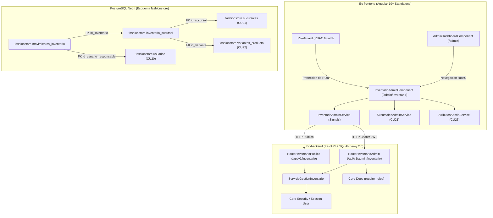
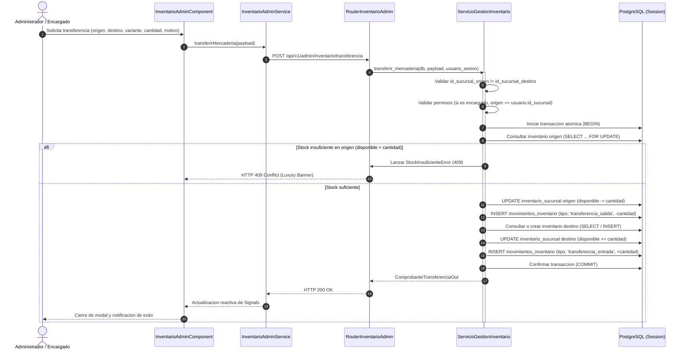

# Diseno Tecnico: CU24 - Gestionar Inventario, Stock y Existencias por Sucursal

**ID del Caso de Uso:** CU24  
**Nombre:** Gestionar Inventario, Stock y Existencias por Sucursal  
**Paquete Arquitectonico:** `gestion_operativa` / `inventario`  
**Modulo Backend:** `app/modules/gestion_operativa/cu24_inventario_stock`  
**Modulo Frontend Web:** `src/app/modules/gestion_operativa/cu24_inventario_stock`  
**Referencia de Requisitos:** `.specs/changes/CU24/spec.md`  
**Estado:** En Revision Tecnica (Fase 2 - Diseno)  

---

## 1. Arquitectura General y Enfoque

El caso de uso CU24 establece la infraestructura transaccional, contable y operativa para la administracion y trazabilidad de existencias fisicas en la red omnicanal de **FashionStore**. Modela de forma atomica el balance de prendas por boutique y variante, controlando umbrales de seguridad y registrando de manera inmutable cada operacion que altere el stock fisico mediante un libro de movimientos tipo Kardex.



### 1.1 Diagrama de Secuencia: Transferencia Inter-Sucursal ACID con Doble Kardex

La transferencia de mercaderia entre dos boutiques fisicas exige una ejecucion atomica en base de datos para garantizar que nunca se extravien prendas ni se dupliquen saldos:



### 1.2 Principios de Diseno Arquitectonico
1. **Consistencia Transaccional ACID Innegociable:**
   - Ninguna variacion de existencias puede ocurrir de manera aislada. Toda mutacion sobre `cantidad_disponible` va indisolublemente acompanada de una insercion en `movimientos_inventario` dentro del mismo bloque transaccional (`session.commit()`).
2. **Principio de Minimo Privilegio (PoLP) y Segregacion Territorial:**
   - Los encargados de sucursal (`encargado_sucursal`) solo tienen visibilidad y potestad de mutacion sobre su propia sede (`usuario_sesion.id_sucursal`). El backend rechaza proactivamente con HTTP 403 (`SUCURSAL_NO_AUTORIZADA`) cualquier intento de acceder a inventarios de sedes ajenas.
   - El administrador corporativo (`administrador`) cuenta con potestad transversal sobre todas las sedes.
3. **Invariante de No Negatividad y Proteccion Financiera:**
   - La base de datos y la capa de dominio protegen que `cantidad_disponible >= 0` mediante CHECK constraints y validaciones de servicio. Cualquier operacion de merma o traslado que vulnere esta regla se aborta con HTTP 409 Conflict.
4. **Trazabilidad Inmutable (Kardex):**
   - La tabla `movimientos_inventario` es un registro de append-only (solo inserciones). No se permiten operaciones de `UPDATE` o `DELETE` sobre movimientos historicos, garantizando auditoria forense.
5. **Ratificacion Formal de Exclusion de Ec-mobile:**
   - Las operaciones de administracion de inventario, ajustes fisicos y transferencias quedan formalmente restringidas a la plataforma web (`Ec-frontend`). La aplicacion movil unicamente accede en modo lectura al endpoint de disponibilidad publica de prendas.

---

## 2. Diseno Backend (`Ec-backend` - FastAPI + SQLAlchemy 2.0 + PostgreSQL Neon)

### 2.1 Modelos ORM en Esquema `fashionstore`

Los modelos se implementan en `app/modules/gestion_operativa/cu24_inventario_stock/modelos.py` extendiendo `Base` de SQLAlchemy 2.0:

```python
# app/modules/gestion_operativa/cu24_inventario_stock/modelos.py

from datetime import datetime, timezone
from typing import Optional
from sqlalchemy import (
    BigInteger,
    CheckConstraint,
    DateTime,
    ForeignKey,
    Integer,
    String,
    Text,
    UniqueConstraint,
)
from sqlalchemy.dialects.postgresql import ENUM as PG_ENUM
from sqlalchemy.orm import Mapped, mapped_column, relationship

from app.core.database import Base


# Tipos Enumerados PostgreSQL mapeados en esquema fashionstore
estado_prenda_stock_enum = PG_ENUM(
    "disponible",
    "reservada",
    "vendida",
    "agotada",
    "proxima_ingreso",
    "devuelta",
    name="estado_prenda_stock",
    schema="fashionstore",
    create_type=False,
)

tipo_movimiento_inv_enum = PG_ENUM(
    "ingreso_proveedor",
    "ajuste_positivo",
    "ajuste_negativo",
    "transferencia_salida",
    "transferencia_entrada",
    "venta_confirmada",
    "cancelacion_pedido",
    name="tipo_movimiento_inv",
    schema="fashionstore",
    create_type=False,
)


class InventarioSucursalORM(Base):
    """Mapeo formal de existencias fisicas de variantes por sucursal."""

    __tablename__ = "inventario_sucursal"
    __table_args__ = (
        UniqueConstraint("id_sucursal", "id_variante", name="uq_inventario_sucursal_variante"),
        CheckConstraint("cantidad_disponible >= 0", name="chk_inventario_disponible_positivo"),
        CheckConstraint("cantidad_reservada >= 0", name="chk_inventario_reservada_positivo"),
        CheckConstraint("stock_minimo >= 0", name="chk_inventario_stock_minimo_positivo"),
        CheckConstraint("stock_alerta >= 0", name="chk_inventario_stock_alerta_positivo"),
        {"schema": "fashionstore", "extend_existing": True},
    )

    id_inventario: Mapped[int] = mapped_column(BigInteger, primary_key=True, autoincrement=True)
    id_sucursal: Mapped[int] = mapped_column(
        Integer,
        ForeignKey("fashionstore.sucursales.id_sucursal"),
        nullable=False,
        index=True,
    )
    id_variante: Mapped[int] = mapped_column(
        BigInteger,
        ForeignKey("fashionstore.variantes_producto.id_variante"),
        nullable=False,
        index=True,
    )
    id_temporada: Mapped[int] = mapped_column(
        Integer,
        ForeignKey("fashionstore.temporadas.id_temporada"),
        nullable=False,
        default=1,
    )
    cantidad_disponible: Mapped[int] = mapped_column(Integer, nullable=False, default=0)
    cantidad_reservada: Mapped[int] = mapped_column(Integer, nullable=False, default=0)
    stock_minimo: Mapped[int] = mapped_column(Integer, nullable=False, default=0)
    stock_alerta: Mapped[int] = mapped_column(Integer, nullable=False, default=5)
    estado: Mapped[str] = mapped_column(
        estado_prenda_stock_enum,
        nullable=False,
        default="disponible",
        index=True,
    )
    actualizado_en: Mapped[datetime] = mapped_column(
        DateTime(timezone=True),
        nullable=False,
        default=lambda: datetime.now(timezone.utc),
        onupdate=lambda: datetime.now(timezone.utc),
    )

    # Relaciones relacionales tipadas
    sucursal = relationship(
        "app.modules.gestion_operativa.modelos.SucursalORM",
        foreign_keys=[id_sucursal],
        lazy="joined",
    )
    variante = relationship(
        "app.modules.catalogo.modelos.VarianteProductoORM",
        foreign_keys=[id_variante],
        lazy="joined",
    )
    movimientos = relationship(
        "MovimientoInventarioORM",
        back_populates="inventario",
        cascade="all, delete-orphan",
        order_by="desc(MovimientoInventarioORM.creado_en)",
    )


class MovimientoInventarioORM(Base):
    """Registro inmutable de trazabilidad contable y operativa (Kardex)."""

    __tablename__ = "movimientos_inventario"
    __table_args__ = (
        CheckConstraint("cantidad <> 0", name="chk_movimiento_cantidad_no_cero"),
        {"schema": "fashionstore", "extend_existing": True},
    )

    id_movimiento: Mapped[int] = mapped_column(BigInteger, primary_key=True, autoincrement=True)
    id_inventario: Mapped[int] = mapped_column(
        BigInteger,
        ForeignKey("fashionstore.inventario_sucursal.id_inventario"),
        nullable=False,
        index=True,
    )
    tipo_movimiento: Mapped[str] = mapped_column(
        tipo_movimiento_inv_enum,
        nullable=False,
        index=True,
    )
    cantidad: Mapped[int] = mapped_column(Integer, nullable=False)
    saldo_anterior: Mapped[int] = mapped_column(Integer, nullable=False, default=0)
    saldo_nuevo: Mapped[int] = mapped_column(Integer, nullable=False, default=0)
    motivo: Mapped[str] = mapped_column(Text, nullable=False)
    id_usuario: Mapped[Optional[int]] = mapped_column(
        BigInteger,
        ForeignKey("fashionstore.usuarios.id_usuario"),
        nullable=True,
        index=True,
    )
    referencia_documento: Mapped[Optional[str]] = mapped_column(String(100), nullable=True)
    creado_en: Mapped[datetime] = mapped_column(
        DateTime(timezone=True),
        nullable=False,
        default=lambda: datetime.now(timezone.utc),
    )

    inventario = relationship("InventarioSucursalORM", back_populates="movimientos")
    usuario_responsable = relationship(
        "app.modules.autenticacion_seguridad.modelos.UsuarioORM",
        foreign_keys=[id_usuario],
        lazy="joined",
    )
```

---

### 2.2 Esquemas Pydantic v2

Declarados en `app/modules/gestion_operativa/cu24_inventario_stock/esquemas.py`:

```python
# app/modules/gestion_operativa/cu24_inventario_stock/esquemas.py

from datetime import datetime
from enum import Enum
from typing import List, Optional
from pydantic import BaseModel, ConfigDict, Field, field_validator, model_validator


class TipoMovimientoEnum(str, Enum):
    INGRESO_PROVEEDOR = "ingreso_proveedor"
    AJUSTE_POSITIVO = "ajuste_positivo"
    AJUSTE_NEGATIVO = "ajuste_negativo"
    TRANSFERENCIA_SALIDA = "transferencia_salida"
    TRANSFERENCIA_ENTRADA = "transferencia_entrada"
    VENTA_CONFIRMADA = "venta_confirmada"
    CANCELACION_PEDIDO = "cancelacion_pedido"


class EstadoStockCalculadoEnum(str, Enum):
    OPTIMO = "optimo"
    ALERTA_BAJA = "alerta_baja"
    AGOTADO = "agotado"


class TipoAjusteManualEnum(str, Enum):
    INCREMENTO = "incremento"
    DECREMENTO = "decremento"


# --- Esquemas de Entrada (Requests) ---

class InventarioCrearIn(BaseModel):
    """Payload para registro inicial de existencias para una variante."""
    id_sucursal: int = Field(..., gt=0, description="Identificador de la boutique fisica")
    id_variante: int = Field(..., gt=0, description="Identificador de la variante de producto")
    id_temporada: int = Field(default=1, gt=0, description="Identificador de temporada comercial")
    cantidad_inicial: int = Field(..., ge=0, description="Existencias fisicas iniciales")
    stock_minimo: int = Field(default=0, ge=0, description="Nivel minimo de seguridad")
    stock_alerta: int = Field(default=5, ge=0, description="Umbral para alerta de reposicion")
    referencia_documento: Optional[str] = Field(None, max_length=100, description="Guia o comprobante")
    observacion: Optional[str] = Field(None, max_length=500, description="Nota de ingreso")


class InventarioAjusteIn(BaseModel):
    """Payload para ajuste manual por merma, rotura o sobrante fisico."""
    tipo_ajuste: TipoAjusteManualEnum = Field(..., description="Direccion del ajuste: incremento o decremento")
    cantidad: int = Field(..., gt=0, description="Numero de unidades a ajustar")
    motivo: str = Field(..., min_length=5, max_length=500, description="Justificacion obligatoria del ajuste")
    referencia_documento: Optional[str] = Field(None, max_length=100, description="Numero de acta o resolucion")

    @field_validator("motivo")
    @classmethod
    def validar_motivo(cls, valor: str) -> str:
        saneado = valor.strip()
        if len(saneado) < 5:
            raise ValueError("El motivo del ajuste debe tener al menos 5 caracteres significativos.")
        return saneado


class TransferenciaInterSucursalIn(BaseModel):
    """Payload para transferencia atomica entre dos sucursales."""
    id_sucursal_origen: int = Field(..., gt=0, description="Sede que remite la mercaderia")
    id_sucursal_destino: int = Field(..., gt=0, description="Sede receptora de la mercaderia")
    id_variante: int = Field(..., gt=0, description="Variante fisica a transferir")
    cantidad: int = Field(..., gt=0, description="Numero de prendas a trasladar")
    motivo: str = Field(..., min_length=5, max_length=500, description="Motivo del traslado inter-sedes")

    @model_validator(mode="after")
    def validar_sedes_distintas(self) -> "TransferenciaInterSucursalIn":
        if self.id_sucursal_origen == self.id_sucursal_destino:
            raise ValueError("La sucursal de origen y la de destino deben ser distintas.")
        return self


class InventarioFiltrosIn(BaseModel):
    """Parametros de consulta y filtrado multicriterio."""
    id_sucursal: Optional[int] = Field(None, gt=0)
    id_categoria: Optional[int] = Field(None, gt=0)
    estado_stock: Optional[str] = Field(None, description="optimo, alerta_baja, agotado")
    q: Optional[str] = Field(None, max_length=100, description="Busqueda por prenda o SKU")
    pagina: int = Field(default=1, ge=1)
    limite: int = Field(default=20, ge=1, le=100)


# --- Esquemas de Salida (Responses) ---

class DatosVarianteInventarioOut(BaseModel):
    model_config = ConfigDict(from_attributes=True)
    id_variante: int
    id_producto: int
    nombre_prenda: str
    sku: str
    talla: str
    color_nombre: str
    color_hex: str
    precio_base: float
    precio_final: float
    imagen_url: Optional[str] = None
    categoria_nombre: str


class DatosSucursalInventarioOut(BaseModel):
    model_config = ConfigDict(from_attributes=True)
    id_sucursal: int
    nombre: str
    ciudad: str


class InventarioItemOut(BaseModel):
    model_config = ConfigDict(from_attributes=True)
    id_inventario: int
    id_sucursal: int
    id_variante: int
    cantidad_disponible: int
    cantidad_reservada: int
    stock_total: int
    stock_minimo: int
    stock_alerta: int
    estado: str
    estado_calculado: EstadoStockCalculadoEnum
    actualizado_en: datetime
    sucursal: DatosSucursalInventarioOut
    variante: DatosVarianteInventarioOut


class ListaPaginadaInventarioOut(BaseModel):
    items: List[InventarioItemOut]
    total: int
    pagina: int
    limite: int
    total_paginas: int


class KardexItemOut(BaseModel):
    model_config = ConfigDict(from_attributes=True)
    id_movimiento: int
    id_inventario: int
    tipo_movimiento: str
    cantidad: int
    saldo_anterior: int
    saldo_nuevo: int
    motivo: str
    referencia_documento: Optional[str] = None
    id_usuario: Optional[int] = None
    usuario_nombre: Optional[str] = None
    creado_en: datetime


class HistorialKardexOut(BaseModel):
    id_inventario: int
    prenda_sku: str
    sucursal_nombre: str
    saldo_actual: int
    movimientos: List[KardexItemOut]


class ComprobanteTransferenciaOut(BaseModel):
    mensaje: str
    id_sucursal_origen: int
    id_sucursal_destino: int
    id_variante: int
    sku: str
    cantidad_transferida: int
    saldo_origen_nuevo: int
    saldo_destino_nuevo: int
    fecha: datetime


class DisponibilidadSucursalOut(BaseModel):
    id_sucursal: int
    nombre_sucursal: str
    ciudad: str
    direccion: str
    cantidad_disponible: int
    estado: str


class DisponibilidadPublicaOut(BaseModel):
    id_variante: int
    sku: str
    nombre_prenda: str
    sucursales: List[DisponibilidadSucursalOut]
```

---

### 2.3 Jerarquia de Excepciones Semanticas de Dominio

Implementadas en `app/modules/gestion_operativa/cu24_inventario_stock/errores.py`:

```python
# app/modules/gestion_operativa/cu24_inventario_stock/errores.py

from app.core.errors import AppError


class InventarioError(AppError):
    """Excepcion base para errores del modulo de inventario."""
    pass


class InventarioNoEncontradoError(InventarioError):
    def __init__(self, id_inventario: int):
        super().__init__(
            f"El registro de inventario con ID {id_inventario} no fue encontrado.",
            codigo="INVENTARIO_NO_ENCONTRADO",
            status_code=404,
        )


class InventarioDuplicadoError(InventarioError):
    def __init__(self, id_sucursal: int, id_variante: int):
        super().__init__(
            f"Ya existe un inventario registrado para la variante {id_variante} en la sucursal {id_sucursal}. Utilice la funcion de ajuste.",
            codigo="INVENTARIO_DUPLICADO",
            status_code=409,
        )


class StockInsuficienteError(InventarioError):
    def __init__(self, disponible: int, solicitado: int):
        super().__init__(
            f"Stock insuficiente para completar la operacion. Disponible: {disponible}, Solicitado: {solicitado}.",
            codigo="STOCK_INSUFICIENTE",
            status_code=409,
        )


class AutoTransferenciaError(InventarioError):
    def __init__(self):
        super().__init__(
            "No se puede transferir mercaderia a la misma sucursal de origen.",
            codigo="TRANSFERENCIA_MISMA_SUCURSAL",
            status_code=422,
        )


class MotivoInvalidoError(InventarioError):
    def __init__(self, detalle: str):
        super().__init__(
            f"Motivo de operacion invalido: {detalle}.",
            codigo="MOTIVO_OPERACION_INVALIDO",
            status_code=422,
        )


class SucursalNoAutorizadaError(InventarioError):
    def __init__(self, id_sucursal_solicitada: int, id_sucursal_usuario: int):
        super().__init__(
            f"Acceso denegado: Su perfil solo le permite gestionar la sucursal {id_sucursal_usuario}, no la sucursal {id_sucursal_solicitada}.",
            codigo="SUCURSAL_NO_AUTORIZADA",
            status_code=403,
        )


class EntidadInactivaError(InventarioError):
    def __init__(self, entidad: str):
        super().__init__(
            f"No se puede operar inventario sobre una entidad inactiva o descontinuada: {entidad}.",
            codigo="ENTIDAD_INACTIVA_PARA_INVENTARIO",
            status_code=422,
        )
```

---

### 2.4 Servicio de Dominio Transaccional (`ServicioGestionInventario`)

Implementado en `app/modules/gestion_operativa/cu24_inventario_stock/servicio.py`:

```python
# app/modules/gestion_operativa/cu24_inventario_stock/servicio.py

from datetime import datetime, timezone
import math
from typing import Optional
from sqlalchemy import and_, func, or_, select
from sqlalchemy.orm import Session, joinedload

from app.modules.autenticacion_seguridad.modelos import UsuarioORM
from app.modules.catalogo.modelos import ProductoORM, VarianteProductoORM
from app.modules.gestion_operativa.modelos import SucursalORM
from .modelos import InventarioSucursalORM, MovimientoInventarioORM
from .esquemas import (
    ComprobanteTransferenciaOut,
    DisponibilidadPublicaOut,
    DisponibilidadSucursalOut,
    EstadoStockCalculadoEnum,
    HistorialKardexOut,
    InventarioAjusteIn,
    InventarioCrearIn,
    InventarioFiltrosIn,
    InventarioItemOut,
    KardexItemOut,
    ListaPaginadaInventarioOut,
    TipoAjusteManualEnum,
    TipoMovimientoEnum,
    TransferenciaInterSucursalIn,
)
from .errores import (
    AutoTransferenciaError,
    EntidadInactivaError,
    InventarioDuplicadoError,
    InventarioNoEncontradoError,
    StockInsuficienteError,
    SucursalNoAutorizadaError,
)


class ServicioGestionInventario:
    """Logica de negocio transaccional para la gestion de existencias y kardex."""

    @staticmethod
    def _calcular_estado_stock(disponible: int, alerta: int) -> EstadoStockCalculadoEnum:
        if disponible <= 0:
            return EstadoStockCalculadoEnum.AGOTADO
        if disponible <= alerta:
            return EstadoStockCalculadoEnum.ALERTA_BAJA
        return EstadoStockCalculadoEnum.OPTIMO

    @staticmethod
    def _validar_acceso_sucursal(usuario_sesion: UsuarioORM, id_sucursal_solicitada: int) -> None:
        """Aplica la regla de segregacion territorial estricta para encargados."""
        if usuario_sesion.rol == "encargado_sucursal":
            if usuario_sesion.id_sucursal != id_sucursal_solicitada:
                raise SucursalNoAutorizadaError(
                    id_sucursal_solicitada, usuario_sesion.id_sucursal or 0
                )

    def listar_inventario(
        self, db: Session, filtros: InventarioFiltrosIn, usuario_sesion: UsuarioORM
    ) -> ListaPaginadaInventarioOut:
        # Segregacion forzada para encargado_sucursal
        id_sucursal_consulta = filtros.id_sucursal
        if usuario_sesion.rol == "encargado_sucursal":
            id_sucursal_consulta = usuario_sesion.id_sucursal
        elif id_sucursal_consulta:
            self._validar_acceso_sucursal(usuario_sesion, id_sucursal_consulta)

        condiciones = []
        if id_sucursal_consulta:
            condiciones.append(InventarioSucursalORM.id_sucursal == id_sucursal_consulta)

        stmt = (
            select(InventarioSucursalORM)
            .join(InventarioSucursalORM.variante)
            .join(VarianteProductoORM.producto)
            .options(
                joinedload(InventarioSucursalORM.sucursal),
                joinedload(InventarioSucursalORM.variante)
                .joinedload(VarianteProductoORM.producto),
                joinedload(InventarioSucursalORM.variante)
                .joinedload(VarianteProductoORM.talla),
                joinedload(InventarioSucursalORM.variante)
                .joinedload(VarianteProductoORM.color),
            )
        )

        if filtros.id_categoria:
            condiciones.append(ProductoORM.id_categoria == filtros.id_categoria)

        if filtros.q:
            termino = f"%{filtros.q.strip()}%"
            condiciones.append(
                or_(
                    ProductoORM.nombre.ilike(termino),
                    VarianteProductoORM.sku.ilike(termino),
                )
            )

        if filtros.estado_stock == "agotado":
            condiciones.append(InventarioSucursalORM.cantidad_disponible <= 0)
        elif filtros.estado_stock == "alerta_baja":
            condiciones.append(
                and_(
                    InventarioSucursalORM.cantidad_disponible > 0,
                    InventarioSucursalORM.cantidad_disponible <= InventarioSucursalORM.stock_alerta,
                )
            )
        elif filtros.estado_stock == "optimo":
            condiciones.append(
                InventarioSucursalORM.cantidad_disponible > InventarioSucursalORM.stock_alerta
            )

        if condiciones:
            stmt = stmt.where(and_(*condiciones))

        # Conteo total
        stmt_count = select(func.count(InventarioSucursalORM.id_inventario))
        if condiciones:
            stmt_count = stmt_count.select_from(InventarioSucursalORM).join(
                InventarioSucursalORM.variante
            ).join(VarianteProductoORM.producto).where(and_(*condiciones))
        total = db.scalar(stmt_count) or 0

        # Paginacion
        offset = (filtros.pagina - 1) * filtros.limite
        stmt = stmt.order_by(InventarioSucursalORM.id_inventario.desc()).offset(offset).limit(filtros.limite)
        registros = db.scalars(stmt).unique().all()

        items_out = []
        for inv in registros:
            estado_calc = self._calcular_estado_stock(inv.cantidad_disponible, inv.stock_alerta)
            items_out.append(
                self._to_inventario_item_out(inv, estado_calc)
            )

        total_paginas = math.ceil(total / filtros.limite) if total > 0 else 1
        return ListaPaginadaInventarioOut(
            items=items_out,
            total=total,
            pagina=filtros.pagina,
            limite=filtros.limite,
            total_paginas=total_paginas,
        )

    def crear_inventario_inicial(
        self, db: Session, payload: InventarioCrearIn, usuario_sesion: UsuarioORM
    ) -> InventarioItemOut:
        self._validar_acceso_sucursal(usuario_sesion, payload.id_sucursal)

        # 1. Validar sucursal activa
        sucursal = db.get(SucursalORM, payload.id_sucursal)
        if not sucursal or not sucursal.activa:
            raise EntidadInactivaError(f"Sucursal ID {payload.id_sucursal}")

        # 2. Validar variante y prenda activa
        variante = db.get(VarianteProductoORM, payload.id_variante)
        if not variante or not variante.activo or not variante.producto.activo:
            raise EntidadInactivaError(f"Variante ID {payload.id_variante}")

        # 3. Comprobar no duplicidad
        existente = db.scalar(
            select(InventarioSucursalORM).where(
                and_(
                    InventarioSucursalORM.id_sucursal == payload.id_sucursal,
                    InventarioSucursalORM.id_variante == payload.id_variante,
                )
            )
        )
        if existente:
            raise InventarioDuplicadoError(payload.id_sucursal, payload.id_variante)

        # 4. Crear entidad de inventario
        nuevo_inv = InventarioSucursalORM(
            id_sucursal=payload.id_sucursal,
            id_variante=payload.id_variante,
            id_temporada=payload.id_temporada,
            cantidad_disponible=payload.cantidad_inicial,
            cantidad_reservada=0,
            stock_minimo=payload.stock_minimo,
            stock_alerta=payload.stock_alerta,
            estado="disponible" if payload.cantidad_inicial > 0 else "agotada",
        )
        db.add(nuevo_inv)
        db.flush()

        # 5. Generar movimiento inicial en Kardex si hubo carga inicial
        if payload.cantidad_inicial > 0:
            mov = MovimientoInventarioORM(
                id_inventario=nuevo_inv.id_inventario,
                tipo_movimiento=TipoMovimientoEnum.INGRESO_PROVEEDOR.value,
                cantidad=payload.cantidad_inicial,
                saldo_anterior=0,
                saldo_nuevo=payload.cantidad_inicial,
                motivo=payload.observacion or "Carga inicial de existencias",
                id_usuario=usuario_sesion.id_usuario,
                referencia_documento=payload.referencia_documento,
            )
            db.add(mov)

        db.commit()
        db.refresh(nuevo_inv)
        estado_calc = self._calcular_estado_stock(nuevo_inv.cantidad_disponible, nuevo_inv.stock_alerta)
        return self._to_inventario_item_out(nuevo_inv, estado_calc)

    def ajustar_inventario(
        self, db: Session, id_inventario: int, payload: InventarioAjusteIn, usuario_sesion: UsuarioORM
    ) -> InventarioItemOut:
        inv = db.get(InventarioSucursalORM, id_inventario)
        if not inv:
            raise InventarioNoEncontradoError(id_inventario)

        self._validar_acceso_sucursal(usuario_sesion, inv.id_sucursal)

        saldo_anterior = inv.cantidad_disponible
        if payload.tipo_ajuste == TipoAjusteManualEnum.INCREMENTO:
            saldo_nuevo = saldo_anterior + payload.cantidad
            tipo_mov = TipoMovimientoEnum.AJUSTE_POSITIVO.value
            delta = payload.cantidad
        else:
            if saldo_anterior < payload.cantidad:
                raise StockInsuficienteError(disponible=saldo_anterior, solicitado=payload.cantidad)
            saldo_nuevo = saldo_anterior - payload.cantidad
            tipo_mov = TipoMovimientoEnum.AJUSTE_NEGATIVO.value
            delta = -payload.cantidad

        inv.cantidad_disponible = saldo_nuevo
        inv.estado = "disponible" if saldo_nuevo > 0 else "agotada"
        inv.actualizado_en = datetime.now(timezone.utc)

        # Registro inmutable en Kardex
        mov = MovimientoInventarioORM(
            id_inventario=inv.id_inventario,
            tipo_movimiento=tipo_mov,
            cantidad=delta,
            saldo_anterior=saldo_anterior,
            saldo_nuevo=saldo_nuevo,
            motivo=payload.motivo,
            id_usuario=usuario_sesion.id_usuario,
            referencia_documento=payload.referencia_documento,
        )
        db.add(mov)
        db.commit()
        db.refresh(inv)

        estado_calc = self._calcular_estado_stock(inv.cantidad_disponible, inv.stock_alerta)
        return self._to_inventario_item_out(inv, estado_calc)

    def transferir_mercaderia(
        self, db: Session, payload: TransferenciaInterSucursalIn, usuario_sesion: UsuarioORM
    ) -> ComprobanteTransferenciaOut:
        if payload.id_sucursal_origen == payload.id_sucursal_destino:
            raise AutoTransferenciaError()

        self._validar_acceso_sucursal(usuario_sesion, payload.id_sucursal_origen)

        # 1. Validar sedes activas
        origen_suc = db.get(SucursalORM, payload.id_sucursal_origen)
        destino_suc = db.get(SucursalORM, payload.id_sucursal_destino)
        if not origen_suc or not origen_suc.activa:
            raise EntidadInactivaError(f"Sucursal Origen ID {payload.id_sucursal_origen}")
        if not destino_suc or not destino_suc.activa:
            raise EntidadInactivaError(f"Sucursal Destino ID {payload.id_sucursal_destino}")

        # 2. Localizar y bloquear inventario origen
        inv_origen = db.scalar(
            select(InventarioSucursalORM).where(
                and_(
                    InventarioSucursalORM.id_sucursal == payload.id_sucursal_origen,
                    InventarioSucursalORM.id_variante == payload.id_variante,
                )
            ).with_for_update()
        )
        if not inv_origen or inv_origen.cantidad_disponible < payload.cantidad:
            disponible = inv_origen.cantidad_disponible if inv_origen else 0
            raise StockInsuficienteError(disponible=disponible, solicitado=payload.cantidad)

        # 3. Localizar o instanciar inventario destino
        inv_destino = db.scalar(
            select(InventarioSucursalORM).where(
                and_(
                    InventarioSucursalORM.id_sucursal == payload.id_sucursal_destino,
                    InventarioSucursalORM.id_variante == payload.id_variante,
                )
            ).with_for_update()
        )

        saldo_origen_ant = inv_origen.cantidad_disponible
        inv_origen.cantidad_disponible -= payload.cantidad
        inv_origen.estado = "disponible" if inv_origen.cantidad_disponible > 0 else "agotada"
        inv_origen.actualizado_en = datetime.now(timezone.utc)

        if not inv_destino:
            inv_destino = InventarioSucursalORM(
                id_sucursal=payload.id_sucursal_destino,
                id_variante=payload.id_variante,
                id_temporada=inv_origen.id_temporada,
                cantidad_disponible=payload.cantidad,
                cantidad_reservada=0,
                stock_minimo=inv_origen.stock_minimo,
                stock_alerta=inv_origen.stock_alerta,
                estado="disponible",
            )
            db.add(inv_destino)
            db.flush()
            saldo_destino_ant = 0
            saldo_destino_nuevo = payload.cantidad
        else:
            saldo_destino_ant = inv_destino.cantidad_disponible
            inv_destino.cantidad_disponible += payload.cantidad
            saldo_destino_nuevo = inv_destino.cantidad_disponible
            inv_destino.estado = "disponible"
            inv_destino.actualizado_en = datetime.now(timezone.utc)

        # Insercion de movimientos espejo en Kardex
        mov_salida = MovimientoInventarioORM(
            id_inventario=inv_origen.id_inventario,
            tipo_movimiento=TipoMovimientoEnum.TRANSFERENCIA_SALIDA.value,
            cantidad=-payload.cantidad,
            saldo_anterior=saldo_origen_ant,
            saldo_nuevo=inv_origen.cantidad_disponible,
            motivo=f"Transferencia hacia {destino_suc.nombre}: {payload.motivo}",
            id_usuario=usuario_sesion.id_usuario,
            referencia_documento=f"TRF-OUT->{destino_suc.id_sucursal}",
        )
        mov_entrada = MovimientoInventarioORM(
            id_inventario=inv_destino.id_inventario,
            tipo_movimiento=TipoMovimientoEnum.TRANSFERENCIA_ENTRADA.value,
            cantidad=payload.cantidad,
            saldo_anterior=saldo_destino_ant,
            saldo_nuevo=saldo_destino_nuevo,
            motivo=f"Transferencia desde {origen_suc.nombre}: {payload.motivo}",
            id_usuario=usuario_sesion.id_usuario,
            referencia_documento=f"TRF-IN<-{origen_suc.id_sucursal}",
        )
        db.add_all([mov_salida, mov_entrada])
        db.commit()

        variante = db.get(VarianteProductoORM, payload.id_variante)
        return ComprobanteTransferenciaOut(
            mensaje="Transferencia inter-sucursal completada exitosamente.",
            id_sucursal_origen=payload.id_sucursal_origen,
            id_sucursal_destino=payload.id_sucursal_destino,
            id_variante=payload.id_variante,
            sku=variante.sku if variante else "N/A",
            cantidad_transferida=payload.cantidad,
            saldo_origen_nuevo=inv_origen.cantidad_disponible,
            saldo_destino_nuevo=saldo_destino_nuevo,
            fecha=datetime.now(timezone.utc),
        )

    def obtener_kardex(
        self, db: Session, id_inventario: int, usuario_sesion: UsuarioORM
    ) -> HistorialKardexOut:
        inv = db.get(InventarioSucursalORM, id_inventario)
        if not inv:
            raise InventarioNoEncontradoError(id_inventario)

        self._validar_acceso_sucursal(usuario_sesion, inv.id_sucursal)

        movs = db.scalars(
            select(MovimientoInventarioORM)
            .where(MovimientoInventarioORM.id_inventario == id_inventario)
            .order_by(MovimientoInventarioORM.creado_en.desc())
        ).all()

        kardex_items = []
        for m in movs:
            nombre_u = "Sistema"
            if m.usuario_responsable:
                nombre_u = f"{m.usuario_responsable.nombres} {m.usuario_responsable.apellidos}".strip()
            kardex_items.append(
                KardexItemOut(
                    id_movimiento=m.id_movimiento,
                    id_inventario=m.id_inventario,
                    tipo_movimiento=m.tipo_movimiento,
                    cantidad=m.cantidad,
                    saldo_anterior=m.saldo_anterior,
                    saldo_nuevo=m.saldo_nuevo,
                    motivo=m.motivo,
                    referencia_documento=m.referencia_documento,
                    id_usuario=m.id_usuario,
                    usuario_nombre=nombre_u,
                    creado_en=m.creado_en,
                )
            )

        return HistorialKardexOut(
            id_inventario=inv.id_inventario,
            prenda_sku=f"{inv.variante.producto.nombre} ({inv.variante.sku})",
            sucursal_nombre=inv.sucursal.nombre,
            saldo_actual=inv.cantidad_disponible,
            movimientos=kardex_items,
        )

    def consultar_disponibilidad_publica(
        self, db: Session, id_variante: int
    ) -> DisponibilidadPublicaOut:
        variante = db.get(VarianteProductoORM, id_variante)
        if not variante or not variante.activo or not variante.producto.activo:
            raise EntidadInactivaError(f"Variante ID {id_variante}")

        registros = db.scalars(
            select(InventarioSucursalORM)
            .join(InventarioSucursalORM.sucursal)
            .where(
                and_(
                    InventarioSucursalORM.id_variante == id_variante,
                    SucursalORM.activa.is_(True),
                )
            )
        ).all()

        sucursales_out = []
        for r in registros:
            sucursales_out.append(
                DisponibilidadSucursalOut(
                    id_sucursal=r.id_sucursal,
                    nombre_sucursal=r.sucursal.nombre,
                    ciudad=r.sucursal.ciudad.nombre if r.sucursal.ciudad else "",
                    direccion=r.sucursal.direccion,
                    cantidad_disponible=r.cantidad_disponible,
                    estado="disponible" if r.cantidad_disponible > 0 else "agotada",
                )
            )

        return DisponibilidadPublicaOut(
            id_variante=variante.id_variante,
            sku=variante.sku,
            nombre_prenda=variante.producto.nombre,
            sucursales=sucursales_out,
        )
```

---

### 2.5 Rutas y Endpoints REST (FastAPI)

Implementados en `app/modules/gestion_operativa/cu24_inventario_stock/router.py`:

| Metodo | Ruta | Proteccion RBAC | Codigos HTTP | Descripcion |
|---|---|---|---|---|
| `GET` | `/api/v1/admin/inventario` | `["administrador", "encargado_sucursal"]` | 200, 401, 403 | Consulta paginada con filtros multicriterio (segregacion de sede forzada para encargados). |
| `POST` | `/api/v1/admin/inventario` | `["administrador", "encargado_sucursal"]` | 201, 409, 422 | Asignacion de existencias iniciales para variante en sucursal con kardex. |
| `POST` | `/api/v1/admin/inventario/{id}/ajuste` | `["administrador", "encargado_sucursal"]` | 200, 404, 409, 422 | Ajuste manual por merma, rotura o sobrante fisico con justificacion obligatoria. |
| `POST` | `/api/v1/admin/inventario/transferencia` | `["administrador", "encargado_sucursal"]` | 200, 404, 409, 422 | Transferencia atomica inter-sucursales (origen -> destino) con doble registro en Kardex. |
| `GET` | `/api/v1/admin/inventario/{id}/kardex` | `["administrador", "encargado_sucursal"]` | 200, 404, 403 | Consulta cronologica del historial de movimientos de inventario de una variante. |
| `GET` | `/api/v1/inventario/disponibilidad/{id_variante}` | Publico (Sin autenticacion) | 200, 422 | Consulta abierta de disponibilidad fisica en tiendas para catalogo web/movil. |

---

## 3. Diseno Frontend Web (`Ec-frontend` - Angular 19+ Standalone)

### 3.1 Modelos e Interfaces TypeScript (`inventario.dto.ts`)

Ubicado en `src/app/modules/gestion_operativa/cu24_inventario_stock/modelos/inventario.dto.ts`:

```typescript
// inventario.dto.ts

export type EstadoStockCalculado = 'optimo' | 'alerta_baja' | 'agotado';
export type TipoAjusteManual = 'incremento' | 'decremento';

export interface DatosVarianteInventario {
  id_variante: number;
  id_producto: number;
  nombre_prenda: str;
  sku: string;
  talla: string;
  color_nombre: string;
  color_hex: string;
  precio_base: number;
  precio_final: number;
  imagen_url?: string | null;
  categoria_nombre: string;
}

export interface DatosSucursalInventario {
  id_sucursal: number;
  nombre: string;
  ciudad: string;
}

export interface ItemInventarioAdmin {
  id_inventario: number;
  id_sucursal: number;
  id_variante: number;
  cantidad_disponible: number;
  cantidad_reservada: number;
  stock_total: number;
  stock_minimo: number;
  stock_alerta: number;
  estado: string;
  estado_calculado: EstadoStockCalculado;
  actualizado_en: string;
  sucursal: DatosSucursalInventario;
  variante: DatosVarianteInventario;
}

export interface InventarioCrearPayload {
  id_sucursal: number;
  id_variante: number;
  id_temporada?: number;
  cantidad_inicial: number;
  stock_minimo: number;
  stock_alerta: number;
  referencia_documento?: string;
  observacion?: string;
}

export interface InventarioAjustePayload {
  tipo_ajuste: TipoAjusteManual;
  cantidad: number;
  motivo: string;
  referencia_documento?: string;
}

export interface TransferenciaInterSucursalPayload {
  id_sucursal_origen: number;
  id_sucursal_destino: number;
  id_variante: number;
  cantidad: number;
  motivo: string;
}

export interface KardexItem {
  id_movimiento: number;
  id_inventario: number;
  tipo_movimiento: string;
  cantidad: number;
  saldo_anterior: number;
  saldo_nuevo: number;
  motivo: string;
  referencia_documento?: string;
  usuario_nombre?: string;
  creado_en: string;
}

export interface HistorialKardex {
  id_inventario: number;
  prenda_sku: string;
  sucursal_nombre: string;
  saldo_actual: number;
  movimientos: KardexItem[];
}

export interface ParametrosFiltroInventario {
  id_sucursal?: number;
  id_categoria?: number;
  estado_stock?: string;
  q?: string;
  pagina?: number;
  limite?: number;
}

export interface ListaPaginadaInventario {
  items: ItemInventarioAdmin[];
  total: number;
  pagina: number;
  limite: number;
  total_paginas: number;
}
```

---

### 3.2 Servicio HTTP Reactivo con Angular Signals (`InventarioAdminService`)

Ubicado en `src/app/modules/gestion_operativa/cu24_inventario_stock/servicios/inventario-admin.service.ts`:

- Inyeccion de dependencias: `HttpClient`, `LoginService`.
- Estado Reactivo gobernado por Signals:
  * `inventario = signal<ItemInventarioAdmin[]>([])`
  * `totalRegistros = signal<number>(0)`
  * `paginaActual = signal<number>(1)`
  * `totalPaginas = signal<number>(1)`
  * `cargando = signal<boolean>(false)`
  * `guardando = signal<boolean>(false)`
  * `kardexActual = signal<HistorialKardex | null>(null)`
  * `error = signal<string | null>(null)`
  * `mensajeExito = signal<string | null>(null)`
  * `filtros = signal<ParametrosFiltroInventario>({ pagina: 1, limite: 20 })`
- Metodos publicos:
  * `cargarInventario(filtros?: ParametrosFiltroInventario): void`
  * `crearStockInicial(payload: InventarioCrearPayload): Observable<ItemInventarioAdmin>`
  * `ajustarStock(idInventario: number, payload: InventarioAjustePayload): Observable<ItemInventarioAdmin>`
  * `transferirMercaderia(payload: TransferenciaInterSucursalPayload): Observable<any>`
  * `cargarKardex(idInventario: number): Observable<HistorialKardex>`
  * `limpiarMensajes(): void`

---

### 3.3 Integracion en `AdminDashboardComponent`

El panel principal `/admin` integra la 5ta tarjeta boutique:
- **Titulo:** "Inventario y Stock"
- **Categoria:** "Logistica y Existencias"
- **Descripcion:** "Monitoreo de existencias fisicas, control de mermas, reposicion y traspasos entre sedes."
- **Badge:** "Control Operativo"
- **Boton:** `id="btn-gestionar-inventario"`, `routerLink="/admin/inventario"`, `(click)="navegar('/admin/inventario')"`.
- **Visibilidad:** Visible tanto si `esAdmin()` es verdadero como si `esEncargado()` es verdadero.
- **Rejilla responsiva:** Se adapta limpiamente mediante rejilla flexible de diseno institucional.

---

### 3.4 Componente Standalone `InventarioAdminComponent` (`/admin/inventario`)

1. **Layout y Diseno Editorial Atelier:**
   - Contenedor: `max-w-[1440px] px-6 py-8 mx-auto`.
   - Paleta cromatica: Fondo `bg-slate-50 / bg-white`, acentos `Camel (#AD8C63)` y contraste `Obsidian (#0F172A)`.
   - Boton de navegacion superior: `"<- Volver al Panel Principal"` con enlace a `/admin`.
2. **Barra de Filtros Multicriterio:**
   - Input reactivo de busqueda textual `q` (debounce de 300ms).
   - Selector de sucursal: Al entrar un `encargado_sucursal`, se bloquea (`disabled`) mostrando su boutique propia; para `administrador`, desplegable completo con opcion "Todas las sedes".
   - Selector de categoria taxonomica (alimentado por `AtributosAdminService`).
   - Selector de estado de stock: `Todos`, `Optimo`, `Alerta de Reposicion`, `Agotados`.
3. **Tabla Maestra Editorial:**
   - Miniatura de prenda (52x52px, `rounded-xl`, `border-slate-200`) o placeholder sobrio.
   - Detalle de variante: modelo, SKU corporativo, talla y muestra visual `#HEX`.
   - Sede asignada.
   - Balance de existencias: columna destacada con `cantidad_disponible` y detalle sutil de `cantidad_reservada`.
   - Badges cromados de estado:
     * `Optimo` (Verde Esmeralda).
     * `Alerta de Reposicion` (Ambar / Camel pulsante).
     * `Agotado` (Rojo Carmesi).
   - Botones de accion: "Ajustar", "Transferir" y "Kardex".
4. **Modales Reactivos con `NonNullableFormBuilder`:**
   - **Modal de Alta Inicial (`+ INGRESAR MERCADERIA`):** Selección de producto, variante, sucursal, cantidad inicial y umbrales.
   - **Modal de Ajuste Manual:** Selector de incremento/decremento, cantidad (con validación de límite) y textarea con justificación obligatoria (mínimo 5 caracteres).
   - **Modal de Transferencia:** Dropdown de sede destino (excluyendo automáticamente origen), cantidad limitada a disponible y motivo.
   - **Modal / Panel de Kardex:** Cronología visual descendente con fecha, tipo de movimiento, variación (+/-), saldos anterior/nuevo y usuario responsable.
5. **Luxury Banners:**
   - Componente no destructivo que captura errores HTTP 409 y 422 mostrando explicaciones claras sin cerrar los modales ni resetear los datos digitados por el operador.

---

## 4. Estrategia de Pruebas Automatizadas

### 4.1 Backend (`pytest` en `Ec-backend`)
Ubicacion: `tests/modules/gestion_operativa/test_cu24_inventario_stock.py`.
- **Casos de Acceso y RBAC:** Rechazo 401 si no hay token; rechazo 403 para cajero/cliente; acceso concedido a administrador y encargado_sucursal (AC-1).
- **Segregacion Territorial:** Rechazo 403 cuando un encargado intenta consultar o modificar una sucursal distinta a la suya (AC-2).
- **Consulta Paginada y Filtros:** Paginacion limpia, filtrado por categoria, por estado y por texto (AC-3, AC-4).
- **Alta Inicial:** Creacion exitosa con generacion de kardex inicial (AC-5); rechazo 409 ante duplicidad (AC-6); rechazo 422 ante sede/variante inactiva (AC-7).
- **Ajustes Manuales:** Incremento y decremento con kardex (AC-8); rechazo 409 si el decremento supera el disponible (AC-9); rechazo 422 si el motivo tiene menos de 5 caracteres (AC-10).
- **Transferencias:** Transferencia inter-sucursal atomica con doble registro en kardex (AC-11); rechazo 422 ante auto-transferencia (AC-12); rechazo 409 ante saldo insuficiente en origen (AC-13).
- **Kardex y Disponibilidad:** Consulta de historial cronologico (AC-14); consulta publica de disponibilidad (AC-15).

### 4.2 Frontend (`Vitest` en `Ec-frontend`)
- `inventario-admin.service.spec.ts`: Operaciones HTTP reactivas con `HttpTestingController` y evaluacion de Signals.
- `inventario-admin.component.spec.ts`: Inicializacion, renderizado de tabla, filtros interactivos con debounce, bloqueo del selector para encargados, apertura/cierre de modales y Luxury Banners ante 409/422.
- `admin-dashboard.component.spec.ts`: Presencia y enlace del boton `#btn-gestionar-inventario` para administrador y encargado.

---

## 5. Matriz de Trazabilidad Requisitos (EARS) vs Componentes Tecnicos

| Requisito EARS | Componente Backend | Componente Frontend | Verificacion |
|---|---|---|---|
| **# AC-1 (RBAC)** | `require_roles(["administrador", "encargado_sucursal"])` | `roleGuard` en `app.routes.ts` | Pytest `test_cu24_rbac` / Vitest `role.guard.spec` |
| **# AC-2 (Segregacion)** | `ServicioGestionInventario._validar_acceso_sucursal` | Selector de sede bloqueado con `esEncargado()` | Pytest `test_cu24_segregacion` |
| **# AC-3 (Listado Paginado)** | `ServicioGestionInventario.listar_inventario` | Tabla maestra con Signals | Pytest `test_cu24_listar` / Vitest `inventario.component.spec` |
| **# AC-4 (Filtros)** | Parametros query y clausulas `where()` dinamicas | Barra de filtros con `debounce` | Pytest `test_cu24_filtros` |
| **# AC-5 (Stock Inicial)** | `ServicioGestionInventario.crear_inventario_inicial` | Modal `FormularioIngresoMercaderia` | Pytest `test_cu24_crear_inicial` |
| **# AC-6 (Duplicidad 409)** | `InventarioDuplicadoError` (409) | Luxury Banner de conflicto 409 | Pytest `test_cu24_duplicado_409` |
| **# AC-7 (Inactiva 422)** | `EntidadInactivaError` (422) | Luxury Banner 422 | Pytest `test_cu24_inactiva_422` |
| **# AC-8 (Ajuste Manual)** | `ServicioGestionInventario.ajustar_inventario` | Modal de ajuste contextual | Pytest `test_cu24_ajuste_exitoso` |
| **# AC-9 (No Negatividad 409)**| `StockInsuficienteError` (409) | Validacion reactiva de maximo y banner 409 | Pytest `test_cu24_saldo_negativo_409` |
| **# AC-10 (Motivo Obligatorio)**| `@field_validator("motivo")` | `Validators.minLength(5)` | Pytest `test_cu24_motivo_invalido_422` |
| **# AC-11 (Transferencia ACID)**| `ServicioGestionInventario.transferir_mercaderia` | Modal de transferencia | Pytest `test_cu24_transferencia` |
| **# AC-12 (Auto-Transferencia)**| `AutoTransferenciaError` (422) | Exclusion automatica de origen en dropdown | Pytest `test_cu24_auto_transferencia_422` |
| **# AC-13 (Stock Origen 409)** | `StockInsuficienteError` (409) | Validacion síncrona en modal | Pytest `test_cu24_stock_origen_409` |
| **# AC-14 (Kardex)** | `ServicioGestionInventario.obtener_kardex` | Panel / Modal de Kardex | Pytest `test_cu24_kardex` |
| **# AC-15 (Disponibilidad)** | `ServicioGestionInventario.consultar_disponibilidad_publica`| Consumo por catalogo cliente | Pytest `test_cu24_disponibilidad` |
| **# AC-16 (Tarjeta Dashboard)** | N/A | `AdminDashboardComponent` | Vitest `admin-dashboard.component.spec` |
| **# AC-17 (Ruta Protegida)** | N/A | `InventarioAdminComponent` | Vitest `inventario-admin.component.spec` |
| **# AC-18 (Boton Retorno)** | N/A | Boton `"<- Volver al Panel Principal"` | Vitest `inventario-admin.component.spec` |
| **# AC-19 (Tabla Editorial)** | N/A | Tabla con miniaturas y badges | Vitest `inventario-admin.component.spec` |
| **# AC-20 (Sede Bloqueada)** | N/A | Selector deshabilitado para encargados | Vitest `inventario-admin.component.spec` |
| **# AC-21 (Modal Alta)** | N/A | Formulario reactivo tipado | Vitest `inventario-admin.component.spec` |
| **# AC-22 (Modal Ajuste)** | N/A | Formulario de ajuste con motivo | Vitest `inventario-admin.component.spec` |
| **# AC-23 (Modal Transfer)** | N/A | Formulario de traslado inter-sedes | Vitest `inventario-admin.component.spec` |
| **# AC-24 (Panel Kardex)** | N/A | Modal con cronologia de movimientos | Vitest `inventario-admin.component.spec` |
| **# AC-25 (Banners y Signals)**| N/A | `InventarioAdminService` y Luxury Banners | Vitest y `ng build` (0 errores) |
