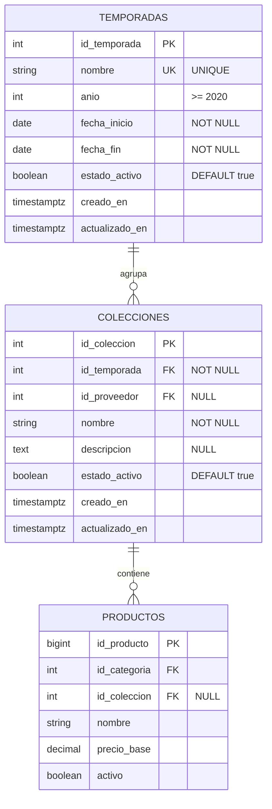

# Diseno Tecnico y Contratos de Arquitectura: [CU24] Gestionar temporadas y colecciones

**Codigo del Caso de Uso:** CU24  
**Denominacion Oficial:** Gestionar temporadas y colecciones  
**Modulo de Arquitectura:** Catalogo / Taxonomia Comercial (`catalogo_productos`)  
**Metodologia:** Spec-Driven Development (SDD) & Proceso Unificado de Desarrollo de Software (PUDS)  
**Alcance Tecnico:**  
- Backend: Python 3.13 + FastAPI + SQLAlchemy 2.0 + PostgreSQL Neon  
- Frontend Web: Angular 19+ (Standalone Components, Signals, OnPush y Tailwind CSS)  
- Aplicacion Movil: **Excluida formalmente (0 modelos, 0 servicios, 0 pantallas en Flutter)**  

---

## 1. Arquitectura General y Exclusion de Plataforma

### 1.1 Diagrama de Arquitectura del Sistema

```
+-----------------------------------------------------------------------------------+
|                            Ec-frontend (Angular 19+)                             |
|                                                                                   |
|  AdminDashboardComponent                                                          |
|    └─ Tarjeta Boutique "Gestionar temporadas y colecciones" [RBAC Admin/Encargado] |
|                                                                                   |
|  TemporadasColeccionesAdminComponent (/admin/temporadas-colecciones)              |
|    ├─ Pestana 1: Temporadas Comerciales (Tabla Maestra + Modales + Signals)       |
|    └─ Pestana 2: Colecciones y Capsulas (Tabla Maestra + Modales + Signals)       |
|                                                                                   |
|  TemporadasColeccionesAdminService (Angular Signals + HttpClient)                 |
+------------------------------------------+----------------------------------------+
                                           | HTTP REST / JSON (JWT Bearer)
                                           v
+-----------------------------------------------------------------------------------+
|                             Ec-backend (FastAPI)                                 |
|                                                                                   |
|  app/modules/catalogo/cu24_temporadas_colecciones/                                |
|    ├─ router.py (GET, POST, PUT, PATCH /api/v1/admin/temporadas y /colecciones)  |
|    ├─ esquemas.py (Pydantic v2 DTOs con validacion cronologica de fechas)        |
|    ├─ errores.py (Jerarquia de Excepciones Semanticas de Dominio)                 |
|    └─ servicio.py (ServicioGestionTemporadas & ServicioGestionColecciones)        |
|                                                                                   |
|  SQLAlchemy 2.0 ORM:                                                              |
|    ├─ TemporadaORM (fashionstore.temporadas)                                      |
|    └─ ColeccionORM (fashionstore.colecciones)                                     |
+------------------------------------------+----------------------------------------+
                                           | Conectividad Transaccional Neon
                                           v
+-----------------------------------------------------------------------------------+
|                        Base de Datos PostgreSQL (Neon Cloud)                      |
|                                                                                   |
|  Esquema `fashionstore`:                                                          |
|    ├─ fashionstore.temporadas (id_temporada PK, nombre UNIQUE, anio, fechas...)   |
|    ├─ fashionstore.colecciones (id_coleccion PK, id_temporada FK, nombre...)     |
|    └─ fashionstore.productos (id_producto PK, id_coleccion FK...)                 |
+-----------------------------------------------------------------------------------+
```

### 1.2 Justificacion Formal de Exclusion de la Aplicacion Movil (`Ec-mobile`)
La aplicacion movil de FashionStore (`Ec-mobile`), desarrollada en Flutter 3.x, esta concebida de forma exclusiva para la experiencia B2C del cliente final (exploracion editorial, vestidor virtual con Realidad Aumentada, bolsa de compras y pago digital).  
La parametrizacion del calendario estacional de la moda, el establecimiento de vigencias formales de apertura y cierre de temporadas, y la curaduria de colecciones capsula constituyen labores analiticas y de planificacion de mercadeo que competen con exclusividad al personal directivo y de administracion en el panel web (`Ec-frontend`).  
Por consiguiente, se ratifica la total exclusion de `Ec-mobile` de este caso de uso: no existen modelos Dart, servicios HTTP ni vistas en Flutter asociados a la administracion de temporadas y colecciones.

---

## 2. Modelo Relacional de Base de Datos y Migracion Alembic

### 2.1 Esquema Relacional de Base de Datos (`fashionstore`)



### 2.2 Estrategia DDL y Migracion Alembic Idempotente

El esquema base de PostgreSQL cuenta con las tablas `fashionstore.temporadas` y `fashionstore.colecciones`. Para soportar las directivas de negocio de este caso de uso, se disenara una migracion Alembic (`alembic/versions/0007_cu24_temporadas_colecciones.py`) idempotente:

```sql
-- 1. Actualizacion de tabla fashionstore.temporadas
ALTER TABLE fashionstore.temporadas 
    ADD COLUMN IF NOT EXISTS anio INTEGER NOT NULL DEFAULT EXTRACT(YEAR FROM CURRENT_DATE);

ALTER TABLE fashionstore.temporadas 
    ADD COLUMN IF NOT EXISTS estado_activo BOOLEAN NOT NULL DEFAULT TRUE;

ALTER TABLE fashionstore.temporadas 
    ADD COLUMN IF NOT EXISTS creado_en TIMESTAMPTZ NOT NULL DEFAULT now();

ALTER TABLE fashionstore.temporadas 
    ADD COLUMN IF NOT EXISTS actualizado_en TIMESTAMPTZ NOT NULL DEFAULT now();

-- Restricciones e indices unicos
DO $$
BEGIN
    IF NOT EXISTS (
        SELECT 1 FROM pg_constraint WHERE conname = 'chk_temporadas_fechas_orden'
    ) THEN
        ALTER TABLE fashionstore.temporadas 
            ADD CONSTRAINT chk_temporadas_fechas_orden CHECK (fecha_fin > fecha_inicio);
    END IF;

    IF NOT EXISTS (
        SELECT 1 FROM pg_constraint WHERE conname = 'chk_temporadas_anio_valido'
    ) THEN
        ALTER TABLE fashionstore.temporadas 
            ADD CONSTRAINT chk_temporadas_anio_valido CHECK (anio >= 2020);
    END IF;
END $$;

CREATE UNIQUE INDEX IF NOT EXISTS uq_temporadas_nombre_lower 
    ON fashionstore.temporadas (LOWER(TRIM(nombre)));

-- 2. Actualizacion de tabla fashionstore.colecciones
ALTER TABLE fashionstore.colecciones 
    ADD COLUMN IF NOT EXISTS estado_activo BOOLEAN NOT NULL DEFAULT TRUE;

ALTER TABLE fashionstore.colecciones 
    ADD COLUMN IF NOT EXISTS actualizado_en TIMESTAMPTZ NOT NULL DEFAULT now();

CREATE UNIQUE INDEX IF NOT EXISTS uq_colecciones_temporada_nombre_lower 
    ON fashionstore.colecciones (id_temporada, LOWER(TRIM(nombre)));
```

---

## 3. Diseno del Backend (`Ec-backend` - FastAPI + SQLAlchemy 2.0)

### 3.1 Modelos ORM (`modelos.py`)

Ubicacion: `app/modules/catalogo/cu24_temporadas_colecciones/modelos.py` (reutilizando y extendiendo las clases de `app/modules/catalogo/modelos.py`):

```python
from datetime import date, datetime, timezone
from typing import List, Optional
from sqlalchemy import (
    Boolean,
    CheckConstraint,
    Date,
    DateTime,
    ForeignKey,
    Integer,
    String,
    Text,
    UniqueConstraint,
)
from sqlalchemy.orm import Mapped, mapped_column, relationship
from core.database import Base

class TemporadaORM(Base):
    __tablename__ = "temporadas"
    __table_args__ = (
        CheckConstraint("fecha_fin > fecha_inicio", name="chk_temporadas_fechas_orden"),
        CheckConstraint("anio >= 2020", name="chk_temporadas_anio_valido"),
        {"schema": "fashionstore"},
    )

    id_temporada: Mapped[int] = mapped_column(Integer, primary_key=True, autoincrement=True)
    nombre: Mapped[str] = mapped_column(String(100), nullable=False)
    anio: Mapped[int] = mapped_column(Integer, nullable=False, default=2026)
    fecha_inicio: Mapped[date] = mapped_column(Date, nullable=False)
    fecha_fin: Mapped[date] = mapped_column(Date, nullable=False)
    estado_activo: Mapped[bool] = mapped_column(Boolean, nullable=False, default=True)
    creado_en: Mapped[datetime] = mapped_column(
        DateTime(timezone=True), default=lambda: datetime.now(timezone.utc)
    )
    actualizado_en: Mapped[datetime] = mapped_column(
        DateTime(timezone=True),
        default=lambda: datetime.now(timezone.utc),
        onupdate=lambda: datetime.now(timezone.utc),
    )

    colecciones: Mapped[List["ColeccionORM"]] = relationship(
        "ColeccionORM", back_populates="temporada", cascade="all, delete-orphan"
    )


class ColeccionORM(Base):
    __tablename__ = "colecciones"
    __table_args__ = (
        UniqueConstraint("id_temporada", "nombre", name="uq_colecciones_temporada_nombre"),
        {"schema": "fashionstore"},
    )

    id_coleccion: Mapped[int] = mapped_column(Integer, primary_key=True, autoincrement=True)
    id_temporada: Mapped[int] = mapped_column(
        Integer, ForeignKey("fashionstore.temporadas.id_temporada"), nullable=False, index=True
    )
    id_proveedor: Mapped[Optional[int]] = mapped_column(Integer, nullable=True)
    nombre: Mapped[str] = mapped_column(String(150), nullable=False)
    descripcion: Mapped[Optional[str]] = mapped_column(Text, nullable=True)
    estado_activo: Mapped[bool] = mapped_column(Boolean, nullable=False, default=True)
    creado_en: Mapped[datetime] = mapped_column(
        DateTime(timezone=True), default=lambda: datetime.now(timezone.utc)
    )
    actualizado_en: Mapped[datetime] = mapped_column(
        DateTime(timezone=True),
        default=lambda: datetime.now(timezone.utc),
        onupdate=lambda: datetime.now(timezone.utc),
    )

    temporada: Mapped["TemporadaORM"] = relationship("TemporadaORM", back_populates="colecciones")
```

### 3.2 Jerarquia de Excepciones Semanticas de Dominio (`errores.py`)

Ubicacion: `app/modules/catalogo/cu24_temporadas_colecciones/errores.py`:

```python
from fastapi import HTTPException, status

class TemporadaError(HTTPException):
    def __init__(self, status_code: int, codigo: str, mensaje: str):
        super().__init__(status_code=status_code, detail={"codigo": codigo, "mensaje": mensaje})

class TemporadaNoEncontradaError(TemporadaError):
    def __init__(self, id_temporada: int):
        super().__init__(
            status.HTTP_404_NOT_FOUND,
            "TEMPORADA_NO_ENCONTRADA",
            f"La temporada con ID {id_temporada} no existe en el sistema.",
        )

class TemporadaDuplicadaError(TemporadaError):
    def __init__(self, nombre: str):
        super().__init__(
            status.HTTP_409_CONFLICT,
            "TEMPORADA_NOMBRE_DUPLICADO",
            f"Ya existe una temporada registrada con el nombre '{nombre}'.",
        )

class TemporadaFechasInvalidasError(TemporadaError):
    def __init__(self, mensaje: str = "La fecha de finalizacion debe ser posterior a la fecha de inicio."):
        super().__init__(
            status.HTTP_422_UNPROCESSABLE_ENTITY,
            "FECHAS_TEMPORADA_INVALIDAS",
            mensaje,
        )

class ColeccionNoEncontradaError(TemporadaError):
    def __init__(self, id_coleccion: int):
        super().__init__(
            status.HTTP_404_NOT_FOUND,
            "COLECCION_NO_ENCONTRADA",
            f"La coleccion con ID {id_coleccion} no existe en el sistema.",
        )

class ColeccionDuplicadaError(TemporadaError):
    def __init__(self, nombre: str, temporada_nombre: str):
        super().__init__(
            status.HTTP_409_CONFLICT,
            "COLECCION_NOMBRE_DUPLICADO",
            f"Ya existe una coleccion '{nombre}' registrada en la temporada '{temporada_nombre}'.",
        )

class TemporadaInactivaParaColeccionError(TemporadaError):
    def __init__(self):
        super().__init__(
            status.HTTP_422_UNPROCESSABLE_ENTITY,
            "TEMPORADA_INACTIVA_NO_PERMITE_COLECCIONES",
            "No es posible registrar o asociar colecciones a una temporada en estado inactivo.",
        )
```

### 3.3 Esquemas Pydantic v2 (`esquemas.py`)

Ubicacion: `app/modules/catalogo/cu24_temporadas_colecciones/esquemas.py`:

```python
from datetime import date, datetime
from typing import List, Optional
from pydantic import BaseModel, ConfigDict, Field, field_validator, model_validator

# --- Esquemas de Temporada ---
class TemporadaCrearIn(BaseModel):
    nombre: str = Field(..., min_length=3, max_length=100)
    anio: int = Field(..., ge=2020, le=2100)
    fecha_inicio: date
    fecha_fin: date

    @field_validator("nombre")
    @classmethod
    def sanitizar_nombre(cls, v: str) -> str:
        s = v.strip()
        if len(s) < 3:
            raise ValueError("El nombre de la temporada debe contener al menos 3 caracteres validos.")
        return s

    @model_validator(mode="after")
    def validar_rango_fechas(self) -> "TemporadaCrearIn":
        if self.fecha_fin <= self.fecha_inicio:
            raise ValueError("La fecha de finalizacion debe ser estrictamente posterior a la fecha de inicio.")
        return self


class TemporadaActualizarIn(BaseModel):
    nombre: Optional[str] = Field(None, min_length=3, max_length=100)
    anio: Optional[int] = Field(None, ge=2020, le=2100)
    fecha_inicio: Optional[date] = None
    fecha_fin: Optional[date] = None

    @field_validator("nombre")
    @classmethod
    def sanitizar_nombre(cls, v: Optional[str]) -> Optional[str]:
        return v.strip() if v else None


class TemporadaItemOut(BaseModel):
    model_config = ConfigDict(from_attributes=True)

    id_temporada: int
    nombre: str
    anio: int
    fecha_inicio: date
    fecha_fin: date
    estado_activo: bool
    total_colecciones: int = 0
    creado_en: datetime
    actualizado_en: datetime


class ListaPaginadaTemporadasOut(BaseModel):
    items: List[TemporadaItemOut]
    total: int
    pagina: int
    limite: int
    total_paginas: int


# --- Esquemas de Coleccion ---
class ColeccionCrearIn(BaseModel):
    id_temporada: int = Field(..., gt=0)
    nombre: str = Field(..., min_length=3, max_length=150)
    descripcion: Optional[str] = Field(None, max_length=1000)

    @field_validator("nombre")
    @classmethod
    def sanitizar_nombre(cls, v: str) -> str:
        s = v.strip()
        if len(s) < 3:
            raise ValueError("El nombre de la coleccion debe contener al menos 3 caracteres validos.")
        return s


class ColeccionActualizarIn(BaseModel):
    id_temporada: Optional[int] = Field(None, gt=0)
    nombre: Optional[str] = Field(None, min_length=3, max_length=150)
    descripcion: Optional[str] = Field(None, max_length=1000)

    @field_validator("nombre")
    @classmethod
    def sanitizar_nombre(cls, v: Optional[str]) -> Optional[str]:
        return v.strip() if v else None


class ColeccionItemOut(BaseModel):
    model_config = ConfigDict(from_attributes=True)

    id_coleccion: int
    id_temporada: int
    temporada_nombre: str
    temporada_anio: int
    nombre: str
    descripcion: Optional[str]
    estado_activo: bool
    total_productos: int = 0
    creado_en: datetime
    actualizado_en: datetime


class ListaPaginadaColeccionesOut(BaseModel):
    items: List[ColeccionItemOut]
    total: int
    pagina: int
    limite: int
    total_paginas: int


class EstadoConmutarIn(BaseModel):
    estado_activo: bool
```

### 3.4 Capa de Servicio Transaccional (`servicio.py`)

Ubicacion: `app/modules/catalogo/cu24_temporadas_colecciones/servicio.py`:

```python
from sqlalchemy.orm import Session
from sqlalchemy import func, select

# Metodos principales:
# ServicioGestionTemporadas:
# - listar_temporadas(db, q, anio, estado_activo, ordenar_por, pagina, limite)
# - obtener_temporada_por_id(db, id_temporada)
# - crear_temporada(db, payload)
# - actualizar_temporada(db, id_temporada, payload)
# - conmutar_estado_temporada(db, id_temporada, estado_activo)

# ServicioGestionColecciones:
# - listar_colecciones(db, q, id_temporada, estado_activo, pagina, limite)
# - obtener_coleccion_por_id(db, id_coleccion)
# - crear_coleccion(db, payload)
# - actualizar_coleccion(db, id_coleccion, payload)
# - conmutar_estado_coleccion(db, id_coleccion, estado_activo)
```

### 3.5 Definicion de Contratos REST (`router.py`)

Ubicacion: `app/modules/catalogo/cu24_temporadas_colecciones/router.py`:

| Metodo HTTP | Ruta | Descripcion | Permisos RBAC | Respuesta Exitosa | Respuestas de Error |
| :--- | :--- | :--- | :--- | :--- | :--- |
| `GET` | `/api/v1/admin/temporadas` | Listado paginado y filtrado de temporadas | `administrador`, `encargado_sucursal` | 200 OK (`ListaPaginadaTemporadasOut`) | 401, 403, 422 |
| `POST` | `/api/v1/admin/temporadas` | Alta de nueva temporada comercial | `administrador` | 201 Created (`TemporadaItemOut`) | 401, 403, 409, 422 |
| `GET` | `/api/v1/admin/temporadas/{id}` | Ficha tecnica de temporada por ID | `administrador`, `encargado_sucursal` | 200 OK (`TemporadaItemOut`) | 401, 403, 404 |
| `PUT` | `/api/v1/admin/temporadas/{id}` | Actualizacion de datos de temporada | `administrador` | 200 OK (`TemporadaItemOut`) | 401, 403, 404, 409, 422 |
| `PATCH` | `/api/v1/admin/temporadas/{id}/estado` | Baja logica o reactivacion | `administrador` | 200 OK (`TemporadaItemOut`) | 401, 403, 404 |
| `GET` | `/api/v1/admin/colecciones` | Listado paginado de colecciones capsula | `administrador`, `encargado_sucursal` | 200 OK (`ListaPaginadaColeccionesOut`) | 401, 403, 422 |
| `POST` | `/api/v1/admin/colecciones` | Alta de coleccion vinculada a temporada | `administrador` | 201 Created (`ColeccionItemOut`) | 401, 403, 404, 409, 422 |
| `GET` | `/api/v1/admin/colecciones/{id}` | Ficha de coleccion por ID | `administrador`, `encargado_sucursal` | 200 OK (`ColeccionItemOut`) | 401, 403, 404 |
| `PUT` | `/api/v1/admin/colecciones/{id}` | Actualizacion de coleccion | `administrador` | 200 OK (`ColeccionItemOut`) | 401, 403, 404, 409, 422 |
| `PATCH` | `/api/v1/admin/colecciones/{id}/estado` | Baja logica o reactivacion | `administrador` | 200 OK (`ColeccionItemOut`) | 401, 403, 404 |

---

## 4. Diseno del Frontend Web (`Ec-frontend` - Angular 19+ Standalone)

### 4.1 Contratos TypeScript DTO (`temporadas-colecciones.dto.ts`)

Ubicacion: `src/app/modules/catalogo/cu24_temporadas_colecciones/modelos/temporadas-colecciones.dto.ts`:

```typescript
export interface TemporadaItem {
  id_temporada: number;
  nombre: str;
  anio: number;
  fecha_inicio: string;
  fecha_fin: string;
  estado_activo: boolean;
  total_colecciones: number;
  creado_en: string;
  actualizado_en: string;
}

export interface TemporadaCrearPayload {
  nombre: string;
  anio: number;
  fecha_inicio: string;
  fecha_fin: string;
}

export interface TemporadaActualizarPayload {
  nombre?: string;
  anio?: number;
  fecha_inicio?: string;
  fecha_fin?: string;
}

export interface ColeccionItem {
  id_coleccion: number;
  id_temporada: number;
  temporada_nombre: string;
  temporada_anio: number;
  nombre: string;
  descripcion: string | null;
  estado_activo: boolean;
  total_productos: number;
  creado_en: string;
  actualizado_en: string;
}

export interface ColeccionCrearPayload {
  id_temporada: number;
  nombre: string;
  descripcion?: string | null;
}

export interface ColeccionActualizarPayload {
  id_temporada?: number;
  nombre?: string;
  descripcion?: string | null;
}

export interface FiltrosTemporada {
  q: string;
  anio: number | null;
  estado_activo: 'todos' | 'activas' | 'inactivas';
  ordenar_por: 'anio_desc' | 'anio_asc' | 'nombre_asc' | 'nombre_desc';
  pagina: number;
  limite: number;
}

export interface FiltrosColeccion {
  q: string;
  id_temporada: number | null;
  estado_activo: 'todos' | 'activas' | 'inactivas';
  pagina: number;
  limite: number;
}
```

### 4.2 Servicio Reactivo con Signals (`temporadas-colecciones-admin.service.ts`)

Ubicacion: `src/app/modules/catalogo/cu24_temporadas_colecciones/servicios/temporadas-colecciones-admin.service.ts`:

```typescript
// Signals expuestos:
// - temporadas: Signal<TemporadaItem[]>
// - totalTemporadas: Signal<number>
// - colecciones: Signal<ColeccionItem[]>
// - totalColecciones: Signal<number>
// - temporadasActivasParaSelector: Signal<TemporadaItem[]>
// - cargando: Signal<boolean>
// - guardando: Signal<boolean>
// - error: Signal<string | null>
// - mensajeExito: Signal<string | null>
// - pestanaActiva: Signal<'temporadas' | 'colecciones'>
```

### 4.3 Componente Standalone (`temporadas-colecciones-admin.component.ts`)

Ubicacion: `src/app/modules/catalogo/cu24_temporadas_colecciones/paginas/temporadas-colecciones-admin.component.ts`:
- Layout editorial centrado `max-w-[1440px] px-6 py-8 mx-auto`.
- Boton superior editorial: `Volver al Panel Principal` (`/admin`).
- H1 oficial: `Gestionar temporadas y colecciones`.
- Migas de pan: `FASHION STORE / ADMINISTRACION CORPORATIVA / GESTIONAR TEMPORADAS Y COLECCIONES`.
- Pestanas reactivas (`Temporadas` y `Colecciones`).
- Validador sincrono de formulario `rangoFechasValidator(control: AbstractControl)` para verificar `fechaFin > fechaInicio` en el cliente antes de la llamada HTTP.

### 4.4 Integracion en `AdminDashboardComponent`
- Categoria: *"Taxonomia Comercial"*.
- Titulo oficial exacto: *"Gestionar temporadas y colecciones"*.
- Descripcion: *"Calendario estacional de la moda, vigencias de campana y curaduria de colecciones capsula."*.
- Badge: *"Calendario de Moda"*.
- Boton: `id="btn-gestionar-temporadas-colecciones"` con `routerLink="/admin/temporadas-colecciones"`.
- Permiso RBAC: visible para `esAdmin() || esEncargado()`.

---

## 5. Plan de Pruebas Automatizadas

### 5.1 Suite Backend (Pytest)
Archivo: `tests/modules/catalogo/test_cu24_temporadas_colecciones.py`
1. `test_cu24_rbac_sin_token_retorna_401`
2. `test_cu24_rbac_cajero_denegado_403`
3. `test_cu24_rbac_cliente_denegado_403`
4. `test_cu24_administrador_acceso_exitoso_200`
5. `test_cu24_encargado_acceso_lectura_200`
6. `test_cu24_crear_temporada_exitosa_201`
7. `test_cu24_fechas_invalidas_rechaza_422`
8. `test_cu24_nombre_temporada_duplicado_rechaza_409`
9. `test_cu24_baja_logica_temporada_patch_200`
10. `test_cu24_crear_coleccion_vinculada_temporada_201`
11. `test_cu24_coleccion_nombre_duplicado_misma_temporada_409`
12. `test_cu24_coleccion_en_temporada_inactiva_rechaza_422`

### 5.2 Suite Frontend (Vitest)
Archivos:
- `temporadas-colecciones-admin.service.spec.ts` (pruebas de metodos HTTP, Signals y captura de 409/422).
- `temporadas-colecciones-admin.component.spec.ts` (render de encabezado, alternancia de pestanas, validadores de fechas en modales, Luxury Banners).
- `admin-dashboard.component.spec.ts` (verificacion de tarjeta boutique y enlace).
