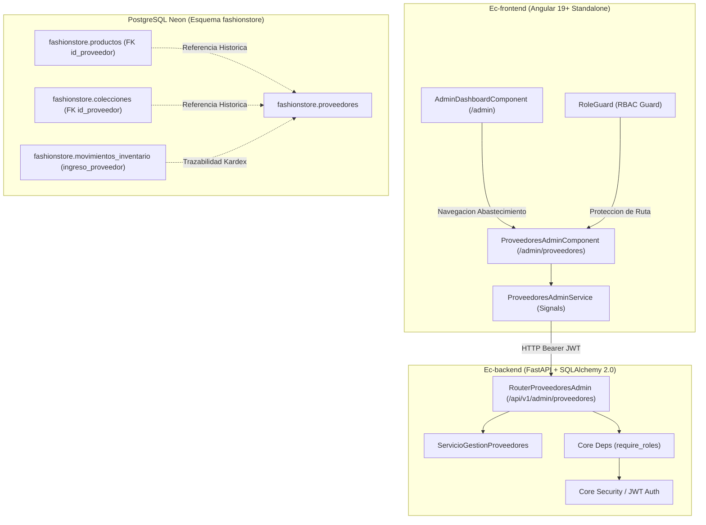
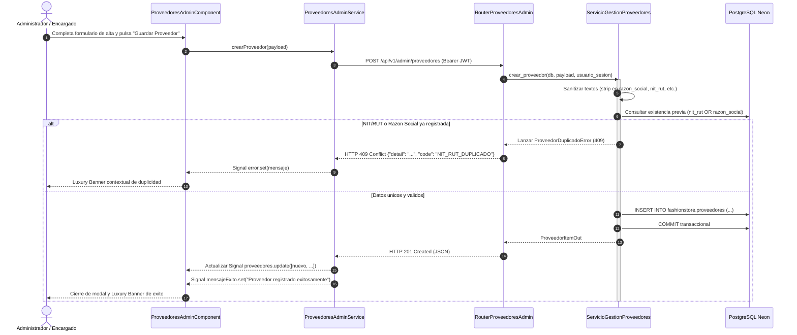

# Diseno Tecnico: CU25 - Gestionar Proveedores

**ID del Caso de Uso:** CU25  
**Nombre:** Gestionar Proveedores  
**Paquete Arquitectonico:** `gestion_operativa` / `abastecimiento`  
**Modulo Backend:** `app/modules/gestion_operativa/cu25_proveedores`  
**Modulo Frontend Web:** `src/app/modules/gestion_operativa/cu25_proveedores`  
**Referencia de Requisitos:** `.specs/changes/CU25/spec.md`  
**Estado:** En Revision Tecnica (Fase 2 - Diseno)  

---

## 1. Arquitectura General y Enfoque

El caso de uso CU25 proporciona la solucion integral para la gobernanza de la cadena de suministro de **FashionStore**, administrando el padron centralizado de proveedores, talleres textiles y fabricantes asociados. Garantiza la consistencia e integridad fiscal de cada registro, la prevencion de colisiones por identificacion tributaria (NIT/RUT) o razon social, y una navegacion reactiva y segura para los roles administrativos.



### 1.1 Diagrama de Secuencia: Alta de Proveedor con Validacion de Unicidad



### 1.2 Principios de Diseno Arquitectonico y Gobernanza
1. **Unicidad e Integridad Fiscal Inmutable:**
   - Todo proveedor registrado debe poseer un `nit_rut` y una `razon_social` unicos en el sistema. La validacion se aplica tanto en la capa de aplicacion (servicio) como en la capa de persistencia mediante restricciones `UNIQUE` e indices relacionales en PostgreSQL Neon.
2. **Preservacion de la Historia Transaccional (Baja Logica Obligatoria):**
   - No se permite el borrado fisico (`DELETE FROM`) de proveedores que puedan haber suministrado prendas o colecciones en el pasado. Se implementa baja logica mediante el flag `estado_activo = False`, inhabilitando al proveedor para nuevas ordenes de compra pero preservando intacta la relacion con productos, colecciones e ingresos de inventario (Kardex).
3. **Control de Acceso Basado en Roles (RBAC):**
   - Los endpoints administrativos `/api/v1/admin/proveedores` estan estrictamente restringidos a los roles `administrador` y `encargado_sucursal`. Los roles `cajero` y `cliente` son interceptados y rechazados de forma inmediata con HTTP 403 Forbidden.
4. **Ratificacion Formal de Exclusion de Ec-mobile:**
   - La gestion de proveedores, catalogos mayoristas y contratos societarios pertenece en su totalidad a la administracion corporativa y trastienda logistica web (`Ec-frontend`). La aplicacion movil en Flutter 3.x (`Ec-mobile`) queda 100% excluida de este dominio.

---

## 2. Diseno Backend (`Ec-backend` - FastAPI + SQLAlchemy 2.0 + PostgreSQL Neon)

### 2.1 Modelo ORM en Esquema `fashionstore`

El modelo se implementara en `app/modules/gestion_operativa/cu25_proveedores/modelos.py`:

```python
# app/modules/gestion_operativa/cu25_proveedores/modelos.py

from datetime import datetime, timezone
from typing import Optional
from sqlalchemy import (
    BigInteger,
    Boolean,
    CheckConstraint,
    DateTime,
    ForeignKey,
    Integer,
    String,
    UniqueConstraint,
)
from sqlalchemy.orm import Mapped, mapped_column

from core.database import Base


class ProveedorORM(Base):
    """Mapeo de la tabla `fashionstore.proveedores` en PostgreSQL Neon."""

    __tablename__ = "proveedores"
    __table_args__ = (
        UniqueConstraint("nit_rut", name="uq_proveedores_nit_rut"),
        UniqueConstraint("razon_social", name="uq_proveedores_razon_social"),
        CheckConstraint("length(trim(razon_social)) >= 3", name="chk_proveedores_razon_social_len"),
        CheckConstraint("length(trim(nit_rut)) >= 5", name="chk_proveedores_nit_rut_len"),
        CheckConstraint("length(trim(contacto_nombre)) >= 3", name="chk_proveedores_contacto_len"),
        {"schema": "fashionstore", "extend_existing": True},
    )

    id_proveedor: Mapped[int] = mapped_column(Integer, primary_key=True, autoincrement=True)
    id_usuario: Mapped[Optional[int]] = mapped_column(
        BigInteger,
        ForeignKey("fashionstore.usuarios.id_usuario"),
        nullable=True,
        index=True,
    )
    razon_social: Mapped[str] = mapped_column(String(150), nullable=False, unique=True, index=True)
    nit_rut: Mapped[str] = mapped_column(String(30), nullable=False, unique=True, index=True)
    contacto_nombre: Mapped[str] = mapped_column(String(120), nullable=False)
    telefono: Mapped[str] = mapped_column(String(30), nullable=False)
    email: Mapped[str] = mapped_column(String(120), nullable=False, index=True)
    direccion: Mapped[str] = mapped_column(String(255), nullable=False)
    ciudad: Mapped[str] = mapped_column(String(80), nullable=False, index=True)
    rubro: Mapped[str] = mapped_column(String(80), nullable=False, index=True)
    estado_activo: Mapped[bool] = mapped_column(Boolean, nullable=False, default=True, index=True)
    creado_en: Mapped[datetime] = mapped_column(
        DateTime(timezone=True),
        nullable=False,
        default=lambda: datetime.now(timezone.utc),
    )
    actualizado_en: Mapped[datetime] = mapped_column(
        DateTime(timezone=True),
        nullable=False,
        default=lambda: datetime.now(timezone.utc),
        onupdate=lambda: datetime.now(timezone.utc),
    )
```

### 2.2 Estrategia de Migracion Alembic (`0006_cu25_proveedores_extension.py`)

Para sincronizar la tabla preexistente en PostgreSQL Neon (creada inicialmente en `0001_base_ddl.py` con columnas basicas `nit`, `activo`) con los requerimientos precisos de CU25, se aplicara una migracion idempotente:

```python
# alembic/versions/0006_cu25_proveedores_extension.py

"""Extension y normalizacion de fashionstore.proveedores para CU25.

Revision ID: 0006_cu25_proveedores_extension
Revises: 0005_cu24_inventario_kardex
"""

from alembic import op
import sqlalchemy as sa


def upgrade() -> None:
    # 1. Asegurar columna nit_rut (renombrar nit si existe, o anadir)
    op.execute("""
        DO $$
        BEGIN
            IF EXISTS (
                SELECT 1 FROM information_schema.columns 
                WHERE table_schema = 'fashionstore' AND table_name = 'proveedores' AND column_name = 'nit'
            ) AND NOT EXISTS (
                SELECT 1 FROM information_schema.columns 
                WHERE table_schema = 'fashionstore' AND table_name = 'proveedores' AND column_name = 'nit_rut'
            ) THEN
                ALTER TABLE fashionstore.proveedores RENAME COLUMN nit TO nit_rut;
            ELSIF NOT EXISTS (
                SELECT 1 FROM information_schema.columns 
                WHERE table_schema = 'fashionstore' AND table_name = 'proveedores' AND column_name = 'nit_rut'
            ) THEN
                ALTER TABLE fashionstore.proveedores ADD COLUMN nit_rut VARCHAR(30) UNIQUE;
            END IF;
        END $$;
    """)

    # 2. Asegurar columna estado_activo (renombrar activo si existe, o anadir)
    op.execute("""
        DO $$
        BEGIN
            IF EXISTS (
                SELECT 1 FROM information_schema.columns 
                WHERE table_schema = 'fashionstore' AND table_name = 'proveedores' AND column_name = 'activo'
            ) AND NOT EXISTS (
                SELECT 1 FROM information_schema.columns 
                WHERE table_schema = 'fashionstore' AND table_name = 'proveedores' AND column_name = 'estado_activo'
            ) THEN
                ALTER TABLE fashionstore.proveedores RENAME COLUMN activo TO estado_activo;
            ELSIF NOT EXISTS (
                SELECT 1 FROM information_schema.columns 
                WHERE table_schema = 'fashionstore' AND table_name = 'proveedores' AND column_name = 'estado_activo'
            ) THEN
                ALTER TABLE fashionstore.proveedores ADD COLUMN estado_activo BOOLEAN NOT NULL DEFAULT TRUE;
            END IF;
        END $$;
    """)

    # 3. Anadir columnas complementarias de domicilio, rubro y marca temporal
    op.execute("""
        ALTER TABLE fashionstore.proveedores
        ADD COLUMN IF NOT EXISTS direccion VARCHAR(255) DEFAULT 'Direccion no registrada',
        ADD COLUMN IF NOT EXISTS ciudad VARCHAR(80) DEFAULT 'La Paz',
        ADD COLUMN IF NOT EXISTS rubro VARCHAR(80) DEFAULT 'Confeccion Textil',
        ADD COLUMN IF NOT EXISTS actualizado_en TIMESTAMPTZ DEFAULT now();
    """)

    # 4. Establecer constraints e indices de unicidad
    op.execute("""
        CREATE UNIQUE INDEX IF NOT EXISTS uq_proveedores_nit_rut ON fashionstore.proveedores (nit_rut);
        CREATE UNIQUE INDEX IF NOT EXISTS uq_proveedores_razon_social ON fashionstore.proveedores (LOWER(razon_social));
        CREATE INDEX IF NOT EXISTS idx_proveedores_estado ON fashionstore.proveedores (estado_activo);
        CREATE INDEX IF NOT EXISTS idx_proveedores_rubro ON fashionstore.proveedores (rubro);
    """)


def downgrade() -> None:
    pass
```

### 2.3 Jerarquia de Excepciones Semanticas de Dominio

En `app/modules/gestion_operativa/cu25_proveedores/errores.py`, integradas con el exception handler de FastAPI:

```python
# app/modules/gestion_operativa/cu25_proveedores/errores.py

from core.errors import ConflictError, DomainError, NotFoundError


class ProveedorNoEncontradoError(NotFoundError):
    """Lanzada cuando un id_proveedor solicitado no existe en la base de datos (HTTP 404)."""
    def __init__(self, id_proveedor: int):
        super().__init__(f"No se encontro ningun proveedor registrado con el ID {id_proveedor}.")


class ProveedorDuplicadoError(ConflictError):
    """Lanzada cuando se intenta registrar o actualizar con un NIT/RUT o Razon Social ya ocupada (HTTP 409)."""
    def __init__(self, campo: str, valor: str):
        super().__init__(f"Ya existe un proveedor registrado con el {campo} '{valor}'.")


class ProveedorInvalidoError(DomainError):
    """Lanzada cuando los datos comerciales incumplen reglas de negocio de la cadena (HTTP 422)."""
    def __init__(self, mensaje: str):
        super().__init__(mensaje)
```

### 2.4 DTOs y Esquemas Pydantic v2

En `app/modules/gestion_operativa/cu25_proveedores/esquemas.py`:

```python
# app/modules/gestion_operativa/cu25_proveedores/esquemas.py

from datetime import datetime
from typing import List, Optional
from pydantic import BaseModel, ConfigDict, EmailStr, Field, field_validator


# --- Esquemas de Entrada (Requests) ---

class ProveedorCrearIn(BaseModel):
    """Payload para registro de un nuevo socio comercial en el padron."""
    razon_social: str = Field(..., min_length=3, max_length=150, description="Denominacion legal de la empresa")
    nit_rut: str = Field(..., min_length=5, max_length=30, description="Identificacion fiscal tributaria unica")
    contacto_nombre: str = Field(..., min_length=3, max_length=120, description="Nombre y apellido del enlace comercial")
    telefono: str = Field(..., min_length=7, max_length=30, description="Numero telefonico institucional")
    email: EmailStr = Field(..., description="Correo electronico corporativo de contacto")
    direccion: str = Field(..., min_length=5, max_length=255, description="Direccion fisica o domicilio legal")
    ciudad: str = Field(..., min_length=2, max_length=80, description="Ciudad de operacion del proveedor")
    rubro: str = Field(..., min_length=3, max_length=80, description="Especialidad textil o tipo de insumo provisto")

    @field_validator("razon_social", "nit_rut", "contacto_nombre", "telefono", "direccion", "ciudad", "rubro")
    @classmethod
    def sanitizar_cadenas(cls, valor: str) -> str:
        saneado = valor.strip()
        if not saneado:
            raise ValueError("El campo no puede estar compuesto exclusivamente por espacios en blanco.")
        return saneado


class ProveedorActualizarIn(BaseModel):
    """Payload para actualizacion parcial o total de la ficha del proveedor."""
    razon_social: Optional[str] = Field(None, min_length=3, max_length=150)
    nit_rut: Optional[str] = Field(None, min_length=5, max_length=30)
    contacto_nombre: Optional[str] = Field(None, min_length=3, max_length=120)
    telefono: Optional[str] = Field(None, min_length=7, max_length=30)
    email: Optional[EmailStr] = Field(None)
    direccion: Optional[str] = Field(None, min_length=5, max_length=255)
    ciudad: Optional[str] = Field(None, min_length=2, max_length=80)
    rubro: Optional[str] = Field(None, min_length=3, max_length=80)

    @field_validator("razon_social", "nit_rut", "contacto_nombre", "telefono", "direccion", "ciudad", "rubro")
    @classmethod
    def sanitizar_opcionales(cls, valor: Optional[str]) -> Optional[str]:
        if valor is not None:
            saneado = valor.strip()
            if not saneado:
                raise ValueError("El campo no puede ser una cadena vacia.")
            return saneado
        return valor


class ProveedorEstadoIn(BaseModel):
    """Payload para conmutacion del estado operativo (baja logica o reactivacion)."""
    estado_activo: bool = Field(..., description="True para habilitar, False para baja logica")


class ProveedorFiltrosIn(BaseModel):
    """Parametros de consulta y filtrado multicriterio."""
    q: Optional[str] = Field(None, max_length=100, description="Busqueda por razon social, NIT o contacto")
    estado_activo: Optional[bool] = Field(None, description="Filtro por estado booleano")
    rubro: Optional[str] = Field(None, max_length=80, description="Filtro por rubro comercial")
    pagina: int = Field(default=1, ge=1)
    limite: int = Field(default=20, ge=1, le=100)


# --- Esquemas de Salida (Responses) ---

class ProveedorItemOut(BaseModel):
    """Representacion publica y tipada de la entidad Proveedor."""
    model_config = ConfigDict(from_attributes=True)

    id_proveedor: int
    id_usuario: Optional[int] = None
    razon_social: str
    nit_rut: str
    contacto_nombre: str
    telefono: str
    email: str
    direccion: str
    ciudad: str
    rubro: str
    estado_activo: bool
    creado_en: datetime
    actualizado_en: datetime


class ListaPaginadaProveedoresOut(BaseModel):
    """Contenedor paginado para respuestas del padron de proveedores."""
    items: List[ProveedorItemOut]
    total: int
    pagina: int
    limite: int
    total_paginas: int
```

### 2.5 Logica de Dominio: Capa de Servicio (`ServicioGestionProveedores`)

En `app/modules/gestion_operativa/cu25_proveedores/servicio.py`:

```python
# app/modules/gestion_operativa/cu25_proveedores/servicio.py

from datetime import datetime, timezone
import math
from typing import Optional
from sqlalchemy import and_, func, or_, select
from sqlalchemy.orm import Session

from modules.autenticacion_seguridad.modelos import UsuarioORM
from .errores import ProveedorDuplicadoError, ProveedorNoEncontradoError
from .esquemas import (
    ListaPaginadaProveedoresOut,
    ProveedorActualizarIn,
    ProveedorCrearIn,
    ProveedorFiltrosIn,
    ProveedorItemOut,
)
from .modelos import ProveedorORM


class ServicioGestionProveedores:
    """Logica de negocio transaccional para la administracion de proveedores."""

    def listar_proveedores(
        self, db: Session, filtros: ProveedorFiltrosIn, usuario_sesion: UsuarioORM
    ) -> ListaPaginadaProveedoresOut:
        condiciones = []

        if filtros.estado_activo is not None:
            condiciones.append(ProveedorORM.estado_activo == filtros.estado_activo)

        if filtros.rubro and filtros.rubro.strip():
            condiciones.append(ProveedorORM.rubro.ilike(f"%{filtros.rubro.strip()}%"))

        if filtros.q and filtros.q.strip():
            termino = f"%{filtros.q.strip()}%"
            condiciones.append(
                or_(
                    ProveedorORM.razon_social.ilike(termino),
                    ProveedorORM.nit_rut.ilike(termino),
                    ProveedorORM.contacto_nombre.ilike(termino),
                )
            )

        stmt = select(ProveedorORM)
        if condiciones:
            stmt = stmt.where(and_(*condiciones))

        # Conteo total
        stmt_count = select(func.count(ProveedorORM.id_proveedor))
        if condiciones:
            stmt_count = stmt_count.where(and_(*condiciones))
        total = db.scalar(stmt_count) or 0

        # Paginacion y ordenamiento descendente
        offset = (filtros.pagina - 1) * filtros.limite
        stmt = stmt.order_by(ProveedorORM.id_proveedor.desc()).offset(offset).limit(filtros.limite)
        registros = db.scalars(stmt).all()

        items = [ProveedorItemOut.model_validate(r) for r in registros]
        total_paginas = math.ceil(total / filtros.limite) if total > 0 else 1

        return ListaPaginadaProveedoresOut(
            items=items,
            total=total,
            pagina=filtros.pagina,
            limite=filtros.limite,
            total_paginas=total_paginas,
        )

    def obtener_proveedor_por_id(
        self, db: Session, id_proveedor: int, usuario_sesion: UsuarioORM
    ) -> ProveedorItemOut:
        prov = db.get(ProveedorORM, id_proveedor)
        if not prov:
            raise ProveedorNoEncontradoError(id_proveedor)
        return ProveedorItemOut.model_validate(prov)

    def crear_proveedor(
        self, db: Session, payload: ProveedorCrearIn, usuario_sesion: UsuarioORM
    ) -> ProveedorItemOut:
        # 1. Validar no duplicidad de nit_rut
        duplicado_nit = db.scalar(
            select(ProveedorORM).where(ProveedorORM.nit_rut.ilike(payload.nit_rut.strip()))
        )
        if duplicado_nit:
            raise ProveedorDuplicadoError("NIT/RUT", payload.nit_rut)

        # 2. Validar no duplicidad de razon_social
        duplicado_rs = db.scalar(
            select(ProveedorORM).where(ProveedorORM.razon_social.ilike(payload.razon_social.strip()))
        )
        if duplicado_rs:
            raise ProveedorDuplicadoError("Razon Social", payload.razon_social)

        # 3. Persistir entidad
        ahora = datetime.now(timezone.utc)
        nuevo_prov = ProveedorORM(
            razon_social=payload.razon_social.strip(),
            nit_rut=payload.nit_rut.strip(),
            contacto_nombre=payload.contacto_nombre.strip(),
            telefono=payload.telefono.strip(),
            email=str(payload.email).strip().lower(),
            direccion=payload.direccion.strip(),
            ciudad=payload.ciudad.strip(),
            rubro=payload.rubro.strip(),
            estado_activo=True,
            creado_en=ahora,
            actualizado_en=ahora,
        )
        db.add(nuevo_prov)
        db.commit()
        db.refresh(nuevo_prov)

        return ProveedorItemOut.model_validate(nuevo_prov)

    def actualizar_proveedor(
        self, db: Session, id_proveedor: int, payload: ProveedorActualizarIn, usuario_sesion: UsuarioORM
    ) -> ProveedorItemOut:
        prov = db.get(ProveedorORM, id_proveedor)
        if not prov:
            raise ProveedorNoEncontradoError(id_proveedor)

        # Validar no duplicidad si nit_rut cambia
        if payload.nit_rut and payload.nit_rut.strip().lower() != prov.nit_rut.lower():
            colision_nit = db.scalar(
                select(ProveedorORM).where(
                    and_(
                        ProveedorORM.nit_rut.ilike(payload.nit_rut.strip()),
                        ProveedorORM.id_proveedor != id_proveedor,
                    )
                )
            )
            if colision_nit:
                raise ProveedorDuplicadoError("NIT/RUT", payload.nit_rut)
            prov.nit_rut = payload.nit_rut.strip()

        # Validar no duplicidad si razon_social cambia
        if payload.razon_social and payload.razon_social.strip().lower() != prov.razon_social.lower():
            colision_rs = db.scalar(
                select(ProveedorORM).where(
                    and_(
                        ProveedorORM.razon_social.ilike(payload.razon_social.strip()),
                        ProveedorORM.id_proveedor != id_proveedor,
                    )
                )
            )
            if colision_rs:
                raise ProveedorDuplicadoError("Razon Social", payload.razon_social)
            prov.razon_social = payload.razon_social.strip()

        if payload.contacto_nombre:
            prov.contacto_nombre = payload.contacto_nombre.strip()
        if payload.telefono:
            prov.telefono = payload.telefono.strip()
        if payload.email:
            prov.email = str(payload.email).strip().lower()
        if payload.direccion:
            prov.direccion = payload.direccion.strip()
        if payload.ciudad:
            prov.ciudad = payload.ciudad.strip()
        if payload.rubro:
            prov.rubro = payload.rubro.strip()

        prov.actualizado_en = datetime.now(timezone.utc)
        db.commit()
        db.refresh(prov)

        return ProveedorItemOut.model_validate(prov)

    def cambiar_estado_proveedor(
        self, db: Session, id_proveedor: int, estado_activo: bool, usuario_sesion: UsuarioORM
    ) -> ProveedorItemOut:
        prov = db.get(ProveedorORM, id_proveedor)
        if not prov:
            raise ProveedorNoEncontradoError(id_proveedor)

        prov.estado_activo = estado_activo
        prov.actualizado_en = datetime.now(timezone.utc)
        db.commit()
        db.refresh(prov)

        return ProveedorItemOut.model_validate(prov)


servicio_gestion_proveedores = ServicioGestionProveedores()
```

### 2.6 Endpoints REST bajo `/api/v1/admin/proveedores`

En `app/modules/gestion_operativa/cu25_proveedores/router.py`:

```python
# app/modules/gestion_operativa/cu25_proveedores/router.py

from typing import Optional
from fastapi import APIRouter, Depends, Query, status
from sqlalchemy.orm import Session

from core.database import get_db
from core.deps import require_roles
from modules.autenticacion_seguridad.modelos import UsuarioORM
from .esquemas import (
    ListaPaginadaProveedoresOut,
    ProveedorActualizarIn,
    ProveedorCrearIn,
    ProveedorEstadoIn,
    ProveedorFiltrosIn,
    ProveedorItemOut,
)
from .servicio import servicio_gestion_proveedores

router = APIRouter(
    prefix="/admin/proveedores",
    tags=["Gestion Operativa - Proveedores y Fabricantes (Admin)"],
)


@router.get(
    "",
    response_model=ListaPaginadaProveedoresOut,
    status_code=status.HTTP_200_OK,
    summary="Consulta paginada del padron de proveedores con filtros",
)
def listar_proveedores(
    q: Optional[str] = Query(None, max_length=100, description="Busqueda por razon social, NIT o contacto"),
    estado_activo: Optional[bool] = Query(None, description="Filtro booleano por estado activo"),
    estado: Optional[str] = Query(None, description="Alias: 'activos', 'inactivos', 'todos'"),
    rubro: Optional[str] = Query(None, max_length=80, description="Filtro por rubro comercial"),
    pagina: int = Query(1, ge=1, description="Numero de pagina"),
    limite: int = Query(20, ge=1, le=100, description="Registros por pagina"),
    db: Session = Depends(get_db),
    usuario_sesion: UsuarioORM = Depends(require_roles(["administrador", "encargado_sucursal"])),
) -> ListaPaginadaProveedoresOut:
    # Normalizacion de alias de estado
    filtro_estado = estado_activo
    if filtro_estado is None and estado:
        if estado == "activos":
            filtro_estado = True
        elif estado == "inactivos":
            filtro_estado = False

    filtros = ProveedorFiltrosIn(
        q=q.strip() if q and q.strip() else None,
        estado_activo=filtro_estado,
        rubro=rubro.strip() if rubro and rubro.strip() else None,
        pagina=pagina,
        limite=limite,
    )
    return servicio_gestion_proveedores.listar_proveedores(db, filtros, usuario_sesion)


@router.get(
    "/{id_proveedor}",
    response_model=ProveedorItemOut,
    status_code=status.HTTP_200_OK,
    summary="Obtiene la ficha detallada de un proveedor por ID",
)
def obtener_proveedor(
    id_proveedor: int,
    db: Session = Depends(get_db),
    usuario_sesion: UsuarioORM = Depends(require_roles(["administrador", "encargado_sucursal"])),
) -> ProveedorItemOut:
    return servicio_gestion_proveedores.obtener_proveedor_por_id(db, id_proveedor, usuario_sesion)


@router.post(
    "",
    response_model=ProveedorItemOut,
    status_code=status.HTTP_201_CREATED,
    summary="Registra un nuevo socio comercial en el padron",
)
def crear_proveedor(
    payload: ProveedorCrearIn,
    db: Session = Depends(get_db),
    usuario_sesion: UsuarioORM = Depends(require_roles(["administrador", "encargado_sucursal"])),
) -> ProveedorItemOut:
    return servicio_gestion_proveedores.crear_proveedor(db, payload, usuario_sesion)


@router.put(
    "/{id_proveedor}",
    response_model=ProveedorItemOut,
    status_code=status.HTTP_200_OK,
    summary="Actualiza los datos fiscales, comerciales o de contacto de un proveedor",
)
def actualizar_proveedor(
    id_proveedor: int,
    payload: ProveedorActualizarIn,
    db: Session = Depends(get_db),
    usuario_sesion: UsuarioORM = Depends(require_roles(["administrador", "encargado_sucursal"])),
) -> ProveedorItemOut:
    return servicio_gestion_proveedores.actualizar_proveedor(db, id_proveedor, payload, usuario_sesion)


@router.patch(
    "/{id_proveedor}/estado",
    response_model=ProveedorItemOut,
    status_code=status.HTTP_200_OK,
    summary="Conmuta el estado operativo del proveedor (baja logica o reactivacion)",
)
def cambiar_estado_proveedor(
    id_proveedor: int,
    payload: ProveedorEstadoIn,
    db: Session = Depends(get_db),
    usuario_sesion: UsuarioORM = Depends(require_roles(["administrador", "encargado_sucursal"])),
) -> ProveedorItemOut:
    return servicio_gestion_proveedores.cambiar_estado_proveedor(
        db, id_proveedor, payload.estado_activo, usuario_sesion
    )
```

---

## 3. Diseno Frontend Web (`Ec-frontend` - Angular 19+ Standalone)

### 3.1 Contratos TypeScript (`proveedor.dto.ts`)

En `src/app/modules/gestion_operativa/cu25_proveedores/modelos/proveedor.dto.ts`:

```typescript
// src/app/modules/gestion_operativa/cu25_proveedores/modelos/proveedor.dto.ts

export interface ProveedorItemAdmin {
  id_proveedor: number;
  id_usuario?: number | null;
  razon_social: string;
  nit_rut: string;
  contacto_nombre: string;
  telefono: string;
  email: string;
  direccion: string;
  ciudad: string;
  rubro: string;
  estado_activo: boolean;
  creado_en: string;
  actualizado_en: string;
}

export interface ProveedorCrearPayload {
  razon_social: string;
  nit_rut: string;
  contacto_nombre: string;
  telefono: string;
  email: string;
  direccion: string;
  ciudad: string;
  rubro: string;
}

export interface ProveedorActualizarPayload {
  razon_social?: string;
  nit_rut?: string;
  contacto_nombre?: string;
  telefono?: string;
  email?: string;
  direccion?: string;
  ciudad?: string;
  rubro?: string;
}

export interface FiltrosProveedores {
  q?: string | null;
  estado_activo?: boolean | null;
  estado?: string | null;
  rubro?: string | null;
  pagina?: number;
  limite?: number;
}

export interface ListaPaginadaProveedores {
  items: ProveedorItemAdmin[];
  total: number;
  pagina: number;
  limite: number;
  total_paginas: number;
}
```

### 3.2 Servicio HTTP Reactivo (`ProveedoresAdminService`)

En `src/app/modules/gestion_operativa/cu25_proveedores/servicios/proveedores-admin.service.ts`:

```typescript
// src/app/modules/gestion_operativa/cu25_proveedores/servicios/proveedores-admin.service.ts

import { Injectable, inject, signal } from '@angular/core';
import { HttpClient, HttpErrorResponse, HttpHeaders, HttpParams } from '@angular/common/http';
import { Observable, tap, catchError, throwError } from 'rxjs';
import {
  FiltrosProveedores,
  ListaPaginadaProveedores,
  ProveedorActualizarPayload,
  ProveedorCrearPayload,
  ProveedorItemAdmin,
} from '../modelos/proveedor.dto';

@Injectable({
  providedIn: 'root',
})
export class ProveedoresAdminService {
  private readonly http = inject(HttpClient);
  private readonly adminUrl = '/api/v1/admin/proveedores';

  // Signals reactivos de estado
  readonly proveedores = signal<ProveedorItemAdmin[]>([]);
  readonly totalRegistros = signal<number>(0);
  readonly paginaActual = signal<number>(1);
  readonly totalPaginas = signal<number>(1);
  readonly cargando = signal<boolean>(false);
  readonly guardando = signal<boolean>(false);
  readonly error = signal<string | null>(null);
  readonly mensajeExito = signal<string | null>(null);
  readonly filtros = signal<FiltrosProveedores>({ pagina: 1, limite: 20 });

  private obtenerHeaders(): HttpHeaders {
    let headers = new HttpHeaders({ 'Content-Type': 'application/json' });
    if (typeof window !== 'undefined') {
      const token =
        localStorage.getItem('fashionstore_token') ||
        sessionStorage.getItem('fashionstore_token');
      if (token) {
        headers = headers.set('Authorization', `Bearer ${token}`);
      }
    }
    return headers;
  }

  limpiarMensajes(): void {
    this.error.set(null);
    this.mensajeExito.set(null);
  }

  private manejarError(err: HttpErrorResponse): Observable<never> {
    let mensaje = 'Ocurrio un error inesperado al procesar la operacion de proveedores.';
    if (err.error?.detail) {
      mensaje = typeof err.error.detail === 'string' ? err.error.detail : JSON.stringify(err.error.detail);
    } else if (err.status === 401) {
      mensaje = 'Su sesion ha expirado o no tiene credenciales validas.';
    } else if (err.status === 403) {
      mensaje = 'Acceso denegado: No cuenta con privilegios para gestionar proveedores.';
    } else if (err.status === 404) {
      mensaje = 'El proveedor solicitado no fue encontrado en el padron.';
    } else if (err.status === 409) {
      mensaje = 'Conflicto: Ya existe un proveedor con ese NIT/RUT o Razon Social.';
    } else if (err.status === 422) {
      mensaje = 'Datos invalidos: Compruebe el formato de correo o la longitud de los campos.';
    }
    this.error.set(mensaje);
    return throwError(() => err);
  }

  cargarProveedores(filtros?: FiltrosProveedores): Observable<ListaPaginadaProveedores> {
    this.cargando.set(true);
    this.error.set(null);

    const f = filtros || this.filtros();
    let params = new HttpParams();

    if (f.q && f.q.trim().length > 0) {
      params = params.set('q', f.q.trim());
    }
    if (f.estado && f.estado !== 'todos') {
      params = params.set('estado', f.estado);
    } else if (f.estado_activo !== undefined && f.estado_activo !== null) {
      params = params.set('estado_activo', f.estado_activo.toString());
    }
    if (f.rubro && f.rubro.trim().length > 0 && f.rubro !== 'todos') {
      params = params.set('rubro', f.rubro.trim());
    }
    if (f.pagina && Number(f.pagina) > 0) {
      params = params.set('pagina', Number(f.pagina).toString());
    }
    if (f.limite && Number(f.limite) > 0) {
      params = params.set('limite', Number(f.limite).toString());
    }

    return this.http
      .get<ListaPaginadaProveedores>(this.adminUrl, {
        headers: this.obtenerHeaders(),
        params,
      })
      .pipe(
        tap((res) => {
          this.proveedores.set(res.items);
          this.totalRegistros.set(res.total);
          this.paginaActual.set(res.pagina);
          this.totalPaginas.set(res.total_paginas);
          this.filtros.set(f);
          this.cargando.set(false);
        }),
        catchError((err) => {
          this.cargando.set(false);
          return this.manejarError(err);
        })
      );
  }

  crearProveedor(payload: ProveedorCrearPayload): Observable<ProveedorItemAdmin> {
    this.guardando.set(true);
    this.limpiarMensajes();

    return this.http
      .post<ProveedorItemAdmin>(this.adminUrl, payload, {
        headers: this.obtenerHeaders(),
      })
      .pipe(
        tap((item) => {
          this.guardando.set(false);
          this.mensajeExito.set('Proveedor registrado exitosamente en el padron comercial.');
          this.proveedores.update((lista) => [item, ...lista]);
          this.totalRegistros.update((n) => n + 1);
        }),
        catchError((err) => {
          this.guardando.set(false);
          return this.manejarError(err);
        })
      );
  }

  actualizarProveedor(
    id_proveedor: number,
    payload: ProveedorActualizarPayload
  ): Observable<ProveedorItemAdmin> {
    this.guardando.set(true);
    this.limpiarMensajes();

    return this.http
      .put<ProveedorItemAdmin>(`${this.adminUrl}/${id_proveedor}`, payload, {
        headers: this.obtenerHeaders(),
      })
      .pipe(
        tap((item) => {
          this.guardando.set(false);
          this.mensajeExito.set('Ficha comercial del proveedor actualizada correctamente.');
          this.proveedores.update((lista) =>
            lista.map((x) => (x.id_proveedor === id_proveedor ? item : x))
          );
        }),
        catchError((err) => {
          this.guardando.set(false);
          return this.manejarError(err);
        })
      );
  }

  cambiarEstadoProveedor(
    id_proveedor: number,
    estado_activo: boolean
  ): Observable<ProveedorItemAdmin> {
    this.guardando.set(true);
    this.limpiarMensajes();

    return this.http
      .patch<ProveedorItemAdmin>(
        `${this.adminUrl}/${id_proveedor}/estado`,
        { estado_activo },
        { headers: this.obtenerHeaders() }
      )
      .pipe(
        tap((item) => {
          this.guardando.set(false);
          const accion = estado_activo ? 'reactivado' : 'desactivado (baja logica)';
          this.mensajeExito.set(`Proveedor ${accion} exitosamente.`);
          this.proveedores.update((lista) =>
            lista.map((x) => (x.id_proveedor === id_proveedor ? item : x))
          );
        }),
        catchError((err) => {
          this.guardando.set(false);
          return this.manejarError(err);
        })
      );
  }
}
```

### 3.3 Integracion en `AdminDashboardComponent`

En `src/app/modules/admin/dashboard/admin-dashboard.component.html`, se anadira la tarjeta dentro de la categoria *"Gestion de Abastecimiento"*:

```html
<!-- Categoria: Gestion de Abastecimiento -->
<div class="mb-10">
  <div class="flex items-center gap-3 mb-6">
    <div class="w-1.5 h-6 bg-camel rounded-full"></div>
    <h2 class="text-xl font-semibold text-obsidian tracking-tight">Gestion de Abastecimiento</h2>
  </div>

  <div class="grid grid-cols-1 md:grid-cols-2 lg:grid-cols-3 gap-6">
    <!-- Tarjeta CU24: Inventario y Stock -->
    <a routerLink="/admin/inventario" class="luxury-card group ...">
      ...
    </a>

    <!-- Tarjeta CU25: Proveedores y Fabricantes -->
    <a
      routerLink="/admin/proveedores"
      class="luxury-card group bg-white border border-slate-200/80 rounded-2xl p-6 transition-all duration-300 hover:shadow-xl hover:border-camel/50 flex flex-col justify-between"
    >
      <div>
        <div class="w-12 h-12 rounded-xl bg-slate-100 flex items-center justify-center text-obsidian group-hover:bg-camel/10 group-hover:text-camel transition-colors duration-300 mb-4">
          <!-- Icono SVG de suministro / camion de abastecimiento -->
          <svg class="w-6 h-6" fill="none" viewBox="0 0 24 24" stroke="currentColor" stroke-width="1.5">
            <path stroke-linecap="round" stroke-linejoin="round" d="M8.25 18.75a1.5 1.5 0 01-3 0m3 0a1.5 1.5 0 00-3 0m3 0h6m-9 0H3.375a1.125 1.125 0 01-1.125-1.125V14.25m17.25 4.5a1.5 1.5 0 01-3 0m3 0a1.5 1.5 0 00-3 0m3 0h1.125c.621 0 1.129-.504 1.09-1.124a17.902 17.902 0 00-3.213-9.193 2.056 2.056 0 00-1.58-.86H14.25M16.5 18.75h-2.25m0-11.25V3.75A1.125 1.125 0 0013.125 2.625H3.375A1.125 1.125 0 002.25 3.75v10.5m14.25-6.75h-3.75m3.75 0v3.75m0-3.75h2.25" />
          </svg>
        </div>
        <h3 class="text-lg font-semibold text-obsidian group-hover:text-camel transition-colors duration-200">
          Proveedores y Fabricantes
        </h3>
        <p class="text-sm text-slate-500 mt-2 leading-relaxed">
          Padron de talleres textiles, identificacion tributaria (NIT/RUT) y contactos directos de abastecimiento.
        </p>
      </div>
      <div class="mt-6 flex items-center gap-2 text-sm font-medium text-camel group-hover:translate-x-1 transition-transform duration-200">
        <span>Gestionar padron</span>
        <svg class="w-4 h-4" fill="none" viewBox="0 0 24 24" stroke="currentColor" stroke-width="2">
          <path stroke-linecap="round" stroke-linejoin="round" d="M13.5 4.5L21 12m0 0l-7.5 7.5M21 12H3" />
        </svg>
      </div>
    </a>
  </div>
</div>
```

### 3.4 Pagina Administrativa `ProveedoresAdminComponent`

En `src/app/modules/gestion_operativa/cu25_proveedores/paginas/proveedores-admin.component.ts`:
- **Decorador:** Standalone (`standalone: true`), `ChangeDetectionStrategy.OnPush`.
- **Ruta:** `/admin/proveedores`, custodiada por `RoleGuard` (`data: { roles: ['administrador', 'encargado_sucursal'] }`).
- **Encabezado:** Boton *"<- Volver al Panel Principal"* que navega hacia `/admin`.
- **Signals reactivos del componente:**
  * `busquedaTexto = signal<string>('')` con debounce de 300 ms.
  * `filtroEstado = signal<string>('todos')`.
  * `filtroRubro = signal<string>('todos')`.
  * `paginaActual = signal<number>(1)`.
  * `limitePorPagina = signal<number>(10)`.
  * `modalCrearAbierto = signal<boolean>(false)`.
  * `modalEditarAbierto = signal<boolean>(false)`.
  * `modalConfirmarEstadoAbierto = signal<boolean>(false)`.
  * `proveedorSeleccionado = signal<ProveedorItemAdmin | null>(null)`.
- **Formularios Reactivos (`NonNullableFormBuilder`):**
  * `formCrear`:
    - `razon_social`: `['', [Validators.required, Validators.minLength(3), Validators.maxLength(150)]]`
    - `nit_rut`: `['', [Validators.required, Validators.minLength(5), Validators.maxLength(30)]]`
    - `contacto_nombre`: `['', [Validators.required, Validators.minLength(3), Validators.maxLength(120)]]`
    - `telefono`: `['', [Validators.required, Validators.minLength(7), Validators.maxLength(30)]]`
    - `email`: `['', [Validators.required, Validators.email]]`
    - `direccion`: `['', [Validators.required, Validators.minLength(5), Validators.maxLength(255)]]`
    - `ciudad`: `['', [Validators.required, Validators.minLength(2), Validators.maxLength(80)]]`
    - `rubro`: `['Sastreria de Lujo', [Validators.required]]`
  * `formEditar`: Misma estructura tipada para sincronizar modificaciones.
- **Rubros predefinidos de alta costura:**
  * `"Sastreria de Lujo"`
  * `"Calzado Artesanal"`
  * `"Marroquineria y Cuero"`
  * `"Tejidos Naturales (Seda/Lino)"`
  * `"Confeccion Denim y Casual"`
  * `"Avios y Accesorios Metalicos"`
  * `"Prendas de Punto y Cashmere"`

---

## 4. Matriz de Trazabilidad: Criterios EARS -> Diseno Tecnico

| Criterio EARS | Requisito | Componente Backend | Componente Frontend | Codigo HTTP |
| :--- | :--- | :--- | :--- | :--- |
| **# AC-1** | Seguridad y Control RBAC | `router.py` (`require_roles`) | `RoleGuard` (`auth.guard`) | 401 / 403 |
| **# AC-2** | Listado Paginado | `servicio.py` (`listar_proveedores`) | `ProveedoresAdminService.cargarProveedores()` | 200 OK |
| **# AC-3** | Filtros Multicriterio (q, estado, rubro) | `router.py` + `servicio.py` | Signals `busquedaTexto`, `filtroEstado`, `filtroRubro` | 200 OK |
| **# AC-4** | Consulta por ID | `router.py` (`obtener_proveedor`) | `servicio.py` (`obtener_proveedor_por_id`) | 200 / 404 |
| **# AC-5** | Alta de Proveedor | `servicio.py` (`crear_proveedor`) | `ProveedoresAdminService.crearProveedor()` | 201 Created |
| **# AC-6** | Prevencion de Duplicidad NIT/Razon Social | `servicio.py` (`ProveedorDuplicadoError`) | Luxury Banner (manejo error 409) | 409 Conflict |
| **# AC-7** | Validacion de Formatos | `esquemas.py` (`ProveedorCrearIn`) | Validadores `NonNullableFormBuilder` | 422 Unprocessable |
| **# AC-8** | Actualizacion de Ficha Comercial | `servicio.py` (`actualizar_proveedor`) | `ProveedoresAdminService.actualizarProveedor()` | 200 OK |
| **# AC-9** | Baja Logica (`estado_activo=False`) | `servicio.py` (`cambiar_estado_proveedor`) | Modal Confirmacion + Signal `cambiarEstado()` | 200 OK |
| **# AC-10** | Reactivacion (`estado_activo=True`) | `servicio.py` (`cambiar_estado_proveedor`) | Accion de tabla + Signal `cambiarEstado()` | 200 OK |
| **# AC-11** | Acceso desde Admin Dashboard | N/A | `admin-dashboard.component.html` (tarjeta) | N/A |
| **# AC-12** | Vista Standalone `/admin/proveedores` | N/A | `proveedores-admin.component.ts` (OnPush) | N/A |
| **# AC-13** | Filtros Reactivos con Debounce | N/A | Input con `debounceTimer` (300 ms) | N/A |
| **# AC-14** | Tabla Maestra Editorial | N/A | `proveedores-admin.component.html` (tabla) | N/A |
| **# AC-15** | Modal de Alta con Formulario Tipado | N/A | Modal con `formCrear` | N/A |
| **# AC-16** | Modal de Edicion | N/A | Modal con `formEditar` | N/A |
| **# AC-17** | Confirmacion de Baja Logica | N/A | Modal contextual `modalConfirmarEstado` | N/A |
| **# AC-18** | Luxury Banners de Feedback | N/A | Banners Exito, Conflicto (409), Error (422) | N/A |
| **# AC-19** | Paginacion y Empty State | N/A | Controles de pagina + Empty State editorial | N/A |

---

## 5. Plan de Pruebas Unitarias y de Integracion Previsto

### Backend (`Ec-backend` - pytest)
Archivo objetivo: `tests/modules/gestion_operativa/test_cu25_proveedores.py`
- Test 1: Seguridad RBAC - Peticion sin token responde 401 Unauthorized (# AC-1).
- Test 2: Seguridad RBAC - Usuario con rol `cajero` o `cliente` recibe 403 Forbidden (# AC-1).
- Test 3: Listado paginado devuelve 200 OK con metadatos (`total`, `pagina`, `limite`, `total_paginas`) (# AC-2).
- Test 4: Filtro de busqueda por texto `q` aplica ILIKE sobre razon social, NIT y contacto (# AC-3).
- Test 5: Filtro por `estado_activo=True` o `estado_activo=False` funciona correctamente (# AC-3).
- Test 6: Filtro por `rubro` funciona correctamente (# AC-3).
- Test 7: Consulta por ID existente responde 200 OK (# AC-4).
- Test 8: Consulta por ID inexistente responde 404 Not Found (# AC-4).
- Test 9: Alta de proveedor con datos validos responde 201 Created y persiste `estado_activo=True` (# AC-5).
- Test 10: Rechazo de alta por colision de NIT/RUT responde 409 Conflict con mensaje descriptivo (# AC-6).
- Test 11: Rechazo de alta por colision de Razon Social responde 409 Conflict (# AC-6).
- Test 12: Rechazo de alta por correo electronico invalido o campos vacios responde 422 (# AC-7).
- Test 13: Actualizacion de ficha comercial responde 200 OK y refresca `actualizado_en` (# AC-8).
- Test 14: Actualizacion que intenta duplicar el NIT de otro proveedor responde 409 (# AC-8).
- Test 15: Baja logica (`estado_activo=False`) responde 200 OK y mantiene la fila intacta en base de datos (# AC-9).
- Test 16: Reactivacion (`estado_activo=True`) responde 200 OK (# AC-10).

### Frontend (`Ec-frontend` - Vitest)
Archivos objetivo:
- `src/app/modules/gestion_operativa/cu25_proveedores/servicios/proveedores-admin.service.spec.ts`:
  * Inicializacion limpia de Signals.
  * `cargarProveedores`: emision de peticion GET con HttpParams correctos y actualizacion de Signals.
  * `crearProveedor`: peticion POST exitosa y prepending en Signal `proveedores`.
  * `actualizarProveedor`: peticion PUT y sustitucion en Signal `proveedores`.
  * `cambiarEstadoProveedor`: peticion PATCH y actualizacion de estado en Signal.
  * Manejo de errores HTTP 401, 403, 404, 409 y 422.
- `src/app/modules/gestion_operativa/cu25_proveedores/paginas/proveedores-admin.component.spec.ts`:
  * Renderizado e inicializacion de la vista y catalogos.
  * Busqueda con debounce reactivo.
  * Apertura, validacion y cierre de modales de alta y edicion.
  * Confirmacion de baja logica.
  * Visualizacion de Luxury Banners ante errores 409 y 422.

---

## 6. Definicion de Terminado (Definition of Done - DoD) para Fase 2

La Fase 2 (Diseno Tecnico) se considerara formalmente concluida cuando:
1. El documento `.specs/changes/CU25/design.md` este redactado en su totalidad, detallando contratos, diagramas Mermaid, modelos ORM, DTOs Pydantic, DTOs TypeScript y componentes Angular.
2. Se haya ratificado sin excepciones la exclusion de la aplicacion movil (`Ec-mobile`).
3. Se garantice la coherencia plena entre los criterios EARS de `spec.md` y la arquitectura tecnica de `design.md`.
4. Se haya certificado 0 presencia de emojis en todo el documento.
5. El usuario revise y apruebe formalmente este diseno para autorizar el paso a la **Fase 3: Plan de Tareas (tasks.md)**.
