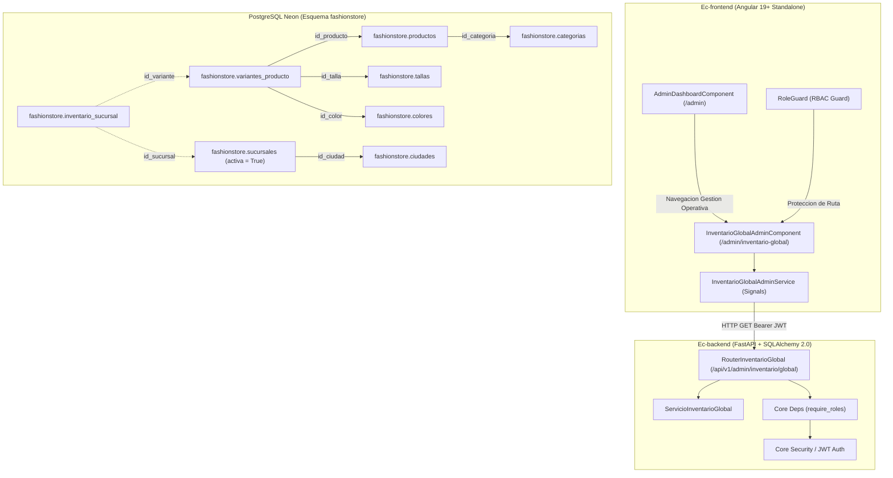
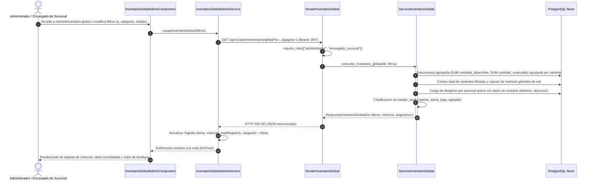

# Diseno Tecnico: CU26 - Consultar inventario global

**ID del Caso de Uso:** CU26  
**Nombre:** Consultar inventario global  
**Paquete Arquitectonico:** `gestion_operativa` / `inventario`  
**Modulo Backend:** `app/modules/gestion_operativa/cu26_inventario_global`  
**Modulo Frontend Web:** `src/app/modules/gestion_operativa/cu26_inventario_global`  
**Referencia de Requisitos:** `.specs/changes/CU26/spec.md`  
**Estado:** En Revision Tecnica (Fase 2 - Diseno)  

---

## 1. Arquitectura General y Enfoque

El caso de uso **CU26 - Consultar inventario global** provee la capacidad analitica y operativa centralizada para supervisar en tiempo real las existencias fisicas de todas las prendas y variantes comerciales (SKUs) distribuidas a lo largo de la red de sucursales de **FashionStore**.

Proporciona agregaciones consolidadas a nivel corporativo, discriminando entre stock disponible y stock retenido en reservas, desglose matricial por boutique activa con datos logisticos de contacto (direccion y telefono) para soporte en derivacion inter-tiendas, e indicadores de alerta temprana ante quiebres de stock.



### 1.1 Diagrama de Secuencia: Consulta Analitica de Inventario Global



### 1.2 Principios de Diseno Arquitectonico y Gobernanza
1. **Consistencia Transaccional y Agregacion Defensiva:**
   - La consulta opera en modo solo lectura (`SELECT`) optimizada, calculando totales consolidados de stock disponible y reservado directamente en motor SQL mediante funciones de agregacion (`SUM`, `COALESCE`) y discriminando sedes inactivas.
   - Las variantes sin registros de inventario son procesadas con valor cero (`0`) mediante `LEFT OUTER JOIN`, garantizando que ninguna prenda valida del catalogo desaparezca de la matriz analitica.
2. **Segregacion de Roles (RBAC):**
   - El endpoint analitico esta restringido a los roles institucionales `administrador` y `encargado_sucursal`. Los roles `cajero` y `cliente` son bloqueados con HTTP 403 Forbidden.
   - El rol `administrador` dispone de vision corporativa total. El rol `encargado_sucursal` consulta la red comercial de forma informativa para coordinacion y derivacion de clientes entre boutiques.
3. **Ratificacion Formal de Exclusion de Ec-mobile:**
   - La aplicacion movil (`Ec-mobile`) en Flutter 3.x esta concebida exclusivamente para la atencion al cliente final (B2C), exploracion visual y vestidor de Realidad Aumentada (AR).
   - Queda formalmente ratificada la exclusion total de CU26 en `Ec-mobile`: cero modelos, cero servicios y cero vistas en Flutter.

---

## 2. Diseno Backend (`Ec-backend` - FastAPI + SQLAlchemy 2.0 + PostgreSQL Neon)

### 2.1 Modulo y Directorio de Implementacion
El codigo del caso de uso residira en el paquete:
`app/modules/gestion_operativa/cu26_inventario_global/`
- `__init__.py`
- `router.py`
- `servicio.py`
- `esquemas.py`
- `errores.py`

### 2.2 Estrategia de Consulta SQL / ORM Analitica

Para asegurar maximo rendimiento sobre la base de datos PostgreSQL Neon y evitar el problema de consultas N+1, la consulta se diseña en dos fases coordinadas dentro de `ServicioInventarioGlobal`:

#### Fase A: Consulta Principal Agregada con Paginacion
Se formula una consulta sobre `VarianteProductoORM` unida con `ProductoORM`, `CategoriaORM`, `TallaORM` y `ColorORM`. Se realiza un `LEFT OUTER JOIN` con `InventarioSucursalORM` y `SucursalORM` condicionado a sucursales activas (`SucursalORM.activa.is_(True)`):

```python
# Consulta base de variantes con agregaciones de stock
from sqlalchemy import func, case, and_, or_, select
from modules.catalogo.modelos import (
    VarianteProductoORM, ProductoORM, CategoriaORM, TallaORM, ColorORM, InventarioSucursalORM
)
from modules.gestion_operativa.modelos import SucursalORM, CiudadORM

# Expresiones agregadas por variante
total_disponible_expr = func.coalesce(
    func.sum(
        case(
            (SucursalORM.activa.is_(True), InventarioSucursalORM.cantidad_disponible),
            else_=0
        )
    ),
    0
).label("total_disponible")

total_reservado_expr = func.coalesce(
    func.sum(
        case(
            (SucursalORM.activa.is_(True), InventarioSucursalORM.cantidad_reservada),
            else_=0
        )
    ),
    0
).label("total_reservado")
```

- Filtros aplicados a nivel de `WHERE`:
  * `ProductoORM.activo.is_(True)` y `VarianteProductoORM.activo.is_(True)`.
  * Filtro textual `q`: `or_(ProductoORM.nombre.ilike(f"%{q}%"), VarianteProductoORM.sku.ilike(f"%{q}%"))`.
  * Filtro categoria: `ProductoORM.id_categoria == filtros.id_categoria`.
  * Filtro sucursal: `InventarioSucursalORM.id_sucursal == filtros.id_sucursal`.
- Filtros aplicados a nivel de `HAVING` para `estado_stock`:
  * `'agotado'`: `total_disponible_expr == 0`
  * `'alerta_baja'`: `and_(total_disponible_expr > 0, total_disponible_expr <= 5)`
  * `'optimo'`: `total_disponible_expr > 5`
- Ordenamiento dinamico:
  * `'stock_asc'`: `total_disponible_expr.asc()`
  * `'stock_desc'`: `total_disponible_expr.desc()`
  * `'nombre_asc'`: `ProductoORM.nombre.asc(), VarianteProductoORM.sku.asc()`
  * `'nombre_desc'`: `ProductoORM.nombre.desc(), VarianteProductoORM.sku.asc()`
  * `'sku_asc'`: `VarianteProductoORM.sku.asc()`

#### Fase B: Ingestion del Desglose por Sucursal Activa
Para el subconjunto de variantes de la pagina actual (`id_variantes_pagina`), se consultan las existencias en cada sucursal activa uniendo `InventarioSucursalORM`, `SucursalORM` y `CiudadORM`:
- Se recuperan: `id_sucursal`, `nombre`, `direccion`, `telefono`, `ciudad.nombre`, `cantidad_disponible`, `cantidad_reservada`.
- Se agrupan por `id_variante` en un mapa en memoria (`dict[int, list[ExistenciaSucursalItemOut]]`).
- Si una sucursal activa no tiene registro en `inventario_sucursal` para esa variante, se genera su entrada con `cantidad_disponible = 0` y `cantidad_reservada = 0`, asegurando que el personal conozca con exactitud la situacion de cada boutique fisica.

#### Fase C: Metricas Consolidadas de Red
Se ejecuta una consulta agregada global para los KPIs superiores:
- `total_unidades_red`: Suma de `cantidad_disponible` en todas las sucursales activas para variantes activas.
- `variantes_monitoreadas`: Conteo total de variantes activas registradas.
- `alertas_stock_bajo`: Conteo de variantes cuyo stock total en red es mayor a 0 y menor o igual a 5 unidades.
- `sedes_activas`: Conteo de registros en `fashionstore.sucursales` con `activa = True`.

### 2.3 Esquemas Pydantic v2 (`esquemas.py`)

```python
# app/modules/gestion_operativa/cu26_inventario_global/esquemas.py

from typing import List, Literal, Optional
from pydantic import BaseModel, ConfigDict, Field


class ExistenciaSucursalItemOut(BaseModel):
    """Detalle de existencias fisicas en una boutique activa."""
    model_config = ConfigDict(from_attributes=True)

    id_sucursal: int
    nombre_sucursal: str
    ciudad: str
    direccion: str
    telefono: Optional[str] = None
    cantidad_disponible: int = 0
    cantidad_reservada: int = 0


class InventarioGlobalItemOut(BaseModel):
    """Ficha consolidada de existencias por variante y prenda."""
    model_config = ConfigDict(from_attributes=True)

    id_variante: int
    id_producto: int
    nombre_producto: str
    sku: str
    categoria: str
    talla: str
    color: str
    swatches_hex: Optional[str] = None
    total_disponible: int
    total_reservado: int
    total_fisico: int
    estado_stock: Literal["optimo", "alerta_baja", "agotado"]
    desglose_sucursales: List[ExistenciaSucursalItemOut] = Field(default_factory=list)


class MetricasInventarioGlobalOut(BaseModel):
    """Indicadores cuantitativos consolidados de la red comercial."""
    model_config = ConfigDict(from_attributes=True)

    total_unidades_red: int = 0
    variantes_monitoreadas: int = 0
    alertas_stock_bajo: int = 0
    sedes_activas: int = 0


class InventarioGlobalFiltrosIn(BaseModel):
    """Parametros de consulta y filtrado multicriterio."""
    q: Optional[str] = Field(default=None, max_length=100)
    id_categoria: Optional[int] = Field(default=None, ge=1)
    id_sucursal: Optional[int] = Field(default=None, ge=1)
    estado_stock: Optional[Literal["optimo", "alerta_baja", "agotado", "todos"]] = Field(default="todos")
    ordenar_por: Optional[Literal["stock_asc", "stock_desc", "nombre_asc", "nombre_desc", "sku_asc"]] = Field(
        default="nombre_asc"
    )
    pagina: int = Field(default=1, ge=1)
    limite: int = Field(default=10, ge=1, le=100)


class RespuestaInventarioGlobalOut(BaseModel):
    """Contrato de respuesta paginada y analitica de inventario global."""
    model_config = ConfigDict(from_attributes=True)

    items: List[InventarioGlobalItemOut]
    metricas: MetricasInventarioGlobalOut
    total: int
    pagina: int
    limite: int
    total_paginas: int
```

### 2.4 Jerarquia de Excepciones Semanticas de Dominio (`errores.py`)

```python
# app/modules/gestion_operativa/cu26_inventario_global/errores.py

from core.errors import (
    AuthorizationError,
    DomainError,
    NotFoundError,
    UnprocessableEntityError,
)


class InventarioGlobalError(DomainError):
    """Base para excepciones del dominio de inventario global."""

    def __init__(self, message: str = "Error en consulta de inventario global", code: str = "INVENTARIO_GLOBAL_ERROR"):
        self.status_code = 400
        super().__init__(message, code=code)


class SucursalInvalidaConsultaError(NotFoundError):
    """Lanzada cuando el filtro id_sucursal especificado no existe o esta inactiva (HTTP 404)."""

    def __init__(self, id_sucursal: int):
        self.status_code = 404
        super().__init__(
            f"La sucursal con identificador {id_sucursal} no existe o no se encuentra activa.",
            code="SUCURSAL_NO_ENCONTRADA_O_INACTIVA",
        )


class CategoriaInvalidaConsultaError(NotFoundError):
    """Lanzada cuando el filtro id_categoria especificado no existe (HTTP 404)."""

    def __init__(self, id_categoria: int):
        self.status_code = 404
        super().__init__(
            f"La categoria con identificador {id_categoria} no existe en el sistema.",
            code="CATEGORIA_NO_ENCONTRADA",
        )


class ParametroConsultaInvalidoError(UnprocessableEntityError):
    """Lanzada cuando un parametro de filtrado o paginacion viola las restricciones de dominio (HTTP 422)."""

    def __init__(self, detalle: str):
        self.status_code = 422
        super().__init__(detalle, code="PARAMETRO_CONSULTA_INVALIDO")
```

### 2.5 Capa de Servicio (`servicio.py`)

```python
# app/modules/gestion_operativa/cu26_inventario_global/servicio.py

from math import ceil
from typing import Dict, List, Tuple
from sqlalchemy import and_, case, func, or_, select
from sqlalchemy.orm import Session

from modules.catalogo.modelos import (
    CategoriaORM,
    ColorORM,
    InventarioSucursalORM,
    ProductoORM,
    TallaORM,
    VarianteProductoORM,
)
from modules.gestion_operativa.modelos import CiudadORM, SucursalORM
from .esquemas import (
    ExistenciaSucursalItemOut,
    InventarioGlobalFiltrosIn,
    InventarioGlobalItemOut,
    MetricasInventarioGlobalOut,
    RespuestaInventarioGlobalOut,
)
from .errores import CategoriaInvalidaConsultaError, SucursalInvalidaConsultaError


class ServicioInventarioGlobal:
    """Logica de negocio analitica para la consolidacion transversal de existencias."""

    @staticmethod
    def calcular_estado_stock(total_disponible: int) -> str:
        """Determina el estado semaforico segun el umbral cuantitativo."""
        if total_disponible <= 0:
            return "agotado"
        if total_disponible <= 5:
            return "alerta_baja"
        return "optimo"

    @classmethod
    def consultar_inventario_global(
        cls,
        db: Session,
        filtros: InventarioGlobalFiltrosIn,
    ) -> RespuestaInventarioGlobalOut:
        # 1. Validacion previa de existencia de filtros foraneos si fueron provistos
        if filtros.id_sucursal is not None:
            sucursal_valida = db.execute(
                select(SucursalORM.id_sucursal).where(
                    SucursalORM.id_sucursal == filtros.id_sucursal,
                    SucursalORM.activa.is_(True),
                )
            ).scalar_one_or_none()
            if not sucursal_valida:
                raise SucursalInvalidaConsultaError(filtros.id_sucursal)

        if filtros.id_categoria is not None:
            cat_valida = db.execute(
                select(CategoriaORM.id_categoria).where(
                    CategoriaORM.id_categoria == filtros.id_categoria
                )
            ).scalar_one_or_none()
            if not cat_valida:
                raise CategoriaInvalidaConsultaError(filtros.id_categoria)

        # 2. Carga de todas las sucursales activas con datos de contacto
        sucursales_activas = db.execute(
            select(
                SucursalORM.id_sucursal,
                SucursalORM.nombre,
                SucursalORM.direccion,
                SucursalORM.telefono,
                CiudadORM.nombre.label("ciudad_nombre"),
            )
            .join(CiudadORM, SucursalORM.id_ciudad == CiudadORM.id_ciudad)
            .where(SucursalORM.activa.is_(True))
            .order_by(SucursalORM.nombre.asc())
        ).all()
        sedes_activas_count = len(sucursales_activas)

        # 3. Construccion de la consulta de agregacion por variante
        total_disp_col = func.coalesce(
            func.sum(
                case(
                    (SucursalORM.activa.is_(True), InventarioSucursalORM.cantidad_disponible),
                    else_=0,
                )
            ),
            0,
        ).label("total_disponible")

        total_res_col = func.coalesce(
            func.sum(
                case(
                    (SucursalORM.activa.is_(True), InventarioSucursalORM.cantidad_reservada),
                    else_=0,
                )
            ),
            0,
        ).label("total_reservado")

        stmt = (
            select(
                VarianteProductoORM.id_variante,
                VarianteProductoORM.id_producto,
                ProductoORM.nombre.label("nombre_producto"),
                VarianteProductoORM.sku,
                CategoriaORM.nombre.label("categoria_nombre"),
                TallaORM.codigo.label("talla_codigo"),
                ColorORM.nombre.label("color_nombre"),
                ColorORM.codigo_hex.label("swatches_hex"),
                total_disp_col,
                total_res_col,
            )
            .join(ProductoORM, VarianteProductoORM.id_producto == ProductoORM.id_producto)
            .join(CategoriaORM, ProductoORM.id_categoria == CategoriaORM.id_categoria)
            .join(TallaORM, VarianteProductoORM.id_talla == TallaORM.id_talla)
            .join(ColorORM, VarianteProductoORM.id_color == ColorORM.id_color)
            .outerjoin(InventarioSucursalORM, VarianteProductoORM.id_variante == InventarioSucursalORM.id_variante)
            .outerjoin(SucursalORM, InventarioSucursalORM.id_sucursal == SucursalORM.id_sucursal)
            .where(
                ProductoORM.activo.is_(True),
                VarianteProductoORM.activo.is_(True),
            )
            .group_by(
                VarianteProductoORM.id_variante,
                VarianteProductoORM.id_producto,
                ProductoORM.nombre,
                VarianteProductoORM.sku,
                CategoriaORM.nombre,
                TallaORM.codigo,
                ColorORM.nombre,
                ColorORM.codigo_hex,
            )
        )

        # Filtros WHERE
        if filtros.q:
            patron = f"%{filtros.q.strip()}%"
            stmt = stmt.where(
                or_(
                    ProductoORM.nombre.ilike(patron),
                    VarianteProductoORM.sku.ilike(patron),
                )
            )

        if filtros.id_categoria:
            stmt = stmt.where(ProductoORM.id_categoria == filtros.id_categoria)

        if filtros.id_sucursal:
            # Restringe el agrupamiento a la presencia en dicha sucursal
            stmt = stmt.where(InventarioSucursalORM.id_sucursal == filtros.id_sucursal)

        # Filtros HAVING segun estado_stock
        if filtros.estado_stock and filtros.estado_stock != "todos":
            if filtros.estado_stock == "agotado":
                stmt = stmt.having(total_disp_col == 0)
            elif filtros.estado_stock == "alerta_baja":
                stmt = stmt.having(and_(total_disp_col > 0, total_disp_col <= 5))
            elif filtros.estado_stock == "optimo":
                stmt = stmt.having(total_disp_col > 5)

        # Ordenamiento
        if filtros.ordenar_por == "stock_asc":
            stmt = stmt.order_by(total_disp_col.asc(), ProductoORM.nombre.asc())
        elif filtros.ordenar_por == "stock_desc":
            stmt = stmt.order_by(total_disp_col.desc(), ProductoORM.nombre.asc())
        elif filtros.ordenar_por == "nombre_desc":
            stmt = stmt.order_by(ProductoORM.nombre.desc(), VarianteProductoORM.sku.asc())
        elif filtros.ordenar_por == "sku_asc":
            stmt = stmt.order_by(VarianteProductoORM.sku.asc())
        else:  # nombre_asc por defecto
            stmt = stmt.order_by(ProductoORM.nombre.asc(), VarianteProductoORM.sku.asc())

        # Conteo total para paginacion usando subconsulta
        conteo_subquery = stmt.subquery()
        total_registros = db.execute(
            select(func.count()).select_from(conteo_subquery)
        ).scalar_one() or 0

        total_paginas = max(1, ceil(total_registros / filtros.limite))
        offset = (filtros.pagina - 1) * filtros.limite

        # Ejecucion paginada
        filas_pagina = db.execute(stmt.offset(offset).limit(filtros.limite)).all()

        ids_variantes_pagina = [f.id_variante for f in filas_pagina]

        # 4. Desglose detallado de sucursales para las variantes de la pagina
        desglose_por_variante: Dict[int, List[ExistenciaSucursalItemOut]] = {
            v_id: [] for v_id in ids_variantes_pagina
        }

        if ids_variantes_pagina and sucursales_activas:
            # Consultar existencias reales registradas
            existencias_db = db.execute(
                select(
                    InventarioSucursalORM.id_variante,
                    InventarioSucursalORM.id_sucursal,
                    InventarioSucursalORM.cantidad_disponible,
                    InventarioSucursalORM.cantidad_reservada,
                )
                .join(SucursalORM, InventarioSucursalORM.id_sucursal == SucursalORM.id_sucursal)
                .where(
                    InventarioSucursalORM.id_variante.in_(ids_variantes_pagina),
                    SucursalORM.activa.is_(True),
                )
            ).all()

            mapa_existencias = {
                (e.id_variante, e.id_sucursal): (e.cantidad_disponible, e.cantidad_reservada)
                for e in existencias_db
            }

            for v_id in ids_variantes_pagina:
                for suc in sucursales_activas:
                    disp, res = mapa_existencias.get((v_id, suc.id_sucursal), (0, 0))
                    desglose_por_variante[v_id].append(
                        ExistenciaSucursalItemOut(
                            id_sucursal=suc.id_sucursal,
                            nombre_sucursal=suc.nombre,
                            ciudad=suc.ciudad_nombre,
                            direccion=suc.direccion,
                            telefono=suc.telefono,
                            cantidad_disponible=disp,
                            cantidad_reservada=res,
                        )
                    )

        # 5. Ensamblado de items de salida
        items_out: List[InventarioGlobalItemOut] = []
        for f in filas_pagina:
            total_disp = f.total_disponible or 0
            total_res = f.total_reservado or 0
            total_fis = total_disp + total_res
            estado_calc = cls.calcular_estado_stock(total_disp)

            items_out.append(
                InventarioGlobalItemOut(
                    id_variante=f.id_variante,
                    id_producto=f.id_producto,
                    nombre_producto=f.nombre_producto,
                    sku=f.sku,
                    categoria=f.categoria_nombre,
                    talla=f.talla_codigo,
                    color=f.color_nombre,
                    swatches_hex=f.swatches_hex,
                    total_disponible=total_disp,
                    total_reservado=total_res,
                    total_fisico=total_fis,
                    estado_stock=estado_calc,
                    desglose_sucursales=desglose_por_variante.get(f.id_variante, []),
                )
            )

        # 6. Metricas de red (calculo global para el panel superior)
        metricas_query = db.execute(
            select(
                func.coalesce(
                    func.sum(
                        case(
                            (SucursalORM.activa.is_(True), InventarioSucursalORM.cantidad_disponible),
                            else_=0,
                        )
                    ),
                    0,
                ).label("total_unidades"),
                func.count(VarianteProductoORM.id_variante.distinct()).label("total_variantes"),
            )
            .select_from(VarianteProductoORM)
            .join(ProductoORM, VarianteProductoORM.id_producto == ProductoORM.id_producto)
            .outerjoin(InventarioSucursalORM, VarianteProductoORM.id_variante == InventarioSucursalORM.id_variante)
            .outerjoin(SucursalORM, InventarioSucursalORM.id_sucursal == SucursalORM.id_sucursal)
            .where(
                ProductoORM.activo.is_(True),
                VarianteProductoORM.activo.is_(True),
            )
        ).one()

        # Conteo de variantes en alerta baja (0 < total_disponible <= 5)
        subq_alerta = (
            select(
                VarianteProductoORM.id_variante,
                func.coalesce(
                    func.sum(
                        case(
                            (SucursalORM.activa.is_(True), InventarioSucursalORM.cantidad_disponible),
                            else_=0,
                        )
                    ),
                    0,
                ).label("disp"),
            )
            .select_from(VarianteProductoORM)
            .join(ProductoORM, VarianteProductoORM.id_producto == ProductoORM.id_producto)
            .outerjoin(InventarioSucursalORM, VarianteProductoORM.id_variante == InventarioSucursalORM.id_variante)
            .outerjoin(SucursalORM, InventarioSucursalORM.id_sucursal == SucursalORM.id_sucursal)
            .where(
                ProductoORM.activo.is_(True),
                VarianteProductoORM.activo.is_(True),
            )
            .group_by(VarianteProductoORM.id_variante)
            .having(
                and_(
                    func.coalesce(func.sum(case((SucursalORM.activa.is_(True), InventarioSucursalORM.cantidad_disponible), else_=0)), 0) > 0,
                    func.coalesce(func.sum(case((SucursalORM.activa.is_(True), InventarioSucursalORM.cantidad_disponible), else_=0)), 0) <= 5,
                )
            )
            .subquery()
        )
        total_alertas = db.execute(select(func.count()).select_from(subq_alerta)).scalar_one() or 0

        metricas_out = MetricasInventarioGlobalOut(
            total_unidades_red=int(metricas_query.total_unidades or 0),
            variantes_monitoreadas=int(metricas_query.total_variantes or 0),
            alertas_stock_bajo=int(total_alertas),
            sedes_activas=sedes_activas_count,
        )

        return RespuestaInventarioGlobalOut(
            items=items_out,
            metricas=metricas_out,
            total=total_registros,
            pagina=filtros.pagina,
            limite=filtros.limite,
            total_paginas=total_paginas,
        )
```

### 2.6 Router REST (`router.py`)

```python
# app/modules/gestion_operativa/cu26_inventario_global/router.py

from typing import Literal, Optional
from fastapi import APIRouter, Depends, Query
from sqlalchemy.orm import Session

from core.database import get_db
from core.security import require_roles
from .esquemas import InventarioGlobalFiltrosIn, RespuestaInventarioGlobalOut
from .servicio import ServicioInventarioGlobal

router = APIRouter(
    prefix="/api/v1/admin/inventario/global",
    tags=["CU26 - Consultar inventario global"],
)


@router.get(
    "",
    response_model=RespuestaInventarioGlobalOut,
    summary="Consultar inventario global consolidado",
    description="Retorna el inventario consolidado multi-sucursal a nivel de prenda y variante con desglose por tienda.",
)
def consultar_inventario_global(
    q: Optional[str] = Query(None, description="Busqueda textual por prenda o SKU"),
    id_categoria: Optional[int] = Query(None, ge=1, description="Filtrar por identificador de categoria"),
    id_sucursal: Optional[int] = Query(None, ge=1, description="Filtrar por identificador de sucursal"),
    estado_stock: Optional[Literal["optimo", "alerta_baja", "agotado", "todos"]] = Query(
        "todos", description="Estado cuantitativo de inventario"
    ),
    ordenar_por: Optional[Literal["stock_asc", "stock_desc", "nombre_asc", "nombre_desc", "sku_asc"]] = Query(
        "nombre_asc", description="Criterio de ordenacion"
    ),
    pagina: int = Query(1, ge=1, description="Numero de pagina"),
    limite: int = Query(10, ge=1, le=100, description="Cantidad de registros por pagina"),
    db: Session = Depends(get_db),
    usuario_autenticado: dict = Depends(require_roles(["administrador", "encargado_sucursal"])),
) -> RespuestaInventarioGlobalOut:
    filtros = InventarioGlobalFiltrosIn(
        q=q,
        id_categoria=id_categoria,
        id_sucursal=id_sucursal,
        estado_stock=estado_stock,
        ordenar_por=ordenar_por,
        pagina=pagina,
        limite=limite,
    )
    return ServicioInventarioGlobal.consultar_inventario_global(db, filtros)
```

---

## 3. Diseno Frontend Web (`Ec-frontend` - Angular 19+ Standalone)

### 3.1 Estructura de Directorios Proyectada
El modulo del caso de uso se ubicara en:
`src/app/modules/gestion_operativa/cu26_inventario_global/`
- `modelos/`
  * `inventario-global.dto.ts`
- `servicios/`
  * `inventario-global-admin.service.ts`
  * `inventario-global-admin.service.spec.ts`
- `paginas/`
  * `inventario-global-admin.component.ts`
  * `inventario-global-admin.component.html`
  * `inventario-global-admin.component.spec.ts`

### 3.2 Contratos TypeScript (`inventario-global.dto.ts`)

```typescript
// src/app/modules/gestion_operativa/cu26_inventario_global/modelos/inventario-global.dto.ts

export type EstadoStockGlobal = 'optimo' | 'alerta_baja' | 'agotado';
export type CriterioOrdenacionInventario = 'stock_asc' | 'stock_desc' | 'nombre_asc' | 'nombre_desc' | 'sku_asc';

export interface ExistenciaSucursalItemOut {
  id_sucursal: number;
  nombre_sucursal: string;
  ciudad: string;
  direccion: string;
  telefono: string | null;
  cantidad_disponible: number;
  cantidad_reservada: number;
}

export interface InventarioGlobalItemOut {
  id_variante: number;
  id_producto: number;
  nombre_producto: string;
  sku: string;
  categoria: string;
  talla: string;
  color: string;
  swatches_hex: string | null;
  total_disponible: number;
  total_reservado: number;
  total_fisico: number;
  estado_stock: EstadoStockGlobal;
  desglose_sucursales: ExistenciaSucursalItemOut[];
}

export interface MetricasInventarioGlobalOut {
  total_unidades_red: number;
  variantes_monitoreadas: number;
  alertas_stock_bajo: number;
  sedes_activas: number;
}

export interface InventarioGlobalFiltros {
  q: string;
  id_categoria: number | null;
  id_sucursal: number | null;
  estado_stock: EstadoStockGlobal | 'todos';
  ordenar_por: CriterioOrdenacionInventario;
  pagina: number;
  limite: number;
}

export interface RespuestaInventarioGlobalOut {
  items: InventarioGlobalItemOut[];
  metricas: MetricasInventarioGlobalOut;
  total: number;
  pagina: number;
  limite: number;
  total_paginas: number;
}
```

### 3.3 Servicio HTTP Reactivo (`InventarioGlobalAdminService`)

```typescript
// src/app/modules/gestion_operativa/cu26_inventario_global/servicios/inventario-global-admin.service.ts

import { Injectable, inject, signal } from '@angular/core';
import { HttpClient, HttpParams } from '@angular/common/http';
import { Observable, catchError, finalize, tap, throwError } from 'rxjs';
import { environment } from '../../../../../environments/environment';
import {
  InventarioGlobalFiltros,
  InventarioGlobalItemOut,
  MetricasInventarioGlobalOut,
  RespuestaInventarioGlobalOut,
} from '../modelos/inventario-global.dto';

@Injectable({
  providedIn: 'root',
})
export class InventarioGlobalAdminService {
  private readonly http = inject(HttpClient);
  private readonly baseUrl = `${environment.apiUrl}/api/v1/admin/inventario/global`;

  // Estado Reactivo con Angular Signals
  readonly items = signal<InventarioGlobalItemOut[]>([]);
  readonly metricas = signal<MetricasInventarioGlobalOut>({
    total_unidades_red: 0,
    variantes_monitoreadas: 0,
    alertas_stock_bajo: 0,
    sedes_activas: 0,
  });
  readonly totalRegistros = signal<number>(0);
  readonly totalPaginas = signal<number>(1);
  readonly cargando = signal<boolean>(false);
  readonly error = signal<string | null>(null);

  readonly filtros = signal<InventarioGlobalFiltros>({
    q: '',
    id_categoria: null,
    id_sucursal: null,
    estado_stock: 'todos',
    ordenar_por: 'nombre_asc',
    pagina: 1,
    limite: 10,
  });

  readonly itemSeleccionadoDetalle = signal<InventarioGlobalItemOut | null>(null);
  readonly modalDetalleAbierto = signal<boolean>(false);

  cargarInventario(): Observable<RespuestaInventarioGlobalOut> {
    this.cargando.set(true);
    this.error.set(null);

    const f = this.filtros();
    let params = new HttpParams()
      .set('pagina', f.pagina.toString())
      .set('limite', f.limite.toString())
      .set('ordenar_por', f.ordenar_por);

    if (f.q.trim()) {
      params = params.set('q', f.q.trim());
    }
    if (f.id_categoria) {
      params = params.set('id_categoria', f.id_categoria.toString());
    }
    if (f.id_sucursal) {
      params = params.set('id_sucursal', f.id_sucursal.toString());
    }
    if (f.estado_stock && f.estado_stock !== 'todos') {
      params = params.set('estado_stock', f.estado_stock);
    }

    return this.http.get<RespuestaInventarioGlobalOut>(this.baseUrl, { params }).pipe(
      tap((res) => {
        this.items.set(res.items);
        this.metricas.set(res.metricas);
        this.totalRegistros.set(res.total);
        this.totalPaginas.set(res.total_paginas);
      }),
      catchError((err) => {
        const msg = err.error?.detail || 'Error al cargar el inventario global consolidado.';
        this.error.set(msg);
        return throwError(() => err);
      }),
      finalize(() => {
        this.cargando.set(false);
      })
    );
  }

  actualizarFiltros(cambios: Partial<InventarioGlobalFiltros>): void {
    this.filtros.update((actual) => ({
      ...actual,
      ...cambios,
      // Si cambia un criterio de busqueda que no sea pagina, reiniciar a pagina 1
      pagina: cambios.pagina !== undefined ? cambios.pagina : 1,
    }));
    this.cargarInventario().subscribe();
  }

  cambiarPagina(nuevaPagina: number): void {
    if (nuevaPagina >= 1 && nuevaPagina <= this.totalPaginas()) {
      this.actualizarFiltros({ pagina: nuevaPagina });
    }
  }

  limpiarFiltros(): void {
    this.filtros.set({
      q: '',
      id_categoria: null,
      id_sucursal: null,
      estado_stock: 'todos',
      ordenar_por: 'nombre_asc',
      pagina: 1,
      limite: 10,
    });
    this.cargarInventario().subscribe();
  }

  abrirDetalle(item: InventarioGlobalItemOut): void {
    this.itemSeleccionadoDetalle.set(item);
    this.modalDetalleAbierto.set(true);
  }

  cerrarDetalle(): void {
    this.itemSeleccionadoDetalle.set(null);
    this.modalDetalleAbierto.set(false);
  }
}
```

### 3.4 Integracion en `AdminDashboardComponent`

Se integrara una tarjeta boutique en la categoria *"Gestion Operativa"* del panel corporativo `/admin`:

- **Ubicacion:** `src/app/modules/admin/dashboard/admin-dashboard.component.html`
- **Condicion de Visibilidad:** `@if (esAdmin() || esEncargado())`
- **Titulo:** `"Consultar inventario global"`
- **Boton:** `"Consultar inventario global"`
- **Identificador:** `id="btn-consultar-inventario-global"`
- **Enlace:** `routerLink="/admin/inventario-global"`
- **Icono Editorial:** SVG limpio de red global y cajas de inventario (sin emojis).
- **Subtitulo/Descripcion:** `"Vision panoramica multi-sucursal de existencias, balances de red comercial y semaforo de stock."`

```html
<!-- Tarjeta CU26: Consultar inventario global -->
@if (esAdmin() || esEncargado()) {
  <div class="bg-white border border-slate-200 rounded-2xl p-6 hover:border-[#AD8C63] transition-all shadow-xs hover:shadow-md group flex flex-col justify-between">
    <div>
      <div class="flex items-center justify-between mb-4">
        <span class="text-[11px] font-bold tracking-widest text-[#AD8C63] uppercase">
          Gestion Operativa
        </span>
        <span class="inline-flex items-center gap-1 px-2.5 py-0.5 rounded-full text-[11px] font-semibold bg-[#FAF7F2] text-[#AD8C63] border border-[#ECE4D8]">
          <span class="w-1.5 h-1.5 rounded-full bg-[#AD8C63]"></span>
          Balance de Red
        </span>
      </div>

      <div class="flex items-start gap-3">
        <div class="w-11 h-11 rounded-xl bg-slate-100 border border-slate-200 flex items-center justify-center shrink-0 group-hover:border-[#AD8C63] transition-colors">
          <svg class="w-5 h-5 text-slate-800" fill="none" stroke="currentColor" viewBox="0 0 24 24">
            <path stroke-linecap="round" stroke-linejoin="round" stroke-width="1.8" d="M3.055 11H5a2 2 0 012 2v1a2 2 0 002 2 2 2 0 012 2v2.945M8 3.935V5.5A2.5 2.5 0 0010.5 8h.5a2 2 0 012 2 2 2 0 104 0 2 2 0 012-2h1.064M15 20.488V18a2 2 0 012-2h3.064M21 12a9 9 0 11-18 0 9 9 0 0118 0z" />
          </svg>
        </div>
        <div>
          <h2 class="text-lg font-bold text-slate-900 group-hover:text-black transition-colors">
            Consultar inventario global
          </h2>
          <p class="text-xs text-slate-500 mt-1 leading-relaxed">
            Consolidado multi-sucursal de existencias, balances de red comercial y alertas de stock bajo.
          </p>
        </div>
      </div>

      <div class="mt-5 pt-4 border-t border-slate-100 space-y-2">
        <div class="flex items-center text-xs text-slate-600 gap-2">
          <svg class="w-3.5 h-3.5 text-[#AD8C63]" fill="none" stroke="currentColor" viewBox="0 0 24 24">
            <path stroke-linecap="round" stroke-linejoin="round" stroke-width="2" d="M5 13l4 4L19 7" />
          </svg>
          <span>Monitoreo transversal de existencias</span>
        </div>
        <div class="flex items-center text-xs text-slate-600 gap-2">
          <svg class="w-3.5 h-3.5 text-[#AD8C63]" fill="none" stroke="currentColor" viewBox="0 0 24 24">
            <path stroke-linecap="round" stroke-linejoin="round" stroke-width="2" d="M5 13l4 4L19 7" />
          </svg>
          <span>Desglose logistico y derivacion inter-tiendas</span>
        </div>
      </div>
    </div>

    <div class="mt-6 pt-3">
      <a
        id="btn-consultar-inventario-global"
        routerLink="/admin/inventario-global"
        (click)="navegar('/admin/inventario-global')"
        class="w-full inline-flex items-center justify-center gap-2 bg-[#0F172A] hover:bg-black text-white text-xs font-bold uppercase tracking-wider py-3 px-4 rounded-xl shadow-xs transition-all cursor-pointer"
      >
        <span>Consultar inventario global</span>
        <svg class="w-3.5 h-3.5 text-[#AD8C63] group-hover:translate-x-1 transition-transform" fill="none" stroke="currentColor" viewBox="0 0 24 24">
          <path stroke-linecap="round" stroke-linejoin="round" stroke-width="2" d="M9 5l7 7-7 7" />
        </svg>
      </a>
    </div>
  </div>
}
```

### 3.5 Pagina Administrativa `InventarioGlobalAdminComponent`

- **Ruta de Acceso:** `/admin/inventario-global` protegida por `roleGuard(['administrador', 'encargado_sucursal'])`.
- **Estructura Visual:**
  1. **Navegacion Superior y Breadcrumb:**
     - Boton `"<- Volver al Panel Principal"` con `routerLink="/admin"`.
     - Migas de pan: `ADMINISTRACION CORPORATIVA / CONSULTAR INVENTARIO GLOBAL`.
     - Titulo H1: `"Consultar inventario global"`.
  2. **Tarjetas de Metricas Superiores (KPIs de Red):**
     - Grid de 4 tarjetas de resumen ejecutivo con tipografia Outfit:
       * *Unidades Totales en Red*: Cifra consolidada de stock disponible.
       * *Variantes Monitoreadas*: Total de SKUs activos bajo analisis.
       * *Alertas de Stock Bajo*: Variantes con $0 < stock \le 5$, destacadas en color ambar/camel.
       * *Sedes Comerciales Activas*: Cantidad de boutiques fisicas operativas.
  3. **Barra de Filtros Reactiva:**
     - Buscador de texto con *debounce* de 300 ms (conectado a `q`).
     - Selector de categoria (cargado de la API de categorias).
     - Selector de sucursal (cargado de la API de sucursales activas).
     - Selector de estado de stock: *"Todos"*, *"Optimo"*, *"Alerta baja"*, *"Agotado"*.
     - Boton de *"Limpiar Filtros"*.
  4. **Tabla Maestra Consolidada:**
     - Columnas:
       * *Prenda & SKU*: Denominacion de prenda, categoria y codigo SKU en fuente monoespaciada.
       * *Talla & Color*: Swatch cromático hex y etiqueta de talla.
       * *Existencias por Sucursal*: Chips visuales con el nombre de cada sede y la cantidad disponible, con fondo verde esmeralda para optimo, ambar para alerta y gris/rojo para agotado.
       * *Stock Total en Red*: Cifra destacada de unidades disponibles, con indicacion de reservadas.
       * *Estado de Existencias*: Badges con diseno editorial:
         - `'optimo'`: Fondo esmeralda sutil, texto verde oscuro.
         - `'alerta_baja'`: Fondo ambar sutil, texto marron dorado.
         - `'agotado'`: Fondo carmesi sutil, texto rojo oscuro.
       * *Acciones*: Boton con icono de ojo o documento para abrir el modal logistico.
  5. **Modal de Detalle Logistico por Sede:**
     - Muestra el nombre completo de la prenda y variante seleccionada.
     - Lista/tabla con cada boutique: Nombre, Direccion completa, Telefono de contacto directo (enlace `tel:`), Stock Disponible y Stock Reservado.
     - Permite coordinar derivaciones o traslados inmediatos llamando directamente a la sede con stock.
  6. **Luxury Banners de Feedback:**
     - Banner de error no destructivo en caso de fallo de red o tiempo de espera agotado.
     - Skeleton loader durante la resolucion de la peticion HTTP.

---

## 4. Plan de Pruebas Tecnicas

### 4.1 Pruebas de Backend (`Ec-backend` - Pytest)
Ubicacion: `tests/modules/gestion_operativa/test_cu26_inventario_global.py`

| Caso de Prueba | Descripcion | Datos de Entrada | Resultado Esperado |
| :--- | :--- | :--- | :--- |
| **test_rbac_sin_token** | Peticion sin cabecera de autenticacion | `GET /api/v1/admin/inventario/global` sin Bearer | HTTP 401 Unauthorized |
| **test_rbac_rol_no_autorizado** | Peticion con rol cajero o cliente | Token JWT con rol `cajero` | HTTP 403 Forbidden |
| **test_rbac_rol_administrador** | Peticion valida con rol administrador | Token JWT con rol `administrador` | HTTP 200 OK con items y metricas |
| **test_rbac_rol_encargado** | Peticion valida con rol encargado | Token JWT con rol `encargado_sucursal` | HTTP 200 OK con items y metricas |
| **test_agregacion_stock_red** | Consolidacion de existencias multi-sede | Variante con stock en 2 sucursales (3 y 4 unidades) | `total_disponible = 7`, `estado_stock = 'optimo'` |
| **test_variante_sin_inventario** | Manejo de nulos en variantes sin stock | Variante sin filas en `inventario_sucursal` | `total_disponible = 0`, `estado_stock = 'agotado'` |
| **test_filtro_texto_q** | Busqueda textual por prenda o SKU | `?q=CAMISA-LINO` | Retorna unicamente variantes coincidentes |
| **test_filtro_estado_alerta_baja** | Filtrado por estado `alerta_baja` | `?estado_stock=alerta_baja` | Retorna variantes con $1 \le total \le 5$ |
| **test_exclusion_sucursal_inactiva** | Validacion de sucursal inactiva | Sucursal con `activa = False` con 10 unidades | Las 10 unidades no se suman al `total_disponible` |
| **test_paginacion_limites** | Validacion de limites de paginacion | `?limite=150` | HTTP 422 Unprocessable Entity |

### 4.2 Pruebas de Frontend (`Ec-frontend` - Vitest)
Ubicacion:
- `src/app/modules/gestion_operativa/cu26_inventario_global/servicios/inventario-global-admin.service.spec.ts`
- `src/app/modules/gestion_operativa/cu26_inventario_global/paginas/inventario-global-admin.component.spec.ts`

| Caso de Prueba | Descripcion | Condicion | Resultado Esperado |
| :--- | :--- | :--- | :--- |
| **test_servicio_cargar_inventario** | Carga inicial del inventario global | Llamada a `cargarInventario()` | Actualiza Signals `items`, `metricas` y `totalRegistros` |
| **test_servicio_actualizar_filtros** | Modificacion reactiva de filtros | Cambio de filtro `q` o `estado_stock` | Emite peticion HTTP con nuevos parametros y reinicia pagina a 1 |
| **test_componente_render_metricas** | Despliegue de tarjetas de metricas | Signal `metricas` con datos | Renderiza 4 tarjetas de KPIs con valores correctos |
| **test_componente_tabla_chips** | Visualizacion de chips por boutique | Lista de items con desglose de sedes | Renderiza chips con unidades disponibles y semaforo |
| **test_componente_modal_detalle** | Apertura y cierre de modal logistico | Clic en boton de detalle de una fila | Signal `modalDetalleAbierto` en true y renderiza telefonos y direcciones |
| **test_componente_luxury_banner_error** | Manejo visual de error HTTP | Error 500 simulado en el servicio | Despliega Luxury Banner de error no destructivo |

---

## 5. Definicion de Terminado (Definition of Done - DoD) para Fase 2

La Fase 2 (Diseno Tecnico) se considerara formalmente concluida cuando:
1. El documento `.specs/changes/CU26/design.md` este redactado y guardado en el repositorio local sin errores.
2. Se mantenga estrictamente la denominacion oficial: *"Consultar inventario global"*.
3. Se ratifique la exclusion total de la aplicacion movil (`Ec-mobile`).
4. Se haya auditado que el documento carece al 100% de caracteres emoji o informales.
5. No se haya generado ni modificado codigo productivo en `Ec-backend`, `Ec-frontend` o `Ec-mobile`.
6. El usuario apruebe formalmente este diseno para autorizar la transicion a la Fase 3 (Plan de Tareas - `tasks.md`).
