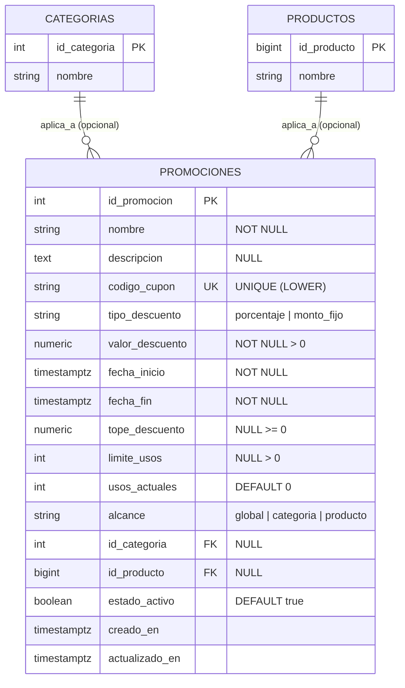

# Diseno Tecnico y Contratos de Arquitectura: [CU27] Gestionar promociones

**Codigo del Caso de Uso:** CU27  
**Denominacion Oficial:** Gestionar promociones  
**Modulo de Arquitectura:** Gestion Comercial / Marketing y Descuentos (`gestion_operativa` / `gestion_comercial`)  
**Metodologia:** Spec-Driven Development (SDD) & Proceso Unificado de Desarrollo de Software (PUDS)  
**Alcance Tecnico:**  
- Backend: Python 3.13 + FastAPI + SQLAlchemy 2.0 + PostgreSQL Neon  
- Frontend Web: Angular 19+ (Standalone Components, Signals, OnPush y Tailwind CSS)  
- Aplicacion Movil: **Excluida formalmente (0 modelos, 0 servicios, 0 pantallas en Flutter)**  

---

## 1. Arquitectura General y Exclusion de Plataforma

### 1.1 Diagrama de Arquitectura del Sistema

```
+-----------------------------------------------------------------------------------+
|                            Ec-frontend (Angular 19+)                             |
|                                                                                   |
|  AdminDashboardComponent                                                          |
|    └─ Tarjeta Boutique "Gestionar promociones" [RBAC Admin/Encargado]             |
|                                                                                   |
|  PromocionesAdminComponent (/admin/promociones)                                   |
|    ├─ Grid Superior de Metricas (Promociones Activas, Cupones, Descuento, Usos)   |
|    ├─ Barra de Filtros con Debounce 300 ms (q, tipo, estado, alcance)             |
|    ├─ Tabla Maestra con Badges Cromaticos y Contadores de Canje                   |
|    ├─ Modales Reactivos (Creacion/Edicion con validacion sincronica y Baja Logica)|
|    └─ Luxury Banners Contextuales No Destructivos (HTTP 409 y 422)                |
|                                                                                   |
|  PromocionesAdminService (Angular Signals + HttpClient)                           |
+------------------------------------------+----------------------------------------+
                                           | HTTP REST / JSON (JWT Bearer)
                                           v
+-----------------------------------------------------------------------------------+
|                             Ec-backend (FastAPI)                                 |
|                                                                                   |
|  app/modules/gestion_operativa/cu27_promociones/                                  |
|    ├─ router.py (Endpoints /api/v1/admin/promociones custodiados por RBAC)        |
|    ├─ esquemas.py (Pydantic v2 DTOs con validacion cronologica y de rangos)      |
|    ├─ errores.py (Jerarquia de Excepciones Semanticas de Dominio)                 |
|    ├─ servicio.py (ServicioGestionPromociones con logica transaccional)           |
|    └─ modelos.py (PromocionORM y relaciones con categorias y productos)           |
|                                                                                   |
|  SQLAlchemy 2.0 ORM:                                                              |
|    └─ PromocionORM (fashionstore.promociones)                                     |
+------------------------------------------+----------------------------------------+
                                           | Conectividad Transaccional Neon
                                           v
+-----------------------------------------------------------------------------------+
|                        Base de Datos PostgreSQL (Neon Cloud)                      |
|                                                                                   |
|  Esquema `fashionstore`:                                                          |
|    ├─ fashionstore.promociones (id_promocion PK, codigo_cupon UNIQUE, checks...)  |
|    ├─ fashionstore.categorias (id_categoria PK referenciada por alcance)          |
|    └─ fashionstore.productos (id_producto PK referenciado por alcance)           |
+-----------------------------------------------------------------------------------+
```

### 1.2 Justificacion Formal de Exclusion de la Aplicacion Movil (`Ec-mobile`)
La aplicacion movil de FashionStore (`Ec-mobile`), desarrollada en Flutter 3.x, esta concebida exclusivamente para la experiencia de compra B2C del consumidor final (catalogo editorial, probador virtual inmersivo con Realidad Aumentada, bolsa de compras y pago digital con Stripe).  
La parametrizacion de politicas comerciales de rebajas, la creacion y asignacion de cupones promocionales, la limitacion cuantitativa de canjes y la supervision de margenes de descuento constituyen labores estrategicas y analiticas reservadas a la gerencia comercial en el panel corporativo web (`Ec-frontend`).  
Por consiguiente, se ratifica la total exclusion de `Ec-mobile`: cero modelos Dart, servicios HTTP o vistas en Flutter participan en la administracion de promociones.

---

## 2. Modelo Relacional de Base de Datos y Migracion Alembic

### 2.1 Esquema Relacional de Base de Datos (`fashionstore.promociones`)



### 2.2 Especificacion DDL en PostgreSQL Neon

```sql
CREATE TABLE IF NOT EXISTS fashionstore.promociones (
    id_promocion SERIAL PRIMARY KEY,
    nombre VARCHAR(150) NOT NULL,
    descripcion TEXT,
    codigo_cupon VARCHAR(50),
    tipo_descuento VARCHAR(20) NOT NULL,
    valor_descuento NUMERIC(10, 2) NOT NULL,
    fecha_inicio TIMESTAMPTZ NOT NULL,
    fecha_fin TIMESTAMPTZ NOT NULL,
    tope_descuento NUMERIC(10, 2),
    limite_usos INTEGER,
    usos_actuales INTEGER NOT NULL DEFAULT 0,
    alcance VARCHAR(20) NOT NULL DEFAULT 'global',
    id_categoria INTEGER REFERENCES fashionstore.categorias(id_categoria) ON DELETE SET NULL,
    id_producto BIGINT REFERENCES fashionstore.productos(id_producto) ON DELETE SET NULL,
    estado_activo BOOLEAN NOT NULL DEFAULT TRUE,
    creado_en TIMESTAMPTZ NOT NULL DEFAULT NOW(),
    actualizado_en TIMESTAMPTZ NOT NULL DEFAULT NOW(),

    -- Restricciones de Dominio
    CONSTRAINT chk_promociones_fechas_orden CHECK (fecha_fin > fecha_inicio),
    CONSTRAINT chk_promociones_tipo_descuento CHECK (tipo_descuento IN ('porcentaje', 'monto_fijo')),
    CONSTRAINT chk_promociones_valor_positivo CHECK (valor_descuento > 0),
    CONSTRAINT chk_promociones_porcentaje_tope CHECK (
        tipo_descuento != 'porcentaje' OR (valor_descuento >= 1.00 AND valor_descuento <= 100.00)
    ),
    CONSTRAINT chk_promociones_tope_positivo CHECK (tope_descuento IS NULL OR tope_descuento >= 0),
    CONSTRAINT chk_promociones_usos_no_negativos CHECK (usos_actuales >= 0),
    CONSTRAINT chk_promociones_limite_positivo CHECK (limite_usos IS NULL OR limite_usos > 0),
    CONSTRAINT chk_promociones_alcance_tipo CHECK (alcance IN ('global', 'categoria', 'producto'))
);

-- Indice unico funcional para codigo de cupon (insensible a mayusculas, ignorando nulos)
CREATE UNIQUE INDEX IF NOT EXISTS uq_promociones_codigo_cupon_lower 
ON fashionstore.promociones (LOWER(TRIM(codigo_cupon))) 
WHERE codigo_cupon IS NOT NULL;

-- Indices para optimizacion de consultas de vigencia y busqueda
CREATE INDEX IF NOT EXISTS ix_promociones_fechas_vigencia 
ON fashionstore.promociones (fecha_inicio, fecha_fin, estado_activo);

CREATE INDEX IF NOT EXISTS ix_promociones_alcance 
ON fashionstore.promociones (alcance, id_categoria, id_producto);
```

### 2.3 Script de Migracion Idempotente Alembic (`0008_cu27_promociones.py`)
- **Revision:** `0008_cu27_promociones`
- **Revisa Abajo:** `0007_cu24_temporadas_colecciones`
- **Operaciones:**
  * Creacion de tabla `fashionstore.promociones` mediante `op.create_table`.
  * Creacion de `CheckConstraint` para validacion de fechas, rangos de porcentaje, alcance y tipos.
  * Creacion de indice funcional unico `uq_promociones_codigo_cupon_lower`.
  * Metodo `downgrade` con eliminacion de indices y drop de tabla en reversa.

---

## 3. Modelo SQLAlchemy 2.0 (`modelos.py`)

```python
from datetime import datetime, timezone
from decimal import Decimal
from typing import Optional
from sqlalchemy import (
    BigInteger,
    Boolean,
    CheckConstraint,
    DateTime,
    ForeignKey,
    Index,
    Integer,
    Numeric,
    String,
    Text,
    func,
)
from sqlalchemy.orm import Mapped, mapped_column, relationship

from core.database import Base


class PromocionORM(Base):
    __tablename__ = "promociones"
    __table_args__ = (
        CheckConstraint("fecha_fin > fecha_inicio", name="chk_promociones_fechas_orden"),
        CheckConstraint("tipo_descuento IN ('porcentaje', 'monto_fijo')", name="chk_promociones_tipo_descuento"),
        CheckConstraint("valor_descuento > 0", name="chk_promociones_valor_positivo"),
        CheckConstraint(
            "tipo_descuento != 'porcentaje' OR (valor_descuento >= 1.00 AND valor_descuento <= 100.00)",
            name="chk_promociones_porcentaje_tope",
        ),
        CheckConstraint("tope_descuento IS NULL OR tope_descuento >= 0", name="chk_promociones_tope_positivo"),
        CheckConstraint("usos_actuales >= 0", name="chk_promociones_usos_no_negativos"),
        CheckConstraint("limite_usos IS NULL OR limite_usos > 0", name="chk_promociones_limite_positivo"),
        CheckConstraint("alcance IN ('global', 'categoria', 'producto')", name="chk_promociones_alcance_tipo"),
        Index(
            "uq_promociones_codigo_cupon_lower",
            func.lower(func.trim(func.coalesce("codigo_cupon", ""))),
            unique=True,
            postgresql_where=func.coalesce("codigo_cupon", "").isnot(None),
        ),
        {"schema": "fashionstore"},
    )

    id_promocion: Mapped[int] = mapped_column(Integer, primary_key=True, autoincrement=True)
    nombre: Mapped[str] = mapped_column(String(150), nullable=False)
    descripcion: Mapped[Optional[str]] = mapped_column(Text, nullable=True)
    codigo_cupon: Mapped[Optional[str]] = mapped_column(String(50), nullable=True)
    tipo_descuento: Mapped[str] = mapped_column(String(20), nullable=False)
    valor_descuento: Mapped[Decimal] = mapped_column(Numeric(10, 2), nullable=False)
    fecha_inicio: Mapped[datetime] = mapped_column(DateTime(timezone=True), nullable=False)
    fecha_fin: Mapped[datetime] = mapped_column(DateTime(timezone=True), nullable=False)
    tope_descuento: Mapped[Optional[Decimal]] = mapped_column(Numeric(10, 2), nullable=True)
    limite_usos: Mapped[Optional[int]] = mapped_column(Integer, nullable=True)
    usos_actuales: Mapped[int] = mapped_column(Integer, nullable=False, default=0)
    alcance: Mapped[str] = mapped_column(String(20), nullable=False, default="global")
    id_categoria: Mapped[Optional[int]] = mapped_column(
        Integer, ForeignKey("fashionstore.categorias.id_categoria", ondelete="SET NULL"), nullable=True
    )
    id_producto: Mapped[Optional[int]] = mapped_column(
        BigInteger, ForeignKey("fashionstore.productos.id_producto", ondelete="SET NULL"), nullable=True
    )
    estado_activo: Mapped[bool] = mapped_column(Boolean, nullable=False, default=True)
    creado_en: Mapped[datetime] = mapped_column(
        DateTime(timezone=True), nullable=False, default=lambda: datetime.now(timezone.utc)
    )
    actualizado_en: Mapped[datetime] = mapped_column(
        DateTime(timezone=True),
        nullable=False,
        default=lambda: datetime.now(timezone.utc),
        onupdate=lambda: datetime.now(timezone.utc),
    )

    # Relaciones relacionales de conveniencia
    categoria = relationship("CategoriaORM", foreign_keys=[id_categoria], lazy="joined")
    producto = relationship("ProductoORM", foreign_keys=[id_producto], lazy="joined")
```

---

## 4. Esquemas Pydantic v2 (`esquemas.py`)

```python
from datetime import datetime
from decimal import Decimal
from enum import Enum
from typing import List, Literal, Optional
from pydantic import BaseModel, ConfigDict, Field, field_validator, model_validator


class TipoDescuentoEnum(str, Enum):
    PORCENTAJE = "porcentaje"
    MONTO_FIJO = "monto_fijo"


class AlcancePromocionEnum(str, Enum):
    GLOBAL = "global"
    CATEGORIA = "categoria"
    PRODUCTO = "producto"


class PromocionBase(BaseModel):
    nombre: str = Field(..., min_length=3, max_length=150, description="Nombre de la promocion")
    descripcion: Optional[str] = Field(None, description="Descripcion comercial de la campana")
    codigo_cupon: Optional[str] = Field(None, max_length=50, description="Codigo de canje alfanumerico")
    tipo_descuento: TipoDescuentoEnum = Field(..., description="Tipo de reduccion de precio")
    valor_descuento: Decimal = Field(..., gt=0, description="Valor del descuento")
    fecha_inicio: datetime = Field(..., description="Inicio de vigencia con zona horaria")
    fecha_fin: datetime = Field(..., description="Fin de vigencia con zona horaria")
    tope_descuento: Optional[Decimal] = Field(None, ge=0, description="Tope maximo monetario de descuento")
    limite_usos: Optional[int] = Field(None, gt=0, description="Numero maximo de canjes admitidos")
    alcance: AlcancePromocionEnum = Field(default=AlcancePromocionEnum.GLOBAL, description="Segmentacion comercial")
    id_categoria: Optional[int] = Field(None, description="ID de categoria obligatoria si alcance es categoria")
    id_producto: Optional[int] = Field(None, description="ID de producto obligatorio si alcance es producto")
    estado_activo: bool = Field(default=True, description="Estado operativo de la campana")

    @field_validator("codigo_cupon", mode="before")
    @classmethod
    def normalizar_codigo_cupon(cls, v: Optional[str]) -> Optional[str]:
        if v is None:
            return None
        s = str(v).strip().upper()
        return s if s else None

    @field_validator("nombre", mode="before")
    @classmethod
    def normalizar_nombre(cls, v: str) -> str:
        s = str(v).strip()
        if len(s) < 3:
            raise ValueError("El nombre debe contener al menos 3 caracteres.")
        return s

    @model_validator(mode="after")
    def validar_consistencia_promocion(self) -> "PromocionBase":
        # Validacion 1: Fechas
        if self.fecha_fin <= self.fecha_inicio:
            raise ValueError("La fecha de finalizacion debe ser estrictamente posterior a la fecha de inicio.")

        # Validacion 2: Tipo de descuento y porcentaje
        if self.tipo_descuento == TipoDescuentoEnum.PORCENTAJE:
            if self.valor_descuento < Decimal("1.00") or self.valor_descuento > Decimal("100.00"):
                raise ValueError("El porcentaje de descuento debe situarse entre 1% y 100%.")

        # Validacion 3: Integridad de alcance
        if self.alcance == AlcancePromocionEnum.CATEGORIA and not self.id_categoria:
            raise ValueError("Debe especificar una categoria valida cuando el alcance es por categoria.")
        if self.alcance == AlcancePromocionEnum.PRODUCTO and not self.id_producto:
            raise ValueError("Debe especificar un producto valido cuando el alcance es por producto.")

        return self


class PromocionCrearIn(PromocionBase):
    pass


class PromocionActualizarIn(PromocionBase):
    pass


class PromocionEstadoIn(BaseModel):
    estado_activo: bool = Field(..., description="Nuevo estado logico de la promocion")


class PromocionItemOut(BaseModel):
    model_config = ConfigDict(from_attributes=True)

    id_promocion: int
    nombre: str
    descripcion: Optional[str]
    codigo_cupon: Optional[str]
    tipo_descuento: str
    valor_descuento: Decimal
    fecha_inicio: datetime
    fecha_fin: datetime
    tope_descuento: Optional[Decimal]
    limite_usos: Optional[int]
    usos_actuales: int
    alcance: str
    id_categoria: Optional[int]
    nombre_categoria: Optional[str] = None
    id_producto: Optional[int]
    nombre_producto: Optional[str] = None
    estado_activo: bool
    creado_en: datetime
    actualizado_en: datetime
    esta_vigente: bool = False


class MetricasPromocionesOut(BaseModel):
    promociones_activas: int
    cupones_vigentes: int
    descuento_promedio: Decimal
    usos_totales: int


class ListaPaginadaPromocionesOut(BaseModel):
    items: List[PromocionItemOut]
    metricas: MetricasPromocionesOut
    total: int
    pagina: int
    limite: int
    total_paginas: int


class FiltrosPromocionIn(BaseModel):
    q: Optional[str] = None
    tipo_descuento: Optional[Literal["porcentaje", "monto_fijo", "todos"]] = "todos"
    estado_activo: Optional[Literal["activas", "inactivas", "todos"]] = "todos"
    alcance: Optional[Literal["global", "categoria", "producto", "todos"]] = "todos"
    ordenar_por: Optional[Literal["fecha_inicio_desc", "fecha_fin_asc", "nombre_asc", "valor_desc", "usos_desc"]] = "fecha_inicio_desc"
    pagina: int = Field(default=1, ge=1)
    limite: int = Field(default=10, ge=1, le=100)
```

---

## 5. Jerarquia de Excepciones Semanticas de Dominio (`errores.py`)

```python
from core.errors import (
    ConflictError,
    DomainError,
    NotFoundError,
    UnprocessableEntityError,
)


class PromocionError(DomainError):
    """Excepcion base para operaciones del modulo de promociones."""
    pass


class PromocionNoEncontradaError(NotFoundError):
    def __init__(self, id_promocion: int):
        super().__init__(
            message=f"La promocion comercial con ID {id_promocion} no existe.",
            code="PROMOCION_NO_ENCONTRADA",
        )


class CodigoCuponDuplicadoError(ConflictError):
    def __init__(self, codigo_cupon: str):
        super().__init__(
            message=f"El codigo de cupon '{codigo_cupon}' ya se encuentra registrado en otra promocion.",
            code="CODIGO_CUPON_DUPLICADO",
        )


class FechasPromocionInvalidasError(UnprocessableEntityError):
    def __init__(self, detalle: str = "La fecha de culminacion debe ser estrictamente posterior a la fecha de inicio."):
        super().__init__(
            message=detalle,
            code="FECHAS_PROMOCION_INVALIDAS",
        )


class ValorDescuentoInvalidoError(UnprocessableEntityError):
    def __init__(self, detalle: str = "El valor o porcentaje de descuento especificado no es valido."):
        super().__init__(
            message=detalle,
            code="VALOR_DESCUENTO_INVALIDO",
        )


class AlcancePromocionInvalidoError(UnprocessableEntityError):
    def __init__(self, detalle: str = "La entidad referenciada para el alcance de la promocion no es valida o no existe."):
        super().__init__(
            message=detalle,
            code="ALCANCE_PROMOCION_INVALIDO",
        )
```

---

## 6. Capa de Servicio Transaccional (`servicio.py`)

La clase `ServicioGestionPromociones` implementa los metodos operativos:
- `listar_promociones(db, filtros: FiltrosPromocionIn) -> ListaPaginadaPromocionesOut`:
  Aplica filtros multicriterio en SQLAlchemy con subconsulta de conteo total, proyeccion de nombres de categorias y productos (`joinedload`), calculo en memoria de `esta_vigente` (`fecha_inicio <= now <= fecha_fin` y `estado_activo`) y obtencion de metricas cuantitativas de red.
- `obtener_promocion_por_id(db, id_promocion: int) -> PromocionItemOut`:
  Obtiene la entidad o emite `PromocionNoEncontradaError` (HTTP 404).
- `crear_promocion(db, datos: PromocionCrearIn) -> PromocionItemOut`:
  Valida unicidad de `codigo_cupon` si existe (emitiendo `CodigoCuponDuplicadoError` 409), valida existencia de categoria o producto segun alcance, crea `PromocionORM`, ejecuta `flush` y `commit`, retornando el DTO completo.
- `actualizar_promocion(db, id_promocion: int, datos: PromocionActualizarIn) -> PromocionItemOut`:
  Busca la promocion, valida unicidad excluyendo su propio ID, actualiza los campos, actualiza `actualizado_en` y confirma transaccion.
- `conmutar_estado(db, id_promocion: int, estado_activo: bool) -> PromocionItemOut`:
  Aplica baja logica o reactivacion conmutando el flag `estado_activo` sin eliminar registros.
- `obtener_metricas(db) -> MetricasPromocionesOut`:
  Calcula `promociones_activas`, `cupones_vigentes`, `descuento_promedio` y `usos_totales`.

---

## 7. Contratos REST de la API (`router.py`)

### 7.1 Definicion de Rutas Base

| Metodo | Ruta | Descripcion | Roles Autorizados | Codigos HTTP |
| :--- | :--- | :--- | :--- | :--- |
| `GET` | `/api/v1/admin/promociones` | Listado paginado con filtros multicriterio y metricas | `administrador`, `encargado_sucursal` | 200, 401, 403 |
| `GET` | `/api/v1/admin/promociones/{id}` | Detalle exhaustivo de una promocion | `administrador`, `encargado_sucursal` | 200, 401, 403, 404 |
| `POST` | `/api/v1/admin/promociones` | Creacion de campana o cupon de descuento | `administrador` | 201, 401, 403, 409, 422 |
| `PUT` | `/api/v1/admin/promociones/{id}` | Modificacion integral de metadatos y reglas | `administrador` | 200, 401, 403, 404, 409, 422 |
| `PATCH` | `/api/v1/admin/promociones/{id}/estado` | Baja logica o reactivacion de la promocion | `administrador` | 200, 401, 403, 404 |

---

## 8. Diseno Tecnico del Frontend Web (`Ec-frontend`)

### 8.1 Modelos e Interfaces TypeScript DTO (`promociones.dto.ts`)

```typescript
export type TipoDescuento = 'porcentaje' | 'monto_fijo';
export type AlcancePromocion = 'global' | 'categoria' | 'producto';
export type EstadoFiltro = 'activas' | 'inactivas' | 'todos';

export interface PromocionItem {
  id_promocion: number;
  nombre: str;
  descripcion: string | null;
  codigo_cupon: string | null;
  tipo_descuento: TipoDescuento;
  valor_descuento: number;
  fecha_inicio: string;
  fecha_fin: string;
  tope_descuento: number | null;
  limite_usos: number | null;
  usos_actuales: number;
  alcance: AlcancePromocion;
  id_categoria: number | null;
  nombre_categoria?: string | null;
  id_producto: number | null;
  nombre_producto?: string | null;
  estado_activo: boolean;
  creado_en: string;
  actualizado_en: string;
  esta_vigente?: boolean;
}

export interface MetricasPromociones {
  promociones_activas: number;
  cupones_vigentes: number;
  descuento_promedio: number;
  usos_totales: number;
}

export interface RespuestaPaginadaPromociones {
  items: PromocionItem[];
  metricas: MetricasPromociones;
  total: number;
  pagina: number;
  limite: number;
  total_paginas: number;
}

export interface PromocionCrearPayload {
  nombre: string;
  descripcion?: string | null;
  codigo_cupon?: string | null;
  tipo_descuento: TipoDescuento;
  valor_descuento: number;
  fecha_inicio: string;
  fecha_fin: string;
  tope_descuento?: number | null;
  limite_usos?: number | null;
  alcance: AlcancePromocion;
  id_categoria?: number | null;
  id_producto?: number | null;
  estado_activo?: boolean;
}

export interface PromocionActualizarPayload extends PromocionCrearPayload {}

export interface FiltrosPromocion {
  q?: string;
  tipo_descuento?: TipoDescuento | 'todos';
  estado_activo?: EstadoFiltro;
  alcance?: AlcancePromocion | 'todos';
  ordenar_por?: string;
  pagina?: number;
  limite?: number;
}
```

### 8.2 Servicio Reactivo `PromocionesAdminService` con Angular Signals
- Signals centralizadas:
  * `promociones = signal<PromocionItem[]>([])`
  * `metricas = signal<MetricasPromociones | null>(null)`
  * `totalRegistros = signal<number>(0)`
  * `paginaActual = signal<number>(1)`
  * `totalPaginas = signal<number>(1)`
  * `cargando = signal<boolean>(false)`
  * `guardando = signal<boolean>(false)`
  * `error = signal<string | null>(null)`
  * `mensajeExito = signal<string | null>(null)`
- Metodos HTTP:
  * `cargarPromociones(filtros)`
  * `crearPromocion(payload)`
  * `actualizarPromocion(id, payload)`
  * `conmutarEstado(id, estado_activo)`
  * `limpiarMensajes()`

### 8.3 Tarjeta en `AdminDashboardComponent`
- Categoria: `"Gestion Comercial"`
- Titulo: `"Gestionar promociones"`
- Badge: `"Marketing y Descuentos"`
- Boton: `id="btn-gestionar-promociones"` con `routerLink="/admin/promociones"` y `(click)="navegar('/admin/promociones', $event)"`
- RBAC: `@if (esAdmin() || esEncargado())`

### 8.4 Componente Standalone `PromocionesAdminComponent`
- Layout editorial `max-w-[1440px]`, `ChangeDetectionStrategy.OnPush`.
- Enrutamiento en `app.routes.ts`:
  ```typescript
  {
    path: 'admin/promociones',
    canActivate: [authGuard, roleGuard(['administrador', 'encargado_sucursal'])],
    loadComponent: () =>
      import('./modules/gestion_operativa/cu27_promociones/paginas/promociones-admin.component').then(
        (m) => m.PromocionesAdminComponent
      ),
  }
  ```
- Validacion sincronica de fechas en `NonNullableFormBuilder` con validador personalizado a nivel de grupo (`validarRangoFechas`).
- Luxury Banners para gestion de errores 409 y 422 preservando controles del formulario.

---

## 9. Plan de Pruebas Automatizadas

### 9.1 Backend (`pytest` en `Ec-backend`)
Suite: `tests/modules/gestion_operativa/test_cu27_promociones.py`
1. `test_cu27_sin_token_rechaza_401`: Rechazo sin cabecera Authorization.
2. `test_cu27_rol_cajero_rechaza_403`: Bloqueo RBAC a rol cajero.
3. `test_cu27_rol_cliente_rechaza_403`: Bloqueo RBAC a rol cliente.
4. `test_cu27_lectura_encargado_sucursal_200`: Permiso de lectura concedido a encargado de boutique.
5. `test_cu27_alta_promocion_global_porcentaje_201`: Alta exitosa de promocion con porcentaje y tope.
6. `test_cu27_alta_cupon_descuento_monto_fijo_201`: Alta exitosa de promocion con cupon alfanumerico normalizado a mayusculas.
7. `test_cu27_cupon_duplicado_rechaza_409`: Rechazo determinista de cupon duplicado case-insensitive.
8. `test_cu27_fechas_inversas_rechaza_422`: Rechazo de fecha_fin <= fecha_inicio.
9. `test_cu27_porcentaje_invalido_rechaza_422`: Rechazo de porcentaje > 100 o <= 0.
10. `test_cu27_alcance_categoria_invalida_rechaza_422`: Rechazo cuando id_categoria no existe o es nulo con alcance 'categoria'.
11. `test_cu27_listado_paginado_filtros_200`: Verificacion de filtros por tipo, texto y metricas consolidadas.
12. `test_cu27_baja_logica_conmutacion_200`: Verificacion de cambio de estado a False conservando el registro.

### 9.2 Frontend (`vitest` en `Ec-frontend`)
Suites:
1. `promociones-admin.service.spec.ts`:
   - Emision de peticiones GET, POST, PUT, PATCH con cabecera JWT.
   - Captura de errores 409 y 422 con propagacion adecuada a Signals.
2. `promociones-admin.component.spec.ts`:
   - Inicializacion del componente y despliegue de 4 tarjetas de metricas.
   - Filtrado reactivo con debounce de 300 ms.
   - Apertura y validacion sincronica de formularios de creacion/edicion.
   - Contencion de colisiones y errores en Luxury Banners.
   - Restriccion RBAC de botones mutables para encargado de sucursal.
3. `admin-dashboard.component.spec.ts`:
   - Renderizado de tarjeta boutique y navegacion hacia `/admin/promociones`.
