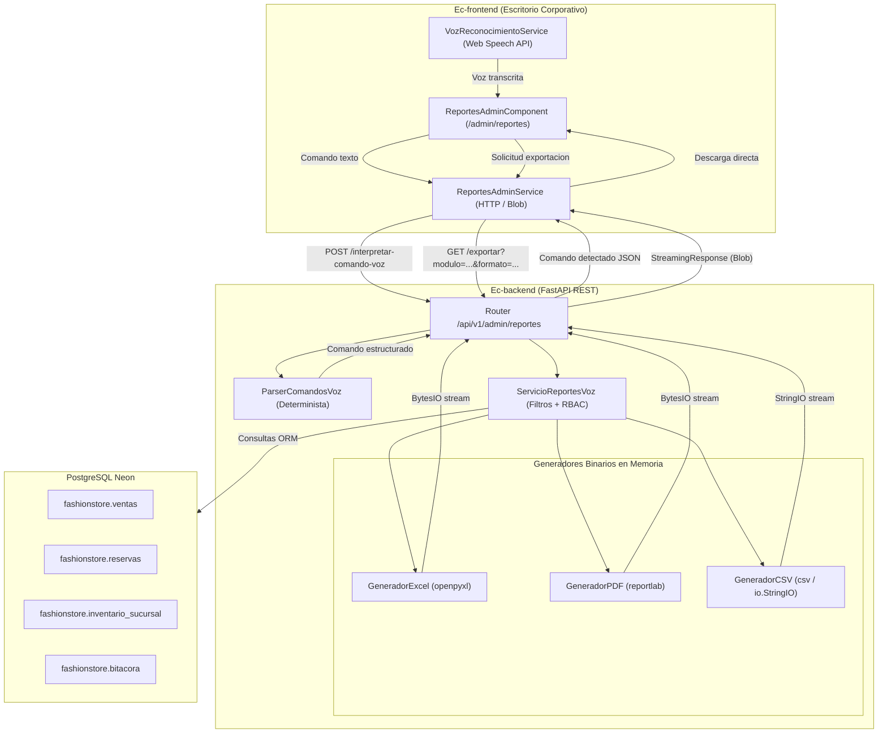

# Diseno Tecnico de Arquitectura: [CU31] Generar reportes ejecutivos y consultas por voz

## 1. Arquitectura General y Exclusion Formal de Mobile

### Justificacion de Arquitectura Exclusiva Web
El procesamiento masivo de consultas analiticas, compilacion vectorial de documentos PDF institucionales de alta densidad y generacion de libros contables en Excel (.xlsx) son operaciones administrativas de direccion corporativa orientadas a terminales de escritorio. La aplicacion movil (`Ec-mobile`) mantiene su foco estrictamente en la experiencia de boutique, catalogo y vestidor de Realidad Aumentada (AR) para clientes B2C. Por tanto, se excluye formalmente `Ec-mobile` de cualquier implementacion de este caso de uso, protegiendo su desempeno y arquitectura.



---

## 2. Modelado de Dominio Backend (`Ec-backend`)

### Esquemas Pydantic v2 (`app/modules/comercial/cu31_reportes_voz/esquemas.py`)
```python
from datetime import date, datetime
from decimal import Decimal
from enum import Enum
from typing import Any, List, Literal, Optional
from pydantic import BaseModel, Field

class ModuloReporteEnum(str, Enum):
    VENTAS = "ventas"
    RESERVAS = "reservas"
    INVENTARIO = "inventario"
    BITACORA = "bitacora"

class FormatoReporteEnum(str, Enum):
    EXCEL = "excel"
    PDF = "pdf"
    CSV = "csv"

class RangoTemporalEnum(str, Enum):
    HOY = "hoy"
    AYER = "ayer"
    ESTA_SEMANA = "esta_semana"
    ESTE_MES = "este_mes"
    ANIO_ACTUAL = "anio_actual"
    PERSONALIZADO = "personalizado"

class IntencionVozEnum(str, Enum):
    EXPORTAR = "exportar"
    CONSULTAR = "consultar"
    FILTRAR = "filtrar"

class ComandoVozIn(BaseModel):
    texto_dictado: str = Field(..., min_length=2, max_length=500, description="Texto dictado por el operador")

class ComandoVozOut(BaseModel):
    texto_dictado: str
    intencion: IntencionVozEnum
    modulo: ModuloReporteEnum
    formato: FormatoReporteEnum
    periodo: RangoTemporalEnum
    id_sucursal: Optional[int] = None
    nombre_sucursal: Optional[str] = None
    fecha_inicio: Optional[date] = None
    fecha_fin: Optional[date] = None
    confianza: float = Field(default=1.0, ge=0.0, le=1.0)
    accion_recomendada: str = Field(default="ejecutar_exportacion")

class ReporteFiltrosIn(BaseModel):
    modulo: ModuloReporteEnum
    formato: FormatoReporteEnum = FormatoReporteEnum.EXCEL
    periodo: RangoTemporalEnum = RangoTemporalEnum.ESTE_MES
    id_sucursal: Optional[int] = None
    fecha_inicio: Optional[date] = None
    fecha_fin: Optional[date] = None

class ReportePrevisualizacionOut(BaseModel):
    modulo: ModuloReporteEnum
    formato: FormatoReporteEnum
    total_registros: int
    fecha_corte: datetime
    nombre_archivo_sugerido: str
    resumen_financiero: Optional[dict[str, Any]] = None
```

### Excepciones de Dominio (`app/modules/comercial/cu31_reportes_voz/errores.py`)
- `ReporteError(AppError)`: Base para errores del modulo (HTTP 400).
- `ModuloReporteNoValidoError(ReporteError)`: Modulo invalido o no reconocido.
- `SucursalReporteNoAutorizadaError(AuthorizationError)`: Encargado de sucursal intentando consultar otra sede o consolidado global (HTTP 403).
- `ModuloRestringidoParaEncargadoError(AuthorizationError)`: Encargado intentando acceder a bitacora (HTTP 403).
- `ComandoVozIninteligibleError(ReporteError)`: Comando de voz que no contiene palabras clave reconocibles (HTTP 422).

---

## 3. Motor de Interpretacion de Comandos de Voz

### Parser Determinista Semantico (`ParserComandosVoz`)
Implementa coincidencia de patrones y analisis lexico sin dependencias de servicios externos:
1. **Normalizacion:** Convertir a minusculas, suprimir tildes y signos de puntuacion.
2. **Deteccion de Modulo:**
   - 'ventas', 'facturacion', 'ingresos', 'pedidos' -> `ModuloReporteEnum.VENTAS`
   - 'reservas', 'apartados', 'citas', 'fitting' -> `ModuloReporteEnum.RESERVAS`
   - 'inventario', 'stock', 'existencias', 'kardex', 'prendas' -> `ModuloReporteEnum.INVENTARIO`
   - 'bitacora', 'auditoria', 'accesos', 'seguridad', 'logs' -> `ModuloReporteEnum.BITACORA`
3. **Deteccion de Formato:**
   - 'excel', 'xlsx', 'hoja de calculo', 'planilla' -> `FormatoReporteEnum.EXCEL`
   - 'pdf', 'documento', 'imprimir' -> `FormatoReporteEnum.PDF`
   - 'csv', 'texto plano', 'delimitado' -> `FormatoReporteEnum.CSV`
   - *Por defecto:* `FormatoReporteEnum.EXCEL`
4. **Deteccion de Periodo:**
   - 'hoy', 'del dia' -> `HOY`
   - 'ayer' -> `AYER`
   - 'esta semana', 'semanal' -> `ESTA_SEMANA`
   - 'este mes', 'mensual' -> `ESTE_MES`
   - 'este anio', 'anual' -> `ANIO_ACTUAL`
5. **Deteccion de Sucursal:** Coincidencia sobre el listado de sedes activas (`Equipetrol`, `Calacoto`, `Central`, etc.). Si se menciona 'todas', 'global' o no se especifica sucursal, se asigna `None` (consolidado).
6. **Deteccion de Intencion:**
   - 'descargar', 'exportar', 'bajar', 'guardar' -> `IntencionVozEnum.EXPORTAR`
   - 'consultar', 'ver', 'mostrar', 'previsualizar' -> `IntencionVozEnum.CONSULTAR`

---

## 4. Motores de Generacion Binaria de Archivos

### Generador Excel (`openpyxl`)
- Paleta visual institucional: Encabezados en Obsidian (`#111111`) con tipografia blanca, acentos en Camel (`#AD8C63`).
- Titulo corporativo en celdas fusionadas (A1:G1) 'FASHION STORE - ALTA COSTURA BOLIVIANA'.
- Ajuste automatico de ancho de columnas segun contenido maximo.
- Formateo explicito de celdas monetarias: `_("Bs."* #,##0.00_)`.
- Fila final de totales con formula `SUM(...)` y doble borde inferior.

### Generador PDF (`reportlab`)
- Maquetacion `SimpleDocTemplate` en tamano carta (Letter) con margenes de 20 mm.
- Encabezado institucional con logotipo tipografico, fecha y hora de emision y usuario solicitante.
- Tabla paginada (`Table`) con `TableStyle`:
  - Fondo de cabecera `#111111`, texto blanco en negrita.
  - Filas alternadas en `#F9F9F9` y `#FFFFFF`.
  - Fila de pie de tabla con totales consolidados y borde superior reforzado.
- Numeracion de paginas dinamica mediante clase `CanvasNumerado`.

### Generador CSV (`csv` con `io.StringIO`)
- Codificacion UTF-8 con caracter BOM inicial (`\ufeff`) para correcta apertura en Microsoft Excel de sistemas Windows.
- Delimitador estandar por comas y entrecomillado seguro de cadenas (`csv.QUOTE_MINIMAL`).

---

## 5. Arquitectura Frontend Web (`Ec-frontend`)

### Servicio de Voz (`src/app/modules/comercial/cu31_reportes_voz/servicios/voz-reconocimiento.service.ts`)
- Utiliza la interfaz estandar `SpeechRecognition` con fallback a `webkitSpeechRecognition`.
- Senales reactivas (`Signals`):
  - `escuchando = signal<boolean>(false)`
  - `transcripcion = signal<string>('')`
  - `soportaVoz = signal<boolean>(true)`
  - `errorVoz = signal<string | null>(null)`
- Metodos: `iniciarEscucha()`, `detenerEscucha()`, `reiniciar()`.

### Servicio HTTP (`src/app/modules/comercial/cu31_reportes_voz/servicios/reportes-admin.service.ts`)
- `interpretarComandoVoz(peticion: ComandoVozIn): Observable<ComandoVozOut>`
- `cargarPrevisualizacion(filtros?: ReporteFiltros): Observable<ReportePrevisualizacion>`
- `exportarReporte(filtros?: ReporteFiltros): Observable<HttpResponse<Blob>>`
- Metodo auxiliar `descargarBlob(blob: Blob, nombreArchivo: string): void`.

### Componente de Pagina (`ReportesAdminComponent`)
- Ruta: `/admin/reportes` con `authGuard` y `roleGuard(['administrador', 'admin', 'encargado_sucursal'])`.
- Interfaz editorial:
  1. **Barra de Asistente por Voz:**
     Boton interactivo con microfono accesible, pulso animado al escuchar, display textual reactivo y feedback de comando parseado.
  2. **Panel Clasico de Exportacion:**
     Selectores estilizados de Modulo, Periodo, Sucursal y Formato.
  3. **Tarjeta de Resumen Preliminar:**
     Conteo de registros coincidentes antes de emitir la descarga pesada.
  4. **Boton Principal de Accion:**
     Generar y descargar reporte con spinner reactivo y bloqueo temporal contra clics dobles.

### Integracion en `AdminDashboardComponent`
- Inclusion de la tarjeta numero 13 en `admin-dashboard.component.html`:
  - Titulo: "Generar reportes ejecutivos y consultas por voz"
  - Badge: "Voz & Exportacion"
  - Boton identificador: `#btn-reportes-voz`
  - Directiva dual estricta: `routerLink="/admin/reportes"` y `(click)="navegar('/admin/reportes', $event)"`
- Actualizacion del conteo computado de modulos en `admin-dashboard.component.ts`:
  - Administrador: 13 activos.
  - Encargado de sucursal: 10 activos.
- Prueba unitaria en `admin-dashboard.component.spec.ts` que despacha clic real en `#btn-reportes-voz` y verifica `router.navigateByUrl('/admin/reportes')`.
